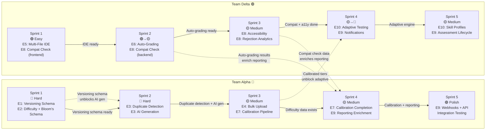
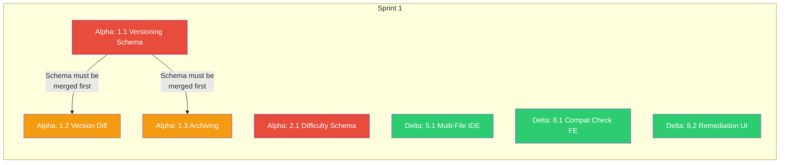
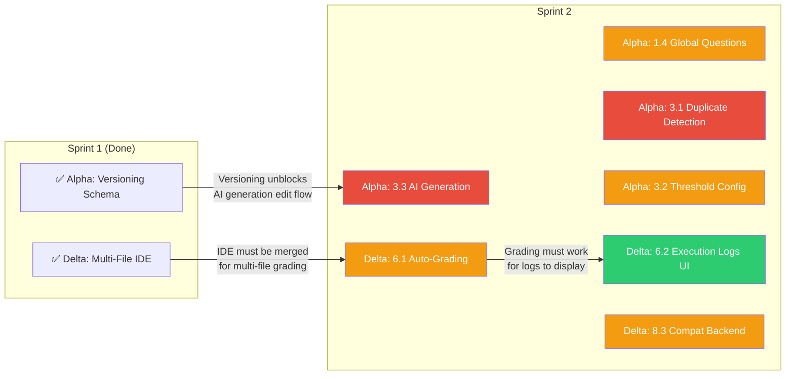
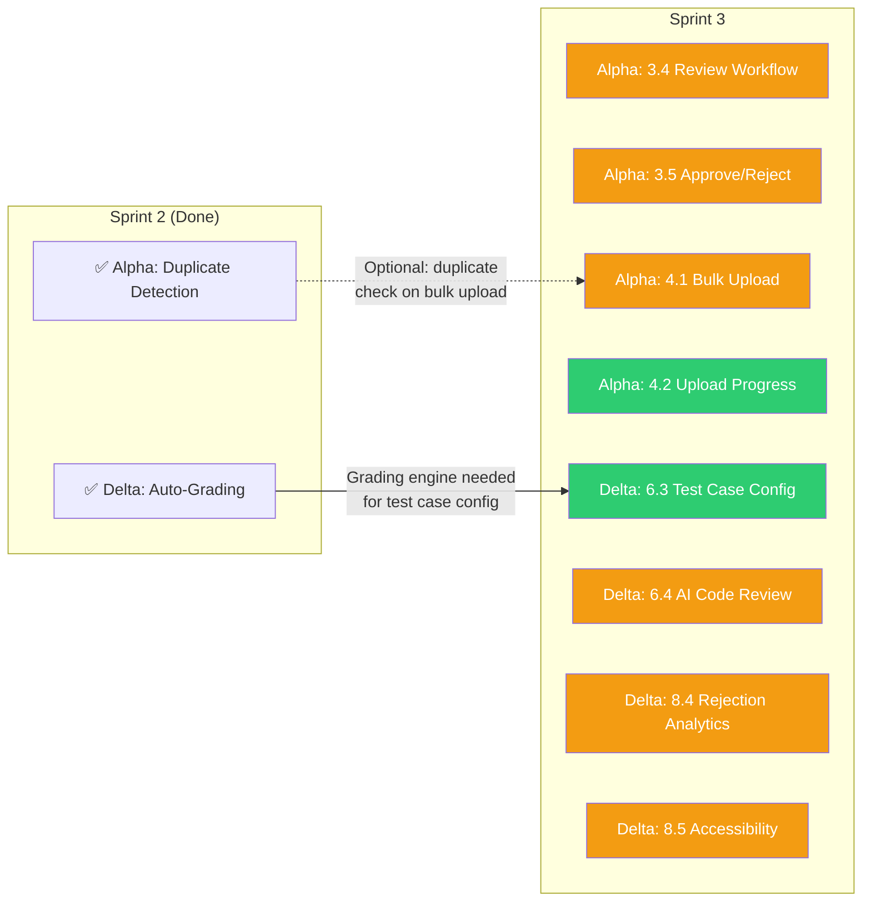
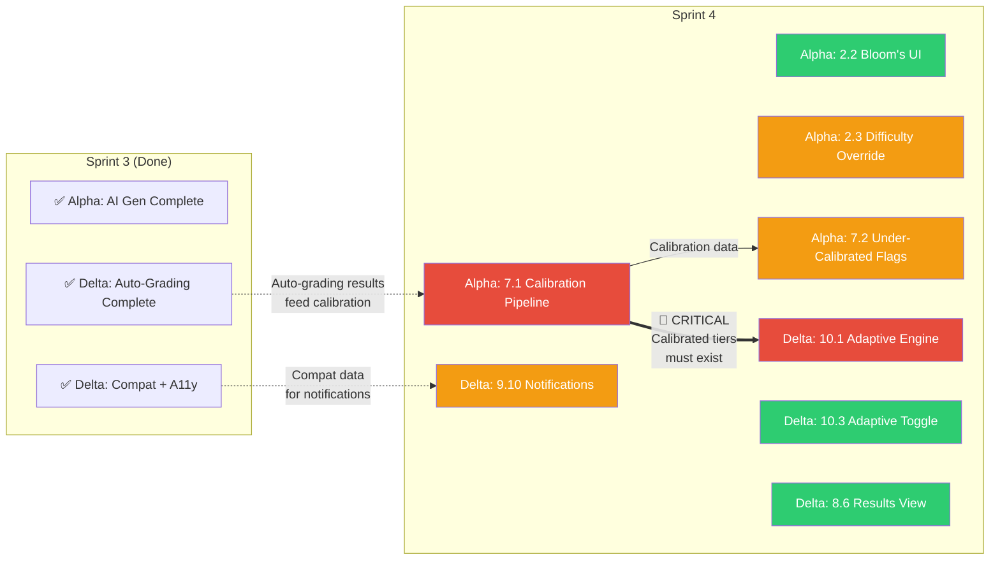
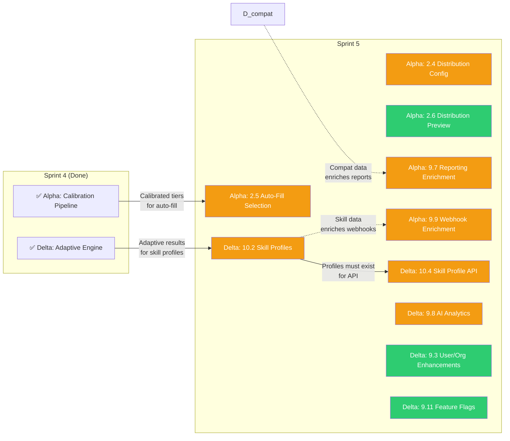
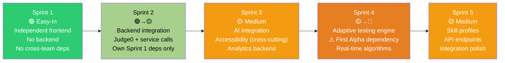
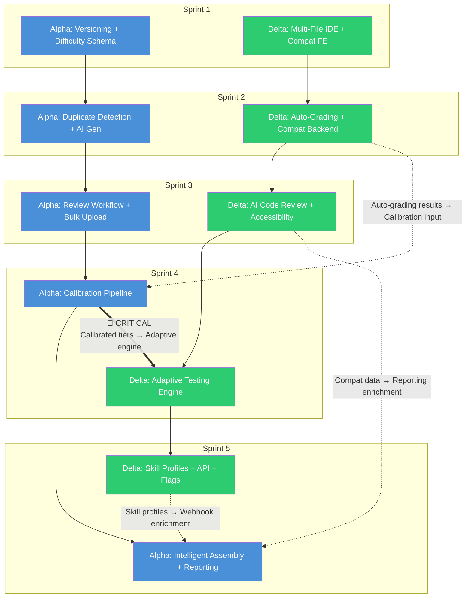

# Dodokpo Q2 2026 — Sprint Plan

**Framework:** Nexus (2 Scrum Teams, 2-week sprints, 1 Product Owner)
**Duration:** 5 sprints (10 weeks)
**Teams:** Team Alpha (experienced) + Team Delta (ramping up)

---

## Team Profiles & Assignment Strategy

### Team Alpha (Experienced)
- Deep knowledge of the codebase, especially backend services (test-creation, ai, reporting)
- Takes the most architecturally complex and high-risk work
- Owns foundational schemas that unblock other work
- Mentors Team Delta through shared PRs and joint sprint planning

### Team Delta (Ramping Up)
- New members with 3 experienced devs as anchors
- **Sprint 1:** Eased in with well-scoped, independent frontend work (no cross-team dependencies)
- **Sprint 2+:** Gradually takes on more backend integration and complex stories
- By Sprint 3, operating at full velocity on both frontend and backend

---

## Sprint-by-Sprint Breakdown

### Sprint 1: Foundations

**Sprint Goal:** Lay the foundational schemas and deliver independent frontend features.

#### Team Alpha — Sprint 1

| Story | Epic | FRs | Complexity | Description |
|-------|------|-----|-----------|-------------|
| 1.1 | E1 | FR16 | 🔴 Hard | Question Version Creation and History — new QuestionVersion Prisma model, append-only versioning, rollback, audit trail |
| 1.2 | E1 | FR17 | 🟡 Medium | Version Comparison (Side-by-Side Diff) — diff UI for question versions |
| 1.3 | E1 | FR18 | 🟡 Medium | Question Archiving — archive status, exclusion from pools, restore capability |
| 2.1 | E2 | FR1 | 🔴 Hard | Difficulty Tier + Bloom's Taxonomy Schema — Prisma migration, new enums, calibration fields |

**Alpha Sprint 1 Output:** Versioning schema live, archiving functional, difficulty/Bloom's schema deployed.

#### Team Delta — Sprint 1

| Story | Epic | FRs | Complexity | Description |
|-------|------|-----|-----------|-------------|
| 5.1 | E5 | FR26 | 🟡 Medium | Multi-File Project Editor (Frontend) — file tree, Monaco tabs, project submission |
| 8.1 | E8 | FR33 | 🟢 Easy | Pre-Test Compatibility Check (Frontend) — browser, OS, network, camera, mic, screen sharing checks |
| 8.2 | E8 | FR34, FR35 | 🟢 Easy | Remediation Guidance UI — clear guidance when issues detected, re-run check |

**Delta Sprint 1 Output:** Multi-file IDE functional, compatibility check frontend complete. *No backend dependencies — fully independent work.*

#### Dependencies — Sprint 1

**No cross-team dependencies in Sprint 1.** Teams work fully independently.

---

### Sprint 2: Intelligence & Grading

**Sprint Goal:** Deliver duplicate detection, AI generation, and auto-grading.

#### Team Alpha — Sprint 2

| Story | Epic | FRs | Complexity | Description |
|-------|------|-----|-----------|-------------|
| 1.4 | E1 | FR19 | 🟡 Medium | Global Questions Across Organizations — cross-org sharing with permission governance |
| 3.1 | E3 | FR14 | 🔴 Hard | Duplicate Detection Engine (Backend) — embedding generation, similarity comparison, configurable threshold |
| 3.2 | E3 | FR15 | 🟡 Medium | Duplicate Detection Threshold & Blocking — admin config, warning vs blocking modes |
| 3.3 | E3 | FR11 | 🔴 Hard | AI Question Generation Trigger — AI service integration, domain/difficulty/Bloom's parameters |

**Alpha Sprint 2 Output:** Duplicate detection live, AI generation triggering functional, global questions enabled.

#### Team Delta — Sprint 2

| Story | Epic | FRs | Complexity | Description |
|-------|------|-----|-----------|-------------|
| 6.1 | E6 | FR27, FR29, FR31 | 🟡 Medium | Auto-Grading Engine (Backend) — Judge0 multi-file submission, public/hidden test cases, resource constraints |
| 6.2 | E6 | FR28 | 🟢 Easy | Test Case Execution Logs UI — pass/fail display, execution time, memory usage per test case |
| 8.3 | E8 | FR41 | 🟡 Medium | Compatibility Check Backend + Analytics — backend service, pass/fail rate tracking per browser/OS/network |

**Delta Sprint 2 Output:** Auto-grading functional with multi-file support, compat check has backend + analytics.

**Dependency:** Story 6.1 depends on Story 5.1 (Sprint 1) — multi-file IDE must be merged.

#### Dependencies — Sprint 2

**One cross-team dependency:** Delta's auto-grading (6.1) needs Delta's own Sprint 1 IDE (5.1). No Alpha→Delta blockers.

---

### Sprint 3: Governance & A11y

**Sprint Goal:** Complete AI review workflow, bulk upload, and accessibility baseline.

#### Team Alpha — Sprint 3

| Story | Epic | FRs | Complexity | Description |
|-------|------|-----|-----------|-------------|
| 3.4 | E3 | FR12 | 🟡 Medium | AI-Generated Question Review Workflow — pending_review status, review queue |
| 3.5 | E3 | FR13 | 🟡 Medium | AI Question Approve/Edit/Reject Actions — bulk review, version tracking on edits |
| 4.1 | E4 | FR20 | 🟡 Medium | Coding Question Bulk Upload via CSV/JSON — template, validation, ingestion with optional duplicate check |
| 4.2 | E4 | FR21 | 🟢 Easy | Bulk Upload Progress & Error Reporting — progress bar, success/failure counts, error download |

**Alpha Sprint 3 Output:** Full AI generation-to-review pipeline complete, bulk upload operational.

#### Team Delta — Sprint 3

| Story | Epic | FRs | Complexity | Description |
|-------|------|-----|-----------|-------------|
| 6.3 | E6 | FR30 | 🟢 Easy | Public vs Hidden Test Case Configuration — test manager UI for defining visible/hidden test cases |
| 6.4 | E6 | FR32 | 🟡 Medium | AI Code Review Integration — AI reviews candidate code for quality and patterns |
| 8.4 | E8 | FR42 | 🟡 Medium | Assessment Rejection Rate Tracking — track rejections from technical issues, surface trends to admins |
| 8.5 | E8 | FR36-39 | 🟡 Medium | Accessibility Baseline — keyboard nav, contrast audit, ARIA labels, screen-reader support (WCAG 2.1 AA) |

**Delta Sprint 3 Output:** Auto-grading complete with AI review, accessibility baseline achieved, rejection analytics live.

#### Dependencies — Sprint 3

**No hard cross-team dependencies.** Alpha's bulk upload optionally uses duplicate detection (Alpha's own). Delta works independently.

---

### Sprint 4: Calibration & Adaptive

**Sprint Goal:** Launch calibration pipeline and begin adaptive testing engine.

#### Team Alpha — Sprint 4

| Story | Epic | FRs | Complexity | Description |
|-------|------|-----|-----------|-------------|
| 2.2 | E2 | FR4 | 🟢 Easy | Bloom's Taxonomy Assignment by Test Managers — dropdown selector, version tracking |
| 2.3 | E2 | FR5 | 🟡 Medium | Manual Difficulty Override with Audit Trail — view system tier, override, sticky overrides |
| 7.1 | E7 | FR2, FR3 | 🔴 Hard | Calibration Pipeline (Backend) — Kafka consumer, BullMQ queue, score aggregation, tier recalculation |
| 7.2 | E7 | FR6 | 🟡 Medium | Under-Calibrated Question Flagging — flag questions with insufficient sample size, admin dashboard |

**Alpha Sprint 4 Output:** Calibration pipeline running, difficulty tiers auto-updating from real data. Bloom's assignment UI live.

#### Team Delta — Sprint 4

| Story | Epic | FRs | Complexity | Description |
|-------|------|-----|-----------|-------------|
| 10.1 | E10 | FR43-45 | 🔴 Hard | Adaptive Difficulty Engine — real-time difficulty adjustment during assessment based on candidate performance |
| 10.3 | E10 | FR47 | 🟢 Easy | Adaptive Mode Toggle — test managers enable/disable adaptive mode per assessment |
| 8.6 | E8 | FR40 | 🟢 Easy | Candidate Results View — candidates view results after completion (when configured) |
| 9.10 | E9 | FR63-66 | 🟡 Medium | Notification Enhancements — enriched notifications for Q2 events (calibration changes, AI generation, compat outcomes) |

**Delta Sprint 4 Output:** Adaptive testing engine functional, candidate results view, enriched notifications.

**Critical Dependency:** Story 10.1 (adaptive engine) requires calibrated difficulty tiers from Alpha's Story 7.1. **Alpha must merge 7.1 by mid-Sprint 4 at latest.**

#### Dependencies — Sprint 4

**CRITICAL cross-team dependency:** Alpha's calibration pipeline (7.1) must be merged before Delta's adaptive engine (10.1) can function. Plan for Alpha to merge 7.1 in week 7 so Delta can integrate in week 8.

---

### Sprint 5: Integration & Polish

**Sprint Goal:** Complete reporting enrichment, skill profiles, assessment lifecycle, and end-to-end integration testing.

#### Team Alpha — Sprint 5

| Story | Epic | FRs | Complexity | Description |
|-------|------|-----|-----------|-------------|
| 2.4 | E2 | FR7 | 🟡 Medium | Difficulty & Bloom's Distribution Specification — configuration UI for test assembly |
| 2.5 | E2 | FR8, FR9 | 🟡 Medium | Intelligent Question Selection from Classified Pools — auto-fill from difficulty/Bloom's pools, unique per candidate |
| 2.6 | E2 | FR10 | 🟢 Easy | Test Distribution Preview Before Dispatch — breakdown chart, cross-tabulation matrix |
| 9.7 | E9 | FR57, FR59, FR62 | 🟡 Medium | Reporting Enrichment — difficulty profiles, calibration data, compat outcomes in reports |
| 9.9 | E9 | FR61, FR70, FR72 | 🟡 Medium | Webhook & API Enrichment — enriched payloads with auto-grading results, AI analysis, skill profiles |

**Alpha Sprint 5 Output:** Intelligent test assembly fully operational, reporting enriched with Q2 data, webhooks deliver enriched payloads.

#### Team Delta — Sprint 5

| Story | Epic | FRs | Complexity | Description |
|-------|------|-----|-----------|-------------|
| 10.2 | E10 | FR46 | 🟡 Medium | Skill-Level Profile Generation — granular profiles from adaptive results (e.g., "Algorithms: Expert") |
| 10.4 | E10 | FR71 | 🟡 Medium | Skill Profile API for External Consumers — API endpoint for CMS integration |
| 9.8 | E9 | FR58, FR60 | 🟡 Medium | AI Analytics Streaming — real-time AI insights delivery |
| 9.3 | E9 | FR48-50 | 🟢 Easy | User/Org Management Enhancements — new `manage_global_questions` permission, multi-org improvements |
| 9.11 | E9 | FR67-69 | 🟢 Easy | Feature Flag Administration — flag management UI, org-by-org targeting |

**Delta Sprint 5 Output:** Adaptive testing complete with skill profiles, AI analytics streaming, feature flag admin.

#### Dependencies — Sprint 5

**Dependency:** Delta's skill profiles (10.2) feed into Alpha's webhook enrichment (9.9). Plan for Delta to merge 10.2 in week 9 so Alpha can integrate in week 10.

---

## Complete Story Allocation Summary

### Team Alpha — 21 Stories

| Sprint | Stories | Epics | Complexity |
|--------|---------|-------|-----------|
| Sprint 1 | 1.1, 1.2, 1.3, 2.1 | E1, E2 | 🔴🔴🟡🟡 |
| Sprint 2 | 1.4, 3.1, 3.2, 3.3 | E1, E3 | 🔴🔴🟡🟡 |
| Sprint 3 | 3.4, 3.5, 4.1, 4.2 | E3, E4 | 🟡🟡🟡🟢 |
| Sprint 4 | 2.2, 2.3, 7.1, 7.2 | E2, E7 | 🔴🟡🟢🟡 |
| Sprint 5 | 2.4, 2.5, 2.6, 9.7, 9.9 | E2, E9 | 🟡🟡🟢🟡🟡 |

### Team Delta — 19 Stories

| Sprint | Stories | Epics | Complexity |
|--------|---------|-------|-----------|
| Sprint 1 | 5.1, 8.1, 8.2 | E5, E8 | 🟡🟢🟢 |
| Sprint 2 | 6.1, 6.2, 8.3 | E6, E8 | 🟡🟢🟡 |
| Sprint 3 | 6.3, 6.4, 8.4, 8.5 | E6, E8 | 🟢🟡🟡🟡 |
| Sprint 4 | 10.1, 10.3, 8.6, 9.10 | E10, E8, E9 | 🔴🟢🟢🟡 |
| Sprint 5 | 10.2, 10.4, 9.8, 9.3, 9.11 | E10, E9 | 🟡🟡🟡🟢🟢 |

---

## Delta Ramp-Up Progression

---

## All Cross-Team Dependencies (Complete Map)

### Dependency Legend

| Type | Symbol | Description |
|------|--------|-------------|
| 🔴 CRITICAL | `==>` thick arrow | Blocks work — must be merged before dependent story starts |
| 🟡 SOFT | `-.->` dashed arrow | Data flows between teams — can integrate mid-sprint or at sprint end |
| ✅ WITHIN-TEAM | `-->` solid arrow | Sequential within same team — normal story ordering |

### Critical Path

The only **hard cross-team blocker** is:

> **Alpha Sprint 4 (Story 7.1: Calibration Pipeline) → Delta Sprint 4 (Story 10.1: Adaptive Engine)**

**Mitigation:** Alpha prioritizes Story 7.1 in the first week of Sprint 4. Delta starts Sprint 4 with Story 10.3 (Adaptive Toggle — no calibration dependency) and Story 8.6 (Results View), then picks up 10.1 once Alpha's 7.1 is merged.

---

## Integration Points (Nexus Coordination)

### Joint Planning (Per Sprint)

| Sprint | Key Alignment Topics |
|--------|---------------------|
| Sprint 1 | Confirm no cross-team deps. Agree on Prisma schema migration strategy (Alpha owns migrations). |
| Sprint 2 | Confirm Delta's IDE is merged. Agree on Kafka topic naming for new events. |
| Sprint 3 | No cross-team deps. Review accessibility checklist alignment. |
| Sprint 4 | **CRITICAL:** Agree on calibration pipeline merge timing (Alpha week 7, Delta integrates week 8). |
| Sprint 5 | Agree on skill profile data contract for webhook enrichment. Plan integration testing. |

### Shared Artifacts

| Artifact | Owner | Consumed By |
|----------|-------|-------------|
| Prisma schema (test-creation) | Alpha | Both (Delta reads for test-execution queries) |
| Kafka topic schemas | Alpha (new topics) | Delta (consumers) |
| Frontend shared components (libs/shared) | Both | Both |
| Feature flag definitions | Alpha (defines) | Both (gate features) |
| API contracts (new endpoints) | Both (own service) | Both (consumers) |

### CI Rules

- Both teams merge to `develop` branch continuously
- Prisma migrations: Alpha runs `prisma migrate deploy` — Delta must pull latest schema before backend work
- Feature flags: All Q2 features disabled by default — enable per-org after merge
- Integration test suite: Run jointly at Sprint 4 and Sprint 5 end

---

## Feature Flag Rollout Plan

| Flag | Enabled In | Rollout Order |
|------|-----------|---------------|
| `q2_question_versioning` | Sprint 1 | Training → Recruitment → Service Center |
| `q2_difficulty_calibration` | Sprint 4 | Training → Recruitment → Service Center |
| `q2_blooms_taxonomy` | Sprint 4 | Training → Recruitment → Service Center |
| `q2_duplicate_detection` | Sprint 2 | All orgs simultaneously |
| `q2_ai_question_gen` | Sprint 3 | Training → Recruitment → Service Center |
| `q2_multifile_coding` | Sprint 2 | All orgs simultaneously |
| `q2_bulk_upload_coding` | Sprint 3 | All orgs simultaneously |
| `q2_compatibility_check` | Sprint 2 | All orgs simultaneously |
| `q2_accessibility` | Sprint 3 | All orgs simultaneously |
| `q2_adaptive_testing` | Sprint 5 | Training only (validate before wider rollout) |
