# Dodokpo Assessment Platform -- Backend Data Models

Complete reference of all database models and schemas across all services, grouped by service and database type.

---

## Table of Contents

1. [PostgreSQL (Prisma) Services](#postgresql-prisma-services)
   - [Authentication Service](#authentication-service)
   - [Test Creation Service](#test-creation-service)
   - [Test Execution Service](#test-execution-service)
   - [Notification Service](#notification-service)
   - [External API Integration Service](#external-api-integration-service)
2. [PostgreSQL (Sequelize) Services](#postgresql-sequelize-services)
   - [User Management Service](#user-management-service)
3. [DynamoDB](#dynamodb)
   - [Reporting Service](#reporting-service)
   - [AI Service](#ai-service)
   - [Test Cases Management Service](#test-cases-management-service)
4. [S3 Storage](#s3-storage)

---

## PostgreSQL (Prisma) Services

### Authentication Service

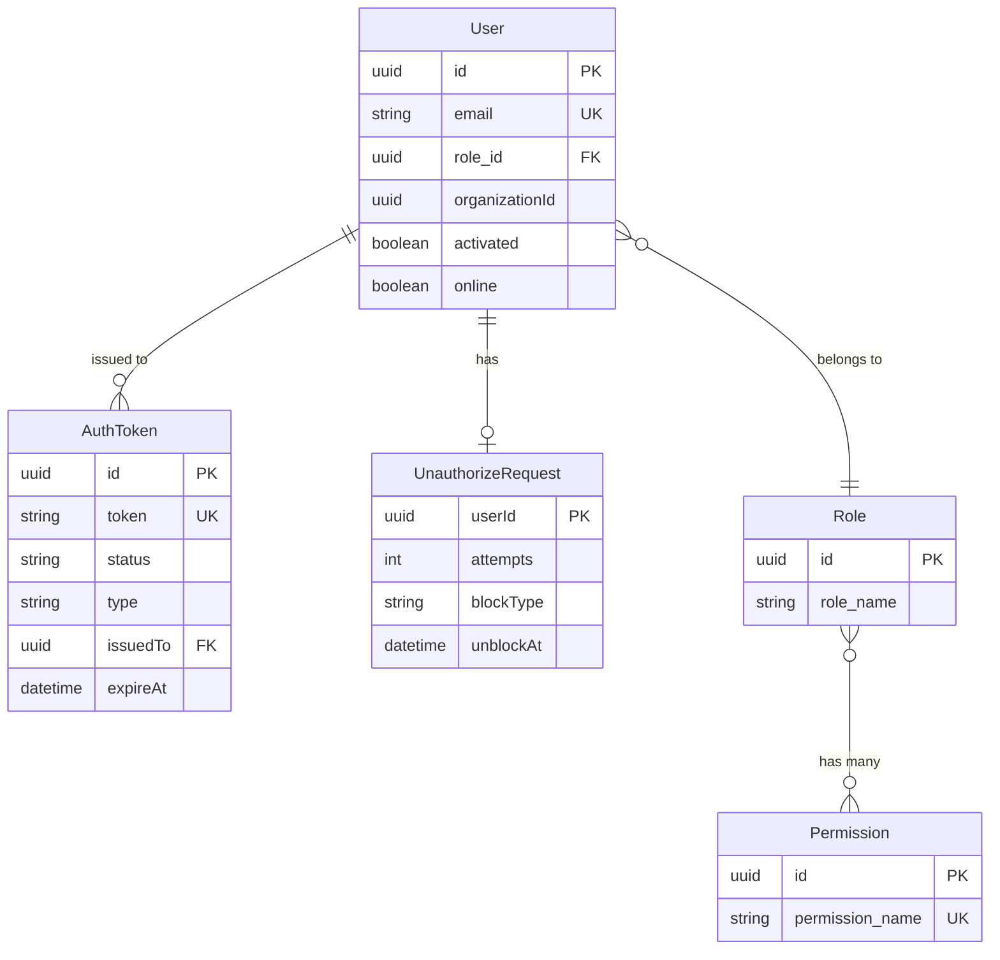

#### User

| Field | Type | Constraints | Description |
|-------|------|-------------|-------------|
| id | String (UUID) | PK, default uuid | Unique user identifier |
| email | String | Unique, not null | User email address |
| role_id | String (UUID) | FK -> Role.id | Assigned role reference |
| organizationId | String (UUID) | Not null | Organization the user belongs to |
| system | Boolean | Default false | Whether this is a system-level account |
| password | String | Nullable | Hashed password |
| reset | Boolean | Default false | Whether a password reset is pending |
| activated | Boolean | Default false | Whether the user has activated their account |
| organization_activated | Boolean | Default false | Whether the user's organization is activated |
| online | Boolean | Default false | Whether the user is currently online |
| deactivateType | String | Nullable | Type of deactivation (e.g., self, admin) |
| createdAt | DateTime | Default now | Record creation timestamp |
| updatedAt | DateTime | Auto-updated | Last update timestamp |

**Relations:** User belongs to Role (via role_id). User belongs to an Organization (via organizationId, logical reference to User Management).

#### Role

| Field | Type | Constraints | Description |
|-------|------|-------------|-------------|
| id | String (UUID) | PK, default uuid | Unique role identifier |
| role_name | String | Not null | Name of the role |
| createdAt | DateTime | Default now | Record creation timestamp |
| updatedAt | DateTime | Auto-updated | Last update timestamp |

**Relations:** Role has many Permissions (M2M via implicit join table). Role has many Users.

#### Permission

| Field | Type | Constraints | Description |
|-------|------|-------------|-------------|
| id | String (UUID) | PK, default uuid | Unique permission identifier |
| permission_name | String | Unique, not null | Permission identifier string |

**Relations:** Permission belongs to many Roles (M2M).

#### AuthToken

| Field | Type | Constraints | Description |
|-------|------|-------------|-------------|
| id | String (UUID) | PK, default uuid | Unique token identifier |
| token | String | Unique, not null | The token value (hashed) |
| status | String | Not null | Token status (active, revoked, expired) |
| type | String | Not null | Token type (reset, invite, create-password) |
| issuedBy | String (UUID) | Not null | ID of the user/system that issued the token |
| issuedTo | String (UUID) | Not null | ID of the user the token is for |
| expireAt | DateTime | Not null | Token expiration timestamp |
| createdAt | DateTime | Default now | Record creation timestamp |

#### UnauthorizeRequest

| Field | Type | Constraints | Description |
|-------|------|-------------|-------------|
| userId | String (UUID) | PK | The user making failed auth attempts |
| attempts | Int | Default 0 | Number of failed attempts |
| blockType | String | Nullable | Type of block applied (temporary, permanent) |
| firstAttempt | DateTime | Not null | Timestamp of the first failed attempt |
| lastAttempt | DateTime | Not null | Timestamp of the most recent failed attempt |
| unblockAt | DateTime | Nullable | Timestamp when the block will be lifted |

---

### Test Creation Service

#### Assessment Domain

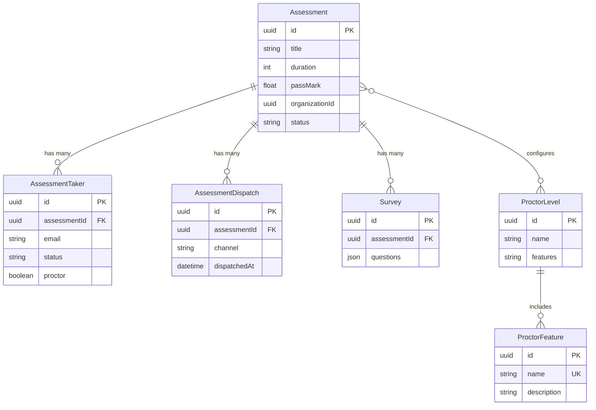

#### Test and Question Domain

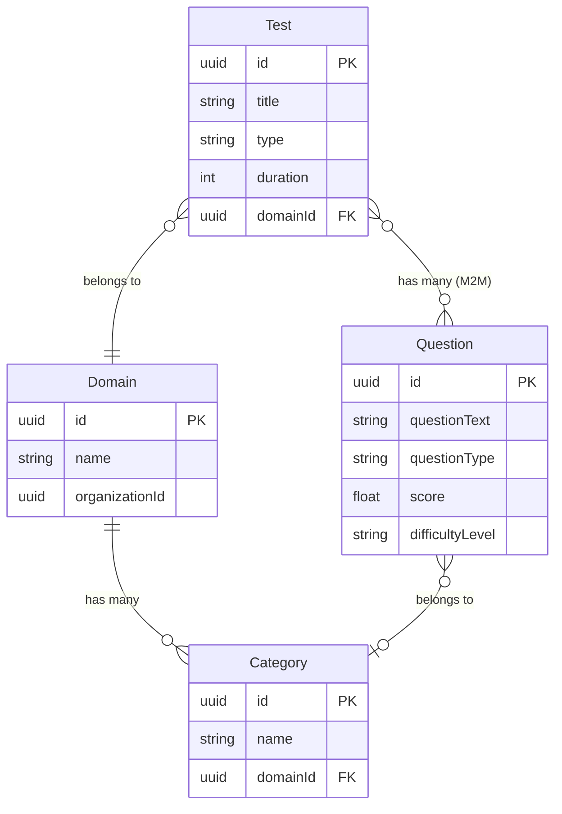

#### Question Answer Types

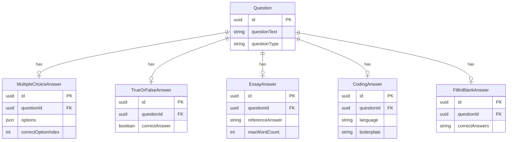

#### Skills Domain

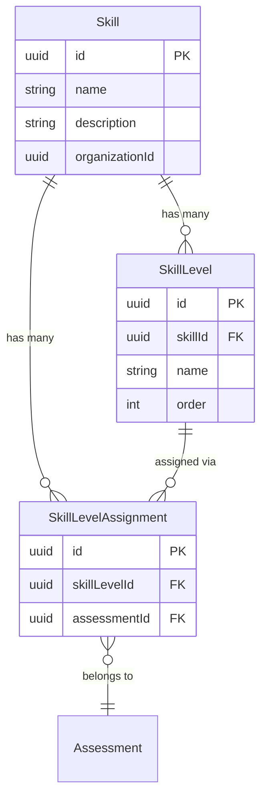

#### Assessment

| Field | Type | Constraints | Description |
|-------|------|-------------|-------------|
| id | String (UUID) | PK, default uuid | Unique assessment identifier |
| title | String | Not null | Assessment title |
| instructions | String | Nullable | Instructions shown to candidates |
| duration | Int | Not null | Total duration in minutes |
| passMark | Float | Nullable | Minimum passing score percentage |
| tags | String[] | Default [] | Tags for categorization |
| organizationId | String (UUID) | Not null | Owning organization |
| createdBy | String (UUID) | Not null | User who created the assessment |
| status | String | Default "draft" | Assessment status (draft, published, archived) |
| createdAt | DateTime | Default now | Record creation timestamp |
| updatedAt | DateTime | Auto-updated | Last update timestamp |

**Relations:** Assessment has many Tests (M2M). Assessment has many AssessmentTakers. Assessment belongs to Organization.

#### AssessmentTaker

| Field | Type | Constraints | Description |
|-------|------|-------------|-------------|
| id | String (UUID) | PK, default uuid | Unique taker record identifier |
| assessmentId | String (UUID) | FK -> Assessment.id | Associated assessment |
| email | String | Not null | Candidate email |
| status | String | Default "invited" | Invitation status (invited, started, completed, expired) |
| proctor | Boolean | Default false | Whether proctoring is enabled |
| proctorFeatures | String[] | Default [] | Enabled proctoring features |
| invitedAt | DateTime | Default now | When the invitation was sent |
| startedAt | DateTime | Nullable | When the candidate started |
| completedAt | DateTime | Nullable | When the candidate completed |

**Relations:** AssessmentTaker belongs to Assessment.

#### Test

| Field | Type | Constraints | Description |
|-------|------|-------------|-------------|
| id | String (UUID) | PK, default uuid | Unique test identifier |
| title | String | Not null | Test title |
| type | String | Not null | Test type (mcq, essay, coding, comprehension, mixed) |
| duration | Int | Not null | Test duration in minutes |
| domainId | String (UUID) | FK -> Domain.id, nullable | Associated domain |
| organizationId | String (UUID) | Not null | Owning organization |
| createdAt | DateTime | Default now | Record creation timestamp |
| updatedAt | DateTime | Auto-updated | Last update timestamp |

**Relations:** Test belongs to Domain. Test has many Questions (M2M). Test belongs to many Assessments (M2M).

#### Question

| Field | Type | Constraints | Description |
|-------|------|-------------|-------------|
| id | String (UUID) | PK, default uuid | Unique question identifier |
| questionText | String | Not null | The question prompt / body |
| questionType | String | Not null | Type (multiple-choice, true-false, essay, coding, fill-in-blank) |
| score | Float | Not null | Maximum score for this question |
| difficultyLevel | String | Not null | Difficulty (easy, medium, hard) |
| organizationId | String (UUID) | Not null | Owning organization |
| isGlobal | Boolean | Default false | Whether this is a global/shared question |
| createdAt | DateTime | Default now | Record creation timestamp |
| updatedAt | DateTime | Auto-updated | Last update timestamp |

**Relations:** Question belongs to many Tests (M2M). Question has one answer subtype record (polymorphic by questionType).

#### Answer Subtypes

**MultipleChoiceAnswer**

| Field | Type | Constraints | Description |
|-------|------|-------------|-------------|
| id | String (UUID) | PK, default uuid | Answer record identifier |
| questionId | String (UUID) | FK -> Question.id, unique | Parent question |
| options | Json | Not null | Array of option objects |
| correctOptionIndex | Int | Not null | Index of the correct option |

**TrueOrFalseAnswer**

| Field | Type | Constraints | Description |
|-------|------|-------------|-------------|
| id | String (UUID) | PK, default uuid | Answer record identifier |
| questionId | String (UUID) | FK -> Question.id, unique | Parent question |
| correctAnswer | Boolean | Not null | The correct true/false value |

**EssayAnswer**

| Field | Type | Constraints | Description |
|-------|------|-------------|-------------|
| id | String (UUID) | PK, default uuid | Answer record identifier |
| questionId | String (UUID) | FK -> Question.id, unique | Parent question |
| referenceAnswer | String | Nullable | AI-generated or manual reference answer |
| maxWordCount | Int | Nullable | Maximum word count |

**CodingAnswer**

| Field | Type | Constraints | Description |
|-------|------|-------------|-------------|
| id | String (UUID) | PK, default uuid | Answer record identifier |
| questionId | String (UUID) | FK -> Question.id, unique | Parent question |
| language | String | Not null | Programming language |
| boilerplate | String | Nullable | Starter code template |
| referenceSolution | String | Nullable | Reference solution code |

**FillInBlankAnswer**

| Field | Type | Constraints | Description |
|-------|------|-------------|-------------|
| id | String (UUID) | PK, default uuid | Answer record identifier |
| questionId | String (UUID) | FK -> Question.id, unique | Parent question |
| correctAnswers | String[] | Not null | Accepted answer values |

#### Domain

| Field | Type | Constraints | Description |
|-------|------|-------------|-------------|
| id | String (UUID) | PK, default uuid | Unique domain identifier |
| name | String | Not null | Domain name |
| organizationId | String (UUID) | Not null | Owning organization |
| createdAt | DateTime | Default now | Record creation timestamp |

**Relations:** Domain has many Categories. Domain has many Tests.

#### Category

| Field | Type | Constraints | Description |
|-------|------|-------------|-------------|
| id | String (UUID) | PK, default uuid | Unique category identifier |
| name | String | Not null | Category name |
| domainId | String (UUID) | FK -> Domain.id | Parent domain |

**Relations:** Category belongs to Domain.

#### Skill

| Field | Type | Constraints | Description |
|-------|------|-------------|-------------|
| id | String (UUID) | PK, default uuid | Unique skill identifier |
| name | String | Not null | Skill name |
| description | String | Nullable | Skill description |
| organizationId | String (UUID) | Not null | Owning organization |
| createdAt | DateTime | Default now | Record creation timestamp |
| updatedAt | DateTime | Auto-updated | Last update timestamp |

**Relations:** Skill has many SkillLevels. Skill has many SkillLevelAssignments.

#### SkillLevel

| Field | Type | Constraints | Description |
|-------|------|-------------|-------------|
| id | String (UUID) | PK, default uuid | Unique level identifier |
| skillId | String (UUID) | FK -> Skill.id | Parent skill |
| name | String | Not null | Level name (e.g., beginner, intermediate, expert) |
| description | String | Nullable | Level description |
| order | Int | Not null | Display order |

**Relations:** SkillLevel belongs to Skill. SkillLevel has many SkillLevelAssignments.

#### SkillLevelAssignment

| Field | Type | Constraints | Description |
|-------|------|-------------|-------------|
| id | String (UUID) | PK, default uuid | Assignment identifier |
| skillLevelId | String (UUID) | FK -> SkillLevel.id | The skill level assigned |
| assessmentId | String (UUID) | FK -> Assessment.id | The assessment it is assigned to |

**Relations:** SkillLevelAssignment belongs to SkillLevel. SkillLevelAssignment belongs to Assessment.

#### ProctorLevel

| Field | Type | Constraints | Description |
|-------|------|-------------|-------------|
| id | String (UUID) | PK, default uuid | Proctor level identifier |
| name | String | Not null | Proctor level name (e.g., basic, strict) |
| features | String[] | Not null | Included proctoring feature names |

#### ProctorFeature

| Field | Type | Constraints | Description |
|-------|------|-------------|-------------|
| id | String (UUID) | PK, default uuid | Feature identifier |
| name | String | Unique, not null | Feature name (e.g., webcam, screen-record, tab-switch) |
| description | String | Nullable | Feature description |

#### Survey

| Field | Type | Constraints | Description |
|-------|------|-------------|-------------|
| id | String (UUID) | PK, default uuid | Survey identifier |
| assessmentId | String (UUID) | FK -> Assessment.id | Associated assessment |
| questions | Json | Not null | Survey question definitions |
| createdAt | DateTime | Default now | Record creation timestamp |

#### OrganizationConfig

| Field | Type | Constraints | Description |
|-------|------|-------------|-------------|
| id | String (UUID) | PK, default uuid | Config record identifier |
| organizationId | String (UUID) | Unique, not null | Organization this config belongs to |
| config | Json | Not null | Configuration key-value pairs |
| updatedAt | DateTime | Auto-updated | Last update timestamp |

---

### Test Execution Service

#### Core Entities

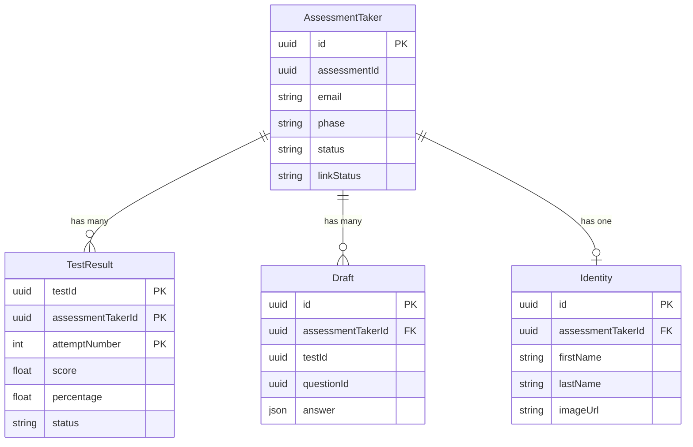

#### Proctoring and Monitoring

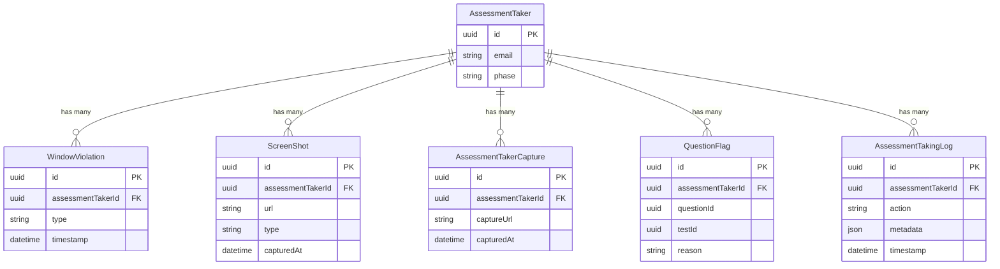

#### AssessmentTaker

| Field | Type | Constraints | Description |
|-------|------|-------------|-------------|
| id | String (UUID) | PK, default uuid | Unique taker record identifier |
| assessmentId | String (UUID) | Not null | Associated assessment (cross-service ref) |
| email | String | Not null | Candidate email |
| phase | String | Not null | Current phase (identity, in-progress, completed, submitted) |
| linkStatus | String | Not null | Link status (active, expired, used) |
| status | String | Not null | Overall status (invited, started, completed, expired) |
| logSummary | Json[] | Default [] | Summary of activity/proctoring logs |
| tags | String[] | Default [] | Tags from the assessment |
| startedAt | DateTime | Nullable | When the candidate started |
| completedAt | DateTime | Nullable | When the candidate finished |
| createdAt | DateTime | Default now | Record creation timestamp |
| updatedAt | DateTime | Auto-updated | Last update timestamp |

**Relations:** AssessmentTaker has many TestResults. AssessmentTaker has many Drafts. AssessmentTaker has one Identity. AssessmentTaker has many WindowViolations. AssessmentTaker has many ScreenShots. AssessmentTaker has many QuestionFlags. AssessmentTaker has many AssessmentTakingLogs.

#### TestResult

| Field | Type | Constraints | Description |
|-------|------|-------------|-------------|
| testId | String (UUID) | Composite PK | Test identifier |
| assessmentTakerId | String (UUID) | Composite PK | Assessment taker identifier |
| attemptNumber | Int | Composite PK | Attempt number (for retakes) |
| score | Float | Nullable | Achieved score |
| totalScore | Float | Nullable | Maximum possible score |
| percentage | Float | Nullable | Score percentage |
| status | String | Not null | Result status (pending, graded, reviewed) |
| answers | Json | Not null | Submitted answers |
| startedAt | DateTime | Not null | When the test was started |
| submittedAt | DateTime | Nullable | When the test was submitted |

**Primary Key:** Composite of (testId, assessmentTakerId, attemptNumber).
**Relations:** TestResult belongs to AssessmentTaker (via assessmentTakerId).

#### Draft

| Field | Type | Constraints | Description |
|-------|------|-------------|-------------|
| id | String (UUID) | PK, default uuid | Draft identifier |
| assessmentTakerId | String (UUID) | FK -> AssessmentTaker.id | Associated taker |
| testId | String (UUID) | Not null | Associated test |
| questionId | String (UUID) | Not null | Associated question |
| answer | Json | Not null | Draft answer content |
| updatedAt | DateTime | Auto-updated | Last update timestamp |

**Unique Constraint:** (assessmentTakerId, testId, questionId).

#### Identity

| Field | Type | Constraints | Description |
|-------|------|-------------|-------------|
| id | String (UUID) | PK, default uuid | Identity record identifier |
| assessmentTakerId | String (UUID) | FK -> AssessmentTaker.id, unique | Associated taker |
| firstName | String | Not null | Candidate first name |
| lastName | String | Not null | Candidate last name |
| imageUrl | String | Nullable | Identity verification photo URL |
| verifiedAt | DateTime | Nullable | When identity was verified |

#### WindowViolation

| Field | Type | Constraints | Description |
|-------|------|-------------|-------------|
| id | String (UUID) | PK, default uuid | Violation record identifier |
| assessmentTakerId | String (UUID) | FK -> AssessmentTaker.id | Associated taker |
| type | String | Not null | Violation type (tab-switch, window-blur, resize) |
| timestamp | DateTime | Not null | When the violation occurred |
| metadata | Json | Nullable | Additional violation context |

#### ScreenShot

| Field | Type | Constraints | Description |
|-------|------|-------------|-------------|
| id | String (UUID) | PK, default uuid | Screenshot record identifier |
| assessmentTakerId | String (UUID) | FK -> AssessmentTaker.id | Associated taker |
| url | String | Not null | S3 URL of the screenshot |
| type | String | Not null | Screenshot type (capture, screen) |
| capturedAt | DateTime | Not null | When the screenshot was taken |

#### QuestionFlag

| Field | Type | Constraints | Description |
|-------|------|-------------|-------------|
| id | String (UUID) | PK, default uuid | Flag record identifier |
| assessmentTakerId | String (UUID) | FK -> AssessmentTaker.id | Associated taker |
| questionId | String (UUID) | Not null | Flagged question |
| testId | String (UUID) | Not null | Associated test |
| reason | String | Nullable | Reason for flagging |
| createdAt | DateTime | Default now | Record creation timestamp |

**Unique Constraint:** (assessmentTakerId, questionId, testId).

#### AssessmentTakingLog

| Field | Type | Constraints | Description |
|-------|------|-------------|-------------|
| id | String (UUID) | PK, default uuid | Log entry identifier |
| assessmentTakerId | String (UUID) | FK -> AssessmentTaker.id | Associated taker |
| action | String | Not null | Action type (start, submit, navigate, violation) |
| metadata | Json | Nullable | Additional log context |
| timestamp | DateTime | Default now | When the action occurred |

---

### Notification Service

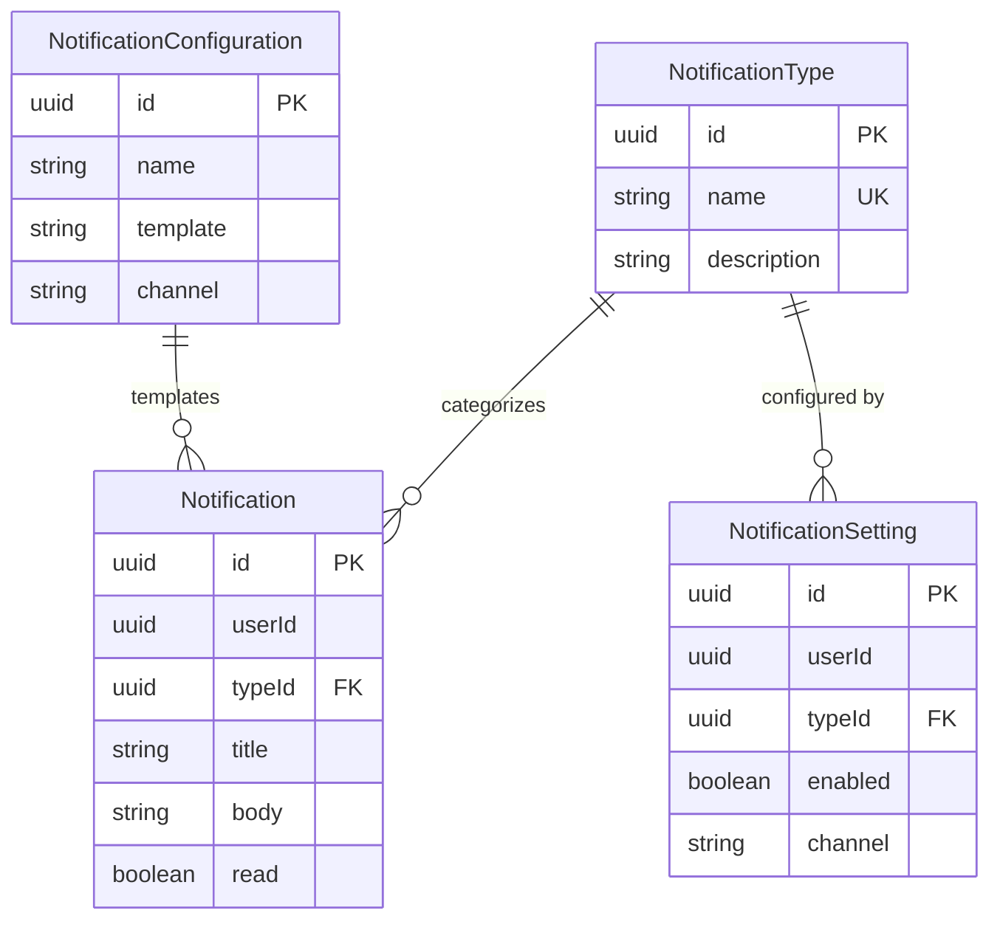

#### NotificationConfiguration

| Field | Type | Constraints | Description |
|-------|------|-------------|-------------|
| id | String (UUID) | PK, default uuid | Configuration identifier |
| name | String | Not null | Configuration name |
| template | String | Not null | Notification template content |
| channel | String | Not null | Delivery channel (in-app, email, push) |
| createdAt | DateTime | Default now | Record creation timestamp |

#### Notification

| Field | Type | Constraints | Description |
|-------|------|-------------|-------------|
| id | String (UUID) | PK, default uuid | Notification identifier |
| userId | String (UUID) | Not null | Recipient user ID |
| typeId | String (UUID) | FK -> NotificationType.id | Notification type |
| title | String | Not null | Notification title |
| body | String | Not null | Notification body content |
| read | Boolean | Default false | Whether the notification has been read |
| metadata | Json | Nullable | Additional context data |
| createdAt | DateTime | Default now | Record creation timestamp |
| updatedAt | DateTime | Auto-updated | Last update timestamp |

**Relations:** Notification belongs to NotificationType.

#### NotificationType

| Field | Type | Constraints | Description |
|-------|------|-------------|-------------|
| id | String (UUID) | PK, default uuid | Type identifier |
| name | String | Unique, not null | Type name (e.g., assessment-invite, result-ready) |
| description | String | Nullable | Type description |

**Relations:** NotificationType has many Notifications.

#### NotificationSetting

| Field | Type | Constraints | Description |
|-------|------|-------------|-------------|
| id | String (UUID) | PK, default uuid | Setting identifier |
| userId | String (UUID) | Not null | User this setting belongs to |
| typeId | String (UUID) | FK -> NotificationType.id | Notification type |
| enabled | Boolean | Default true | Whether this notification type is enabled |
| channel | String | Not null | Delivery channel preference |

**Unique Constraint:** (userId, typeId, channel).

---

### External API Integration Service

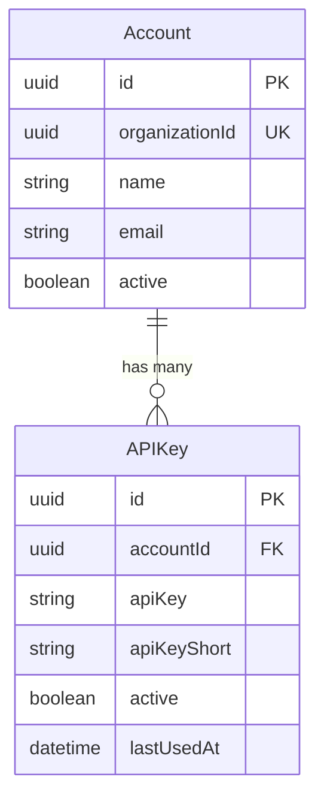

#### Account

| Field | Type | Constraints | Description |
|-------|------|-------------|-------------|
| id | String (UUID) | PK, default uuid | Account identifier |
| organizationId | String (UUID) | Unique, not null | Associated organization |
| name | String | Not null | Account name |
| email | String | Not null | Contact email |
| active | Boolean | Default true | Whether the account is active |
| createdAt | DateTime | Default now | Record creation timestamp |
| updatedAt | DateTime | Auto-updated | Last update timestamp |

**Relations:** Account has many APIKeys.

#### APIKey

| Field | Type | Constraints | Description |
|-------|------|-------------|-------------|
| id | String (UUID) | PK, default uuid | Key record identifier |
| accountId | String (UUID) | FK -> Account.id | Parent account |
| apiKey | String | Not null | Hashed API key value |
| apiKeyShort | String | Not null | Visible short prefix (e.g., "dk_...abc") |
| active | Boolean | Default true | Whether the key is active |
| lastUsedAt | DateTime | Nullable | Last time the key was used |
| createdAt | DateTime | Default now | Record creation timestamp |

**Relations:** APIKey belongs to Account.

---

## PostgreSQL (Sequelize) Services

### User Management Service

#### Core Entities

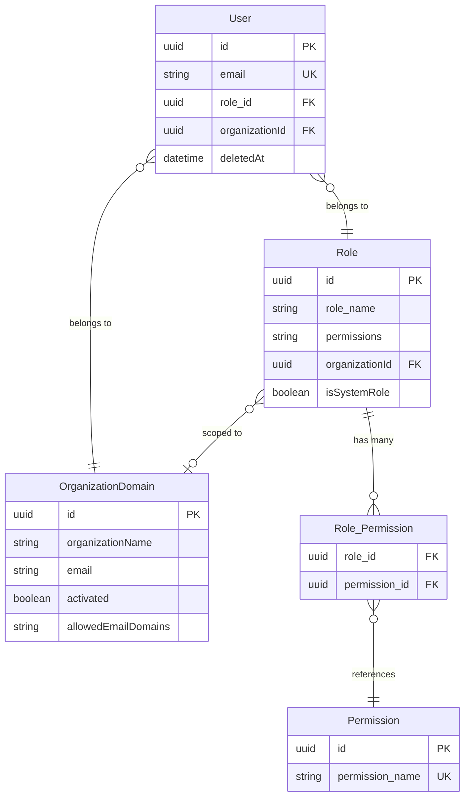

#### Supporting Entities

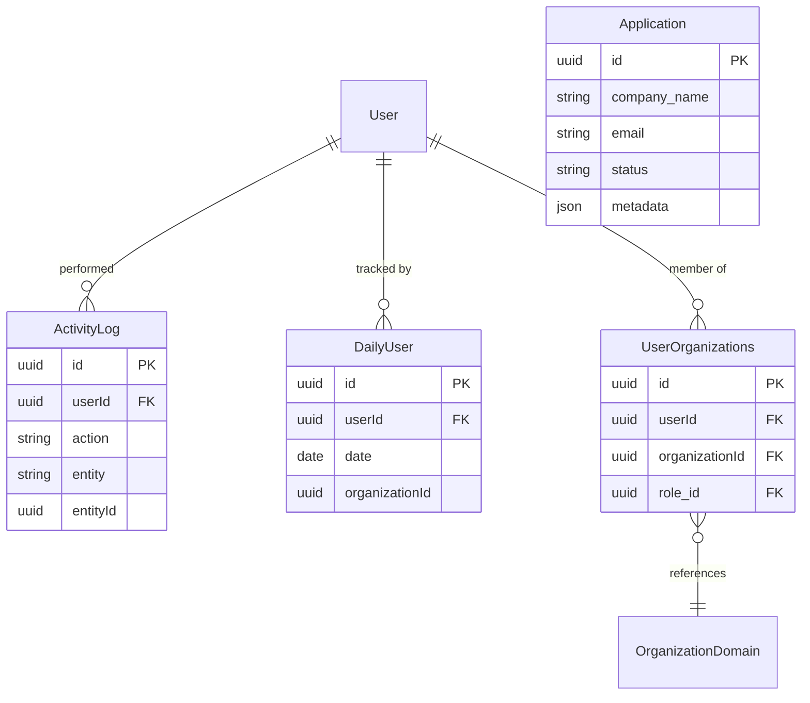

#### User

| Field | Type | Constraints | Description |
|-------|------|-------------|-------------|
| id | UUID | PK, default uuidv4 | Unique user identifier |
| first_name | String | Not null | User first name |
| last_name | String | Not null | User last name |
| email | String | Unique, not null | User email address |
| role_id | UUID | FK -> Role.id | Assigned role |
| organizationId | UUID | FK -> OrganizationDomain.id | Organization membership |
| image_link | String | Nullable | Profile image URL (via CloudFront CDN) |
| deletedAt | DateTime | Nullable (paranoid) | Soft-delete timestamp |
| createdAt | DateTime | Default now | Record creation timestamp |
| updatedAt | DateTime | Auto-updated | Last update timestamp |

**Paranoid mode:** Enabled -- rows are soft-deleted (deletedAt is set instead of row removal).
**Relations:** User belongs to Role. User belongs to OrganizationDomain. User has many UserOrganizations. User has many ActivityLogs.

#### Role

| Field | Type | Constraints | Description |
|-------|------|-------------|-------------|
| id | UUID | PK, default uuidv4 | Unique role identifier |
| role_name | String | Not null | Role display name |
| permissions | String[] | Default [] | Array of permission names |
| organizationId | UUID | FK -> OrganizationDomain.id, nullable | Organization scope (null = system-wide) |
| isSystemRole | Boolean | Default false | Whether this is a built-in system role |
| createdAt | DateTime | Default now | Record creation timestamp |
| updatedAt | DateTime | Auto-updated | Last update timestamp |

**Relations:** Role has many Users. Role belongs to OrganizationDomain (optional).

#### Permission

| Field | Type | Constraints | Description |
|-------|------|-------------|-------------|
| id | UUID | PK, default uuidv4 | Unique permission identifier |
| permission_name | String | Unique, not null | Permission identifier string |

#### OrganizationDomain

| Field | Type | Constraints | Description |
|-------|------|-------------|-------------|
| id | UUID | PK, default uuidv4 | Unique organization identifier |
| organizationName | String | Not null | Organization display name |
| email | String | Not null | Primary contact email |
| activated | Boolean | Default false | Whether the organization is activated |
| allowedEmailDomains | String[] | Default [] | Allowed email domains for member sign-up |
| createdAt | DateTime | Default now | Record creation timestamp |
| updatedAt | DateTime | Auto-updated | Last update timestamp |

**Relations:** OrganizationDomain has many Users. OrganizationDomain has many Roles.

#### Application

| Field | Type | Constraints | Description |
|-------|------|-------------|-------------|
| id | UUID | PK, default uuidv4 | Application identifier |
| company_name | String | Not null | Applicant company name |
| email | String | Not null | Applicant contact email |
| status | String | Default "pending" | Application status (pending, approved, rejected) |
| metadata | JSON | Nullable | Additional application data |
| createdAt | DateTime | Default now | Record creation timestamp |
| updatedAt | DateTime | Auto-updated | Last update timestamp |

#### ActivityLog

| Field | Type | Constraints | Description |
|-------|------|-------------|-------------|
| id | UUID | PK, default uuidv4 | Log entry identifier |
| userId | UUID | FK -> User.id | User who performed the action |
| action | String | Not null | Action description |
| entity | String | Not null | Entity type affected |
| entityId | UUID | Nullable | ID of the affected entity |
| metadata | JSON | Nullable | Additional context |
| createdAt | DateTime | Default now | Record creation timestamp |

**Relations:** ActivityLog belongs to User.

#### DailyUser

| Field | Type | Constraints | Description |
|-------|------|-------------|-------------|
| id | UUID | PK, default uuidv4 | Record identifier |
| userId | UUID | FK -> User.id | Associated user |
| date | DateOnly | Not null | The date of activity |
| organizationId | UUID | Not null | Organization context |

**Unique Constraint:** (userId, date).

#### UserOrganizations

| Field | Type | Constraints | Description |
|-------|------|-------------|-------------|
| id | UUID | PK, default uuidv4 | Record identifier |
| userId | UUID | FK -> User.id | User reference |
| organizationId | UUID | FK -> OrganizationDomain.id | Organization reference |
| role_id | UUID | FK -> Role.id | Role in this organization |
| createdAt | DateTime | Default now | Record creation timestamp |

**Unique Constraint:** (userId, organizationId).
**Relations:** UserOrganizations belongs to User. UserOrganizations belongs to OrganizationDomain. UserOrganizations belongs to Role.

---

## DynamoDB

### Reporting Service

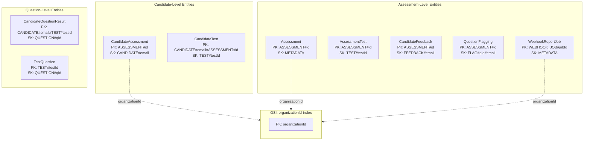

**Design:** Single-table design. All entities share one DynamoDB table with a GSI on `organizationId`.

#### Entity: Assessment

| Attribute | Type | Key | Description |
|-----------|------|-----|-------------|
| PK | String | Partition Key | `ASSESSMENT#<assessmentId>` |
| SK | String | Sort Key | `METADATA` |
| organizationId | String | GSI PK | Organization identifier |
| title | String | -- | Assessment title |
| status | String | -- | Assessment status |
| createdAt | String (ISO) | -- | Creation timestamp |

#### Entity: CandidateAssessment

| Attribute | Type | Key | Description |
|-----------|------|-----|-------------|
| PK | String | Partition Key | `ASSESSMENT#<assessmentId>` |
| SK | String | Sort Key | `CANDIDATE#<candidateEmail>` |
| organizationId | String | GSI PK | Organization identifier |
| email | String | -- | Candidate email |
| status | String | -- | Completion status |
| score | Number | -- | Overall score |
| percentage | Number | -- | Score percentage |
| startedAt | String (ISO) | -- | Start timestamp |
| completedAt | String (ISO) | -- | Completion timestamp |

#### Entity: AssessmentTest

| Attribute | Type | Key | Description |
|-----------|------|-----|-------------|
| PK | String | Partition Key | `ASSESSMENT#<assessmentId>` |
| SK | String | Sort Key | `TEST#<testId>` |
| testTitle | String | -- | Test title |
| testType | String | -- | Test type |
| duration | Number | -- | Duration in minutes |
| questionCount | Number | -- | Number of questions |

#### Entity: CandidateTest

| Attribute | Type | Key | Description |
|-----------|------|-----|-------------|
| PK | String | Partition Key | `CANDIDATE#<candidateEmail>#ASSESSMENT#<assessmentId>` |
| SK | String | Sort Key | `TEST#<testId>` |
| score | Number | -- | Test score |
| totalScore | Number | -- | Maximum possible score |
| percentage | Number | -- | Score percentage |
| submittedAt | String (ISO) | -- | Submission timestamp |

#### Entity: CandidateQuestionResult

| Attribute | Type | Key | Description |
|-----------|------|-----|-------------|
| PK | String | Partition Key | `CANDIDATE#<candidateEmail>#TEST#<testId>` |
| SK | String | Sort Key | `QUESTION#<questionId>` |
| answer | String/Map | -- | Submitted answer |
| score | Number | -- | Achieved score |
| maxScore | Number | -- | Maximum score |
| isCorrect | Boolean | -- | Whether the answer is correct |

#### Entity: TestQuestion

| Attribute | Type | Key | Description |
|-----------|------|-----|-------------|
| PK | String | Partition Key | `TEST#<testId>` |
| SK | String | Sort Key | `QUESTION#<questionId>` |
| questionText | String | -- | Question text |
| questionType | String | -- | Question type |
| score | Number | -- | Question score value |
| difficultyLevel | String | -- | Difficulty level |

#### Entity: CandidateFeedback

| Attribute | Type | Key | Description |
|-----------|------|-----|-------------|
| PK | String | Partition Key | `ASSESSMENT#<assessmentId>` |
| SK | String | Sort Key | `FEEDBACK#<candidateEmail>` |
| rating | Number | -- | Numeric rating |
| comments | String | -- | Feedback text |
| submittedAt | String (ISO) | -- | Submission timestamp |

#### Entity: QuestionFlagging

| Attribute | Type | Key | Description |
|-----------|------|-----|-------------|
| PK | String | Partition Key | `ASSESSMENT#<assessmentId>` |
| SK | String | Sort Key | `FLAG#<questionId>#<candidateEmail>` |
| reason | String | -- | Flag reason |
| createdAt | String (ISO) | -- | Flag timestamp |

#### Entity: WebhookReportJob

| Attribute | Type | Key | Description |
|-----------|------|-----|-------------|
| PK | String | Partition Key | `WEBHOOK_JOB#<jobId>` |
| SK | String | Sort Key | `METADATA` |
| organizationId | String | GSI PK | Organization identifier |
| status | String | -- | Job status (pending, processing, completed, failed) |
| payload | Map | -- | Webhook payload data |
| createdAt | String (ISO) | -- | Creation timestamp |

**GSI: organizationId-index**
- Partition Key: `organizationId`
- Enables querying all entities by organization.

---

### AI Service

**Table:** Jobs

| Attribute | Type | Key | Description |
|-----------|------|-----|-------------|
| jobId | String (UUID) | Partition Key | Unique job identifier |
| jobType | String | -- | Job type (generate-question, analyze-test, etc.) |
| status | String | -- | Job status (pending, processing, completed, failed) |
| requestPayload | Map | -- | Original request parameters |
| result | Map | -- | Job result data (populated on completion) |
| error | Map | -- | Error details (populated on failure) |
| ttl | Number | -- | DynamoDB TTL (24 hours from creation, epoch seconds) |
| createdAt | String (ISO) | -- | Creation timestamp |
| updatedAt | String (ISO) | -- | Last update timestamp |

**TTL:** Records auto-expire 24 hours after creation.

---

### Test Cases Management Service

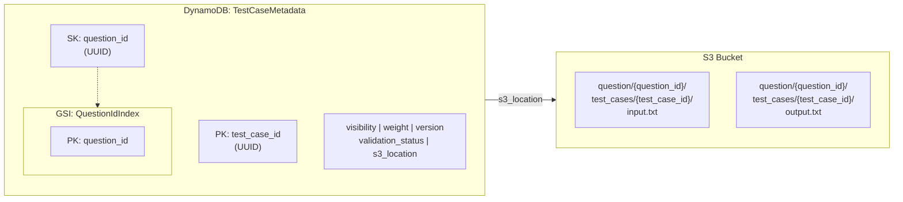

**Table:** TestCaseMetadata

| Attribute | Type | Key | Description |
|-----------|------|-----|-------------|
| pk (test_case_id) | String (UUID) | Partition Key | Unique test case identifier |
| sk (question_id) | String (UUID) | Sort Key | Associated question identifier |
| visibility | String | -- | Visibility level (public, hidden) |
| weight | Number | -- | Weight/importance of this test case |
| version | Number | -- | Version number for optimistic locking |
| s3_location | String | -- | S3 path to input/output files |
| validation_status | String | -- | Status (pending, valid, invalid) |
| createdAt | String (ISO) | -- | Creation timestamp |
| updatedAt | String (ISO) | -- | Last update timestamp |

**GSI: QuestionIdIndex**
- Partition Key: `question_id`
- Enables querying all test cases for a given question.

---

## S3 Storage

### Test Cases Service

| Bucket Path Pattern | Content | Description |
|---------------------|---------|-------------|
| `question/{question_id}/test_cases/{test_case_id}/input.txt` | Plain text | Test case input data |
| `question/{question_id}/test_cases/{test_case_id}/output.txt` | Plain text | Expected test case output |

### User Management Service

| Bucket Path Pattern | Content | Description |
|---------------------|---------|-------------|
| `profiles/{organizationId}/{userId}/*` | Image (JPEG/PNG) | User profile images |

**CDN:** Served via CloudFront distribution for low-latency delivery.

### Test Execution Service

| Bucket Path Pattern | Content | Description |
|---------------------|---------|-------------|
| `screenshots/{assessmentTakerId}/capture/{timestamp}.*` | Image (JPEG/PNG) | Proctoring webcam capture shots |
| `screenshots/{assessmentTakerId}/screen/{timestamp}.*` | Image (JPEG/PNG) | Proctoring screen capture shots |
