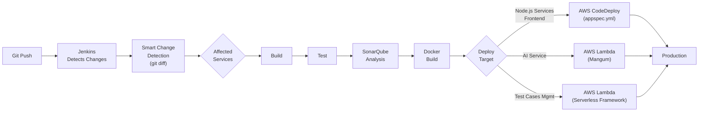
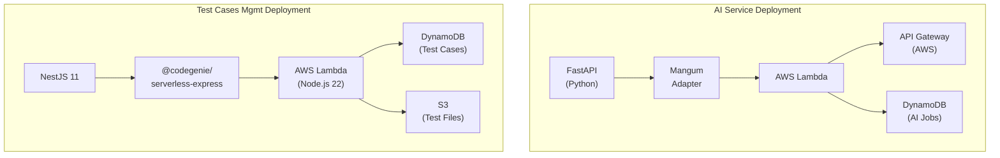

# Dodokpo Assessment Platform -- Deployment Guide

## Infrastructure Requirements

| Component | Service | Purpose |
|-----------|---------|---------|
| PostgreSQL 16+ | Auth, User Mgmt, Test Creation, Test Execution, Notification, Ext API | Primary relational database |
| Redis 7+ | API Gateway, Test Creation, Test Execution, Reporting, Ext API | Caching, session management, BullMQ |
| Apache Kafka | All services | Event-driven messaging |
| DynamoDB | Test Cases Mgmt, Reporting, AI | NoSQL storage |
| S3 | Test Cases Mgmt, Test Execution, User Mgmt | File/image storage |
| CloudFront | User Mgmt | CDN for profile images |

### Infrastructure Topology

```mermaid
flowchart TB
    subgraph DockerCompose["Docker Compose Infrastructure"]
        PG["PostgreSQL<br/>:5432"]
        Redis["Redis<br/>:6379"]
        ZK["Zookeeper<br/>:2181"]
        Kafka["Kafka<br/>:9092"]
        DynamoDB["DynamoDB Local<br/>:8000<br/>(in-memory)"]
        LocalStack["LocalStack (S3)<br/>:4566"]

        ZK --> Kafka
    end

    subgraph Apps["Application Services"]
        GW["API Gateway"]
        Auth["Authentication"]
        UserMgmt["User Management"]
        TestCreation["Test Creation"]
        TestExecution["Test Execution"]
        TestCases["Test Cases Mgmt"]
        Reporting["Reporting"]
        AI["AI Service"]
        Notification["Notification"]
        ExtAPI["External API"]
    end

    Auth -->|DATABASE_URL| PG
    UserMgmt -->|DBHOST:5432| PG
    TestCreation -->|DATABASE_URL| PG
    TestExecution -->|DATABASE_URL| PG
    Notification -->|DATABASE_URL| PG
    ExtAPI -->|DATABASE_URL| PG

    GW -->|:6379| Redis
    TestCreation -->|:6379| Redis
    TestExecution -->|:6379| Redis
    Reporting -->|:6379| Redis
    ExtAPI -->|:6379| Redis

    TestCases -->|:8000| DynamoDB
    Reporting -->|:8000| DynamoDB
    AI -->|:8000| DynamoDB

    TestCases -->|:4566| LocalStack
    TestExecution -->|:4566| LocalStack
    UserMgmt -->|:4566| LocalStack

    Auth -.->|:9092| Kafka
    TestCreation -.->|:9092| Kafka
    TestExecution -.->|:9092| Kafka
    Notification -.->|:9092| Kafka
    Reporting -.->|:9092| Kafka
```



## Containerization

### Backend Services

Each service has its own `Dockerfile` and `Dockerfile.dev`:

```bash
# Build individual service
cd backend/apps/<service-name>/
docker build -t dodokpo-<service-name> .

# Or use Docker Compose profiles
cd backend/
docker compose --profile all up --build
```

### Frontend

```bash
cd frontend/
docker build -t dodokpo-frontend .
# Uses nginx to serve static files
```

### Docker Compose (Local Development)

```bash
cd backend/
docker compose up                    # Infrastructure only
docker compose --profile all up      # Everything
```

**Infrastructure services** (always start):
- `postgres` (5432) -- Multi-database init via `docker/init-postgres.sh`
- `redis` (6379)
- `zookeeper` (2181)
- `dynamodb-local` (8000) -- In-memory mode
- `localstack` (4566) -- S3 emulation

## CI/CD Pipeline

### Backend (Jenkins)

The root `Jenkinsfile` implements **smart change detection**:
- Automatically detects which services changed via git diff
- Only builds/tests/deploys affected services
- Supports manual service selection for targeted builds
- Multi-stage pipeline: Build > Test > Deploy

Each service also has its own `Jenkinsfile` for individual builds.

### CI/CD Pipeline Flow



### Frontend (Jenkins)

The frontend `Jenkinsfile` handles:
- Nx-based build with caching
- Test execution with coverage
- SonarQube analysis
- Docker image build
- AWS CodeDeploy deployment

### AWS CodeDeploy

Both backend and frontend use `appspec.yml` for AWS CodeDeploy:
- Hook scripts in `scripts/` directories
- Lifecycle events: BeforeInstall, AfterInstall, ApplicationStart, ValidateService

## Serverless Deployments

### Serverless Deployment Architecture



### AI Service (AWS Lambda via Mangum)

```bash
cd backend/apps/ai/
poe deploy-dev          # Dev stage
poe deploy-staging      # Staging
poe deploy-prod         # Production
```

### Test Cases Management (AWS Lambda via Serverless Framework)

```bash
cd backend/apps/test-cases-management/
npm run sls:deploy
```

**Lambda configuration** (from `serverless.ts`):
- Runtime: Node.js 22
- Memory: 256MB
- Timeout: 29 seconds
- IAM: S3 (Put/Get/Delete) + DynamoDB (Query/Scan/CRUD)
- Bundling: esbuild (minified, source maps)

## Monitoring & Observability

| Tool | Purpose | Services |
|------|---------|----------|
| **Sentry** | Error tracking + profiling | All services |
| **OpenTelemetry/Jaeger** | Distributed tracing | All Node.js + Java services |
| **Prometheus** | Metrics collection | API Gateway (custom metrics) |
| **SonarQube** | Code quality | All services |

### API Gateway Metrics (Prometheus)

Exposed at `GET /metrics`:
- `http_requests_total` -- Request counts by method/route/status
- `http_request_duration_seconds` -- Request latency histogram
- `http_errors_total` -- Error counts
- `rate_limit_hits_total` -- Rate limiting events
- `circuit_breaker_state` -- Per-service circuit state
- `active_connections` -- Current active connections
- `nodejs_memory_usage_bytes` -- Memory usage

## Environment Configuration

### Per-Environment Setup

Each service requires environment-specific `.env` configuration:

**Shared across all services**:
- `NODE_ENV` / `ENVIRONMENT` -- `development`, `staging`, `production`
- `JWT_SECRET`, `JWT_ENCRYPTION_KEY`, `JWT_ENCRYPTION_ALGO` -- Must be identical across all services
- `KAFKA_BOOTSTRAP_SERVERS` -- Kafka broker addresses
- `SENTRY_DSN` -- Per-service Sentry project

**Database connections**:
- Each Prisma service needs `DATABASE_URL`
- User management needs `DBHOST`, `DBNAME`, `DBUSER`, `DBPASSWORD`
- Reporting needs `DYNAMODB_TABLENAME`, `AWS_ACCESS_KEY`, `AWS_SECRET_KEY`

**AWS credentials**:
- `AWS_ACCESS_KEY_ID`, `AWS_SECRET_ACCESS_KEY`, `AWS_REGION`
- Used by: User Management (S3), Test Execution (S3), Test Cases (DynamoDB/S3), Reporting (DynamoDB), AI (Lambda/DynamoDB)

**Service discovery** (each service needs URLs for services it calls):
- API Gateway: All downstream service URLs
- Auth: `USER_MANAGEMENT_URL`
- Test Execution: `AI_URL`, `TEST_CASES_API_URL`, `JUDGE_0_URL`, `TEST_CREATION_SERVICE_URL`
- Reporting: `AI_URL`
- Ext API: `USER_MANAGEMENT_URL`

## Frontend Deployment

The frontend is built as static files served via **nginx**:
- `nginx/` directory contains the nginx configuration
- Module Federation remote entry loaded from `/next/remoteEntry.mjs` (same origin)
- Environment injected at build time via Angular file replacements

## Health Checks

Every service exposes a health check endpoint:

| Service | Endpoint | Response |
|---------|----------|----------|
| api-gateway | `GET /api/v1/` | `{ success: true, message: "Dodokpo API Gateway <env>" }` |
| authentication | `GET /` | `{ success: true, message: "Dodokpo Auth Service" }` |
| user-management | `GET /api/v1/health` | Health status |
| test-creation | `GET /api/v1/` | Health check |
| test-execution | `GET /api/v1/` | Health check |
| test-cases-mgmt | `GET /` | "Hello from Dodokpo!" |
| reporting | `GET /` | Welcome message |
| ai | `GET /api/v1/health` | Health status |
| ai | `GET /api/v1/health/provider` | AI provider connectivity |
| notification | `GET /api/v1/` | Health check |
| external-api | `GET /api/` | Service name + env |
