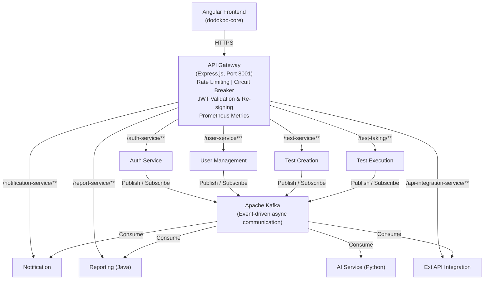
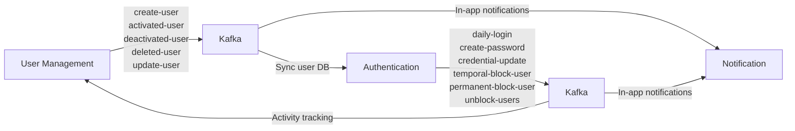
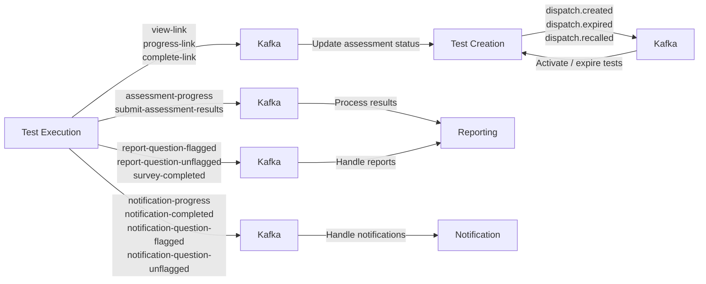
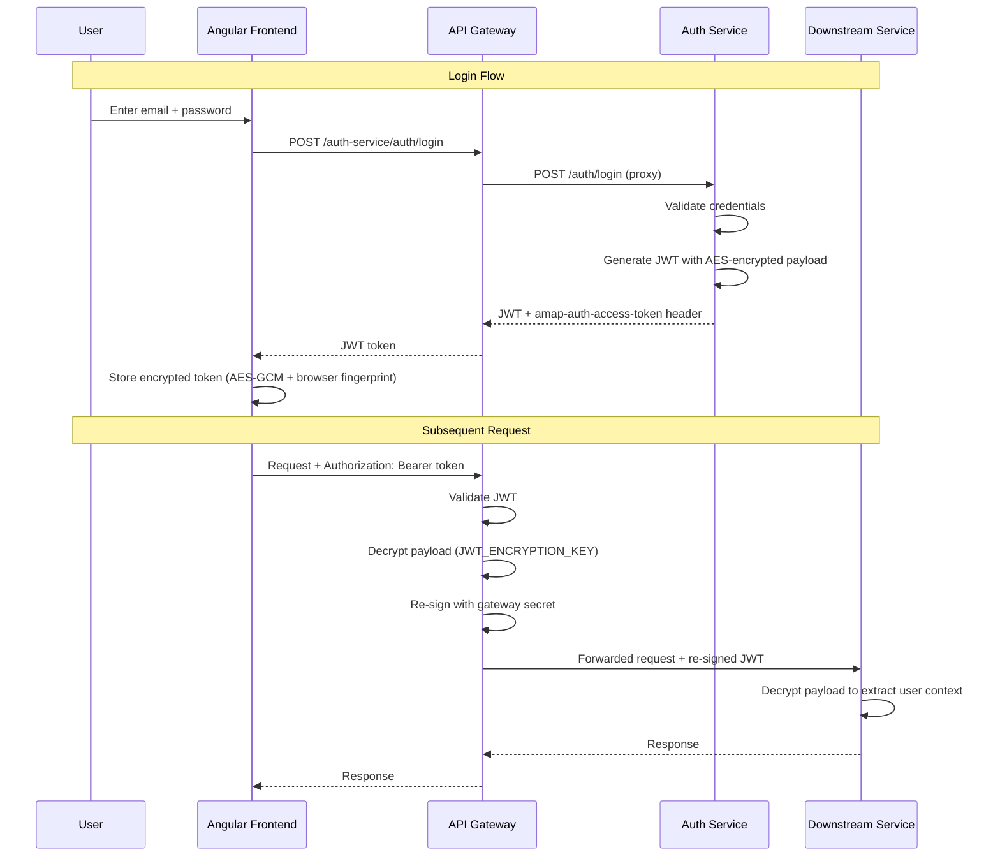
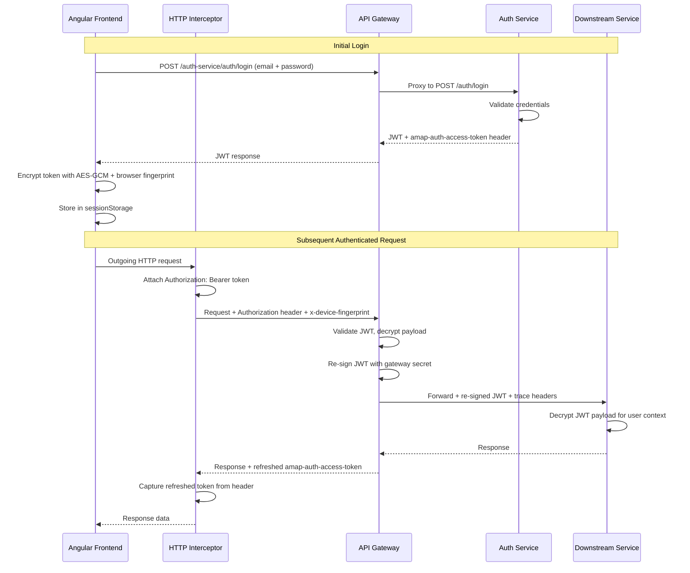
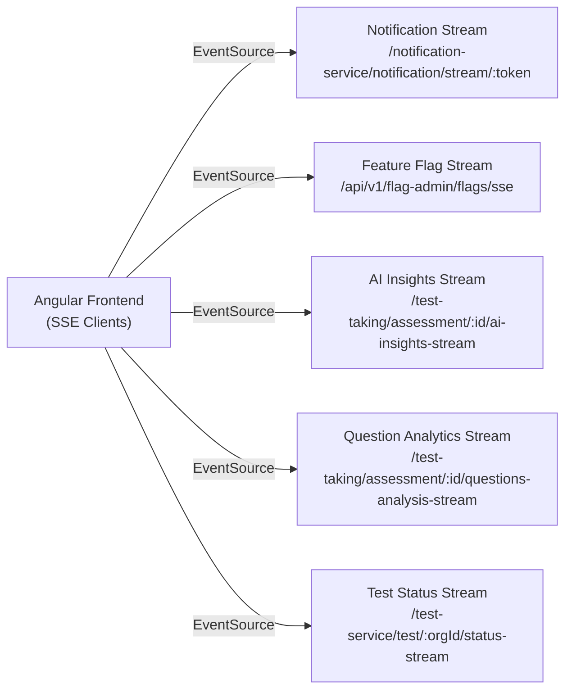

# Dodokpo Assessment Platform -- Integration Architecture

## Overview

The Dodokpo platform uses a **microservices architecture** with two primary integration patterns:
1. **Synchronous HTTP** -- Request/response via API Gateway proxy
2. **Asynchronous Kafka events** -- Publish/subscribe for event-driven workflows

## Traffic Flow

## API Gateway Routing

The API Gateway proxies all frontend traffic to downstream services:

| Frontend Path Prefix | Target Service | Circuit Breaker |
|---------------------|----------------|-----------------|
| `/auth-service/**` | Authentication | Yes |
| `/user-service/**` | User Management | Yes |
| `/test-service/**` | Test Creation | Yes |
| `/test-taking/**` | Test Execution | Yes |
| `/notification-service/**` | Notification | Yes |
| `/report-service/**` | Reporting | Yes |
| `/api-integration-service/**` | External API Integration | Yes |

**Gateway behavior**:
- Strips service prefix before forwarding (e.g., `/auth-service/auth/login` -> `/auth/login`)
- Validates JWT token, decrypts payload, re-signs with gateway secret
- Forwards OpenTelemetry trace context headers (`traceparent`, `tracestate`)
- Forwards device fingerprint header (`x-device-fingerprint`)
- Circuit breaker: 3 failures = open, 30s timeout, 2 successes to close

## Kafka Event Architecture

### Topic Categories

#### User Lifecycle Events
| Topic | Producer | Consumers |
|-------|----------|-----------|
| `create-user` | User Management | Authentication, Notification |
| `activated-user` | User Management | Auth, Test Creation, Test Execution, Notification |
| `deactivated-user` | User Management | Auth, Test Creation, Test Execution, Notification |
| `deleted-user` | User Management | Authentication, Notification |
| `update-user` | User Management | Authentication, Notification |

#### Authentication Events
| Topic | Producer | Consumers |
|-------|----------|-----------|
| `daily-login` | Authentication | User Management |
| `create-password` | Authentication | User Management, Notification |
| `credential-update` | Authentication | Notification |
| `user-logout` | Authentication | -- |
| `temporal-block-user` | Authentication | User Mgmt, Test Creation, Test Execution, Notification |
| `permanent-block-user` | Authentication | User Mgmt, Test Creation, Test Execution, Notification |
| `unblock-users` | Authentication | User Mgmt, Test Creation, Test Execution, Notification |

**Kafka Event Flow: User Lifecycle**

#### Organization Events
| Topic | Producer | Consumers |
|-------|----------|-----------|
| `organisation-creation` | User Management | Authentication, Notification |
| `organisation-deactivation` | User Management | Auth, Test Creation, Test Execution, Notification |
| `organisation-reactivation` | User Management | Auth, Test Creation, Test Execution, Notification |
| `application` | User Management | Notification |

#### Role Events
| Topic | Producer | Consumers |
|-------|----------|-----------|
| `create-role` | User Management | Authentication, Notification |
| `update-role` | User Management | Authentication, Notification |
| `delete-role` | User Management | Authentication, Notification |

#### Assessment Lifecycle Events
| Topic | Producer | Consumers |
|-------|----------|-----------|
| `view-link` | Test Execution | Test Creation |
| `progress-link` | Test Execution | Test Creation |
| `complete-link` | Test Execution | Test Creation |
| `assessment-progress` | Test Execution | Reporting |
| `submit-assessment-results` | Test Execution | Reporting |
| `dispatch.created` | Test Creation | Test Creation (internal) |
| `dispatch.expired` | Test Creation | Test Creation (internal) |
| `dispatch.recalled` | Test Creation | Test Creation (internal) |

#### Notification Events
| Topic | Producer | Consumers |
|-------|----------|-----------|
| `notification-assessment-dispatched` | Test Creation | Notification |
| `notification-assessment-dispatch-recalled` | Test Creation | Notification |
| `notification-progress` | Test Execution | Notification |
| `notification-completed` | Test Execution | Notification |
| `notification-question-flagged` | Test Execution | Notification |
| `notification-question-unflagged` | Test Execution | Notification |

#### Reporting Events
| Topic | Producer | Consumers |
|-------|----------|-----------|
| `report-question-flagged` | Test Execution | Reporting |
| `report-question-unflagged` | Test Execution | Reporting |
| `survey-completed` | Test Execution | Reporting |

**Kafka Event Flow: Assessment Lifecycle**

#### Feature Flag Events
| Topic | Producer | Consumers |
|-------|----------|-----------|
| `feature-flag-updated` | (Feature Flag Service) | API Gateway, Test Execution, Notification |

#### Activity Logging
| Topic | Producer | Consumers |
|-------|----------|-----------|
| `activityLog` | Test Creation | User Management |

## HTTP Inter-Service Communication

Beyond the API Gateway proxy, services also call each other directly:

| From | To | HTTP Call | Purpose |
|------|----|-----------|---------|
| Authentication | User Management | `GET /users/:orgId/:userId` | Fetch full user info during login |
| Authentication | User Management | `GET /users/user-organizations/:email` | Get user's organizations |
| Authentication | User Management | `GET /organizations/:orgId` | Check org activation status |
| Test Execution | Test Creation | `POST /assessment/assessment-info` | Fetch assessment pass marks |
| Test Execution | Test Creation | `GET /question/:orgId/bulk` | Fetch questions by IDs |
| Test Execution | Test Cases Mgmt | `GET /questions/:id/test-cases` | Fetch code test cases |
| Test Execution | AI Service | `POST /assessment/mark-essay` | AI essay grading |
| Test Execution | AI Service | `POST /assessment/analyze-questions` | AI question analytics |
| Test Execution | External API | `POST /account/verify-key` | API key validation |
| Test Execution | Judge0 | `POST /submissions/batch` | Code execution |
| Reporting | AI Service | `POST /assessment/analyze-candidate-performance` | AI candidate analysis |
| Reporting | AI Service | `POST /assessment/analyze-questions` | AI question analytics |
| Ext API Integration | User Management | `GET /organizations/:orgId` | Org details for auto-account creation |
| API Gateway | Ext API Integration | `POST /account/verify-key` | API key validation for x-api-key auth |
| API Gateway | Feature Flag Service | `GET /api/v1/flags` | Seed feature flag cache |

## Shared Data Patterns

### JWT Token Flow

All services share the same JWT encryption scheme:
1. **User logs in** -> Auth service generates JWT with AES-encrypted payload
2. **Frontend sends request** -> API Gateway validates JWT, decrypts, re-encrypts with gateway secret
3. **Downstream service** -> Receives re-signed JWT, decrypts payload to extract user context

Shared secrets: `JWT_SECRET`, `JWT_ENCRYPTION_KEY`, `JWT_ENCRYPTION_ALGO`

### Database Isolation

Each service owns its own database (database-per-service pattern):
- **Auth**: `dodokpo_auth_dev` (Prisma) -- Users, Roles, Permissions, AuthTokens
- **User Mgmt**: Separate PostgreSQL DB (Sequelize) -- Users, Roles, Organizations, Applications
- **Test Creation**: Separate PostgreSQL DB (Prisma) -- Assessments, Tests, Questions, Skills, Domains
- **Test Execution**: Separate PostgreSQL DB (Prisma) -- AssessmentTakers, TestResults, Drafts, Screenshots
- **Notification**: Separate PostgreSQL DB (Prisma) -- Notifications, Settings, Types
- **Ext API**: Separate PostgreSQL DB (Prisma) -- Accounts, APIKeys
- **Reporting**: DynamoDB single table -- Assessment reports, candidate results
- **AI**: DynamoDB -- Async job tracking
- **Test Cases**: DynamoDB + S3 -- Test case metadata + input/output files

### Redis Usage

| Service | Redis Purpose |
|---------|--------------|
| API Gateway | API key validation cache |
| Test Creation | BullMQ job queue, user block status cache, bulk upload progress |
| Test Execution | Device fingerprint validation, user block status, code execution result cache, question analytics cache |
| Reporting | Response caching (Spring Cache) |
| Ext API Integration | Account/API key caching |

## Frontend-to-Backend Integration

### Authentication Flow
1. Frontend calls `POST /auth-service/auth/login` with email + password
2. API Gateway proxies to Auth service
3. Auth returns JWT (encrypted payload) + `amap-auth-access-token` header
4. Frontend stores encrypted token in sessionStorage (AES-GCM with browser fingerprint)
5. Angular HTTP interceptor attaches `Authorization: Bearer <token>` to all requests
6. Interceptor captures refreshed tokens from `amap-auth-access-token` response header

### Real-Time Communication (SSE)
| Endpoint | Service | Purpose |
|----------|---------|---------|
| `GET /notification-service/notification/stream/:token` | Notification | Live notification push |
| `GET /test-service/test/:orgId/status-stream` | Test Creation | Test status changes |
| `GET /test-taking/assessment/:id/ai-insights-stream` | Test Execution | AI analytics streaming |
| `GET /test-taking/assessment/:id/questions-analysis-stream` | Test Execution | Question analytics streaming |
| `GET /api/v1/flag-admin/flags/sse` | API Gateway | Feature flag updates |

### Feature Flag Flow
1. Frontend loads public flags at app init via `GET /api/v1/public/feature-flags`
2. After auth, switches to SSE stream `GET /api/v1/flag-admin/flags/sse` for real-time updates
3. `FeatureFlagService.isFeatureEnabled()` checks in-memory cache
4. Backend services consume `feature-flag-updated` Kafka topic for flag changes
