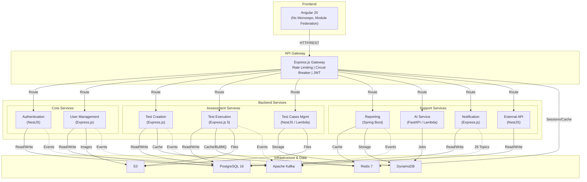

# Dodokpo Assessment Platform -- Project Overview

## Purpose

Dodokpo is a comprehensive, multi-tenant technical assessment platform built by Amali-Tech. It provides end-to-end solutions for creating, administering, proctoring, and evaluating technical assessments including coding challenges, essays, multiple-choice questions, and automated tests.

## Executive Summary

The platform enables organizations to:
- **Create** tests and assessments with multiple question types (coding, essay, multiple-choice, true/false, fill-in-the-blank, matrix matching)
- **Dispatch** assessments to candidates via email, generic links, or bulk operations
- **Proctor** test sessions with webcam monitoring, screenshot capture, tab-switching detection, face verification, and ID document OCR
- **Execute code** in real-time via Judge0 integration with support for JavaScript, TypeScript, Python, and Java
- **Mark automatically** using AI (OpenAI GPT-4, Google Gemini, or Amali AI) for essays and code review
- **Report** with detailed analytics, comparative analysis, candidate trajectories, and AI-powered insights
- **Manage** users, roles, organizations, skills, and domains with granular RBAC

### High-Level System Architecture

## Tech Stack Summary

| Layer | Technology | Version |
|-------|-----------|---------|
| **Frontend** | Angular | 20 |
| **Frontend Build** | Nx + Webpack + Module Federation | Nx 22.6 |
| **Frontend UI** | Angular Material, PrimeNG, TailwindCSS | |
| **Frontend State** | NgRx Component Store | 20.1 |
| **Backend (Node.js)** | Express.js, NestJS | Express 4/5, NestJS 10/11 |
| **Backend (Java)** | Spring Boot | 3.1.4, Java 21 |
| **Backend (Python)** | FastAPI | 0.115+ |
| **Databases** | PostgreSQL | 16 |
| **Cache** | Redis | 7 |
| **NoSQL** | DynamoDB | AWS |
| **Object Storage** | S3 | AWS |
| **Messaging** | Apache Kafka | via KafkaJS / Spring Kafka |
| **Job Queue** | BullMQ | Redis-backed |
| **Code Execution** | Judge0 | External API |
| **AI Providers** | OpenAI, Google Gemini, Amali AI | GPT-4, Gemini 2.5 Flash |
| **Serverless** | AWS Lambda | via Mangum / Serverless Framework |
| **CI/CD** | Jenkins | Smart change detection |
| **Monitoring** | Sentry, OpenTelemetry/Jaeger, Prometheus | |
| **Code Quality** | SonarQube, ESLint, Prettier, Ruff | |
| **Containerization** | Docker, Docker Compose | |
| **Cloud** | AWS (S3, Lambda, DynamoDB, CodeDeploy, CloudFront) | |

### Technology Stack Layers

```mermaid
flowchart LR
    subgraph FE["Frontend Layer"]
        direction TB
        Angular20["Angular 20"]
        Nx["Nx Monorepo"]
        Tailwind["TailwindCSS"]
        NgRx["NgRx Component Store"]
    end

    subgraph GW["Gateway Layer"]
        direction TB
        Express["Express.js"]
        RateLimit["Rate Limiting"]
        CB["Circuit Breaker"]
    end

    subgraph BE["Backend Layer"]
        direction TB
        Node["Express / NestJS<br/>(Node.js)"]
        Java["Spring Boot<br/>(Java 21)"]
        Python["FastAPI<br/>(Python)"]
    end

    subgraph Data["Data Layer"]
        direction TB
        PG["PostgreSQL 16"]
        Redis["Redis 7"]
        Dynamo["DynamoDB"]
        S3["S3"]
    end

    subgraph Infra["Infrastructure Layer"]
        direction TB
        Docker["Docker /<br/>Docker Compose"]
        Kafka["Apache Kafka"]
        Lambda["AWS Lambda"]
        Jenkins["Jenkins CI/CD"]
    end

    FE -->|REST API| GW
    GW -->|Proxy| BE
    BE -->|Read/Write| Data
    BE -->|Deploy/Run| Infra
    Data ---|Hosted on| Infra
```

## Architecture Type

**Microservices with API Gateway** -- event-driven via Apache Kafka.

- **Repository Structure**: Multi-part (2 separate git repos in one workspace)
- **Backend**: Monorepo with 10 microservices + 1 shared package
- **Frontend**: Nx monorepo with 2 Angular apps (Module Federation) + 1 shared library

## Service Inventory

| Service | Language/Framework | Database | Purpose |
|---------|-------------------|----------|---------|
| api-gateway | Express.js/TypeScript | Redis | Traffic routing, rate limiting, circuit breaker, JWT re-signing |
| authentication | NestJS/TypeScript | PostgreSQL (Prisma) | JWT auth, session management, password lifecycle |
| user-management | Express.js/TypeScript | PostgreSQL (Sequelize) | Users, roles, permissions, organizations, applications |
| test-creation | Express.js/TypeScript | PostgreSQL (Prisma), Redis | Tests, questions, assessments, skills, domains, dispatching |
| test-execution | Express.js 5/TypeScript | PostgreSQL (Prisma), Redis | Test delivery, proctoring, code execution, AI marking |
| test-cases-management | NestJS 11/TypeScript (Lambda) | DynamoDB, S3 | Code test case CRUD |
| reporting | Spring Boot/Java | DynamoDB, Redis | Analytics, scoring, comparative analysis, webhooks |
| ai | FastAPI/Python (Lambda) | DynamoDB (jobs) | Essay marking, code review, question generation, analytics |
| notification | Express.js/TypeScript | PostgreSQL (Prisma) | Email, SSE in-app notifications (26 Kafka topics) |
| external-api-integration | NestJS/TypeScript | PostgreSQL (Prisma), Redis | Third-party API key management |
| feature-flag-client | TypeScript (shared pkg) | In-memory | Feature flag cache + Express guard middleware |

## Frontend Apps

| App | Role | Key Features |
|-----|------|-------------|
| dodokpo-core | Module Federation Host | Dashboard, test management, user management, reports, test-taking |
| dodokpo-next | Module Federation Remote | Future feature expansion (currently scaffold) |
| libs/shared | Shared Library | 13 services, 50+ interfaces, 3 directives, design tokens, permissions |
