# Epic & Story Breakdown -- Dodokpo Assessment Platform

**Author:** Thomas
**Date:** 2026-04-15
**Framework:** Nexus (2 Scrum Teams, 2-week sprints)


## 2. FR Coverage Map

Every FR maps to exactly one epic. No gaps, no overlaps.

| FR | Epic | Story |
|----|------|-------|
| FR1 | E2: Difficulty Classification & Intelligent Assembly | 2.1 |
| FR2 | E7: Calibration Pipeline | 7.1 |
| FR3 | E7: Calibration Pipeline | 7.1 |
| FR4 | E2: Difficulty Classification & Intelligent Assembly | 2.2 |
| FR5 | E2: Difficulty Classification & Intelligent Assembly | 2.3 |
| FR6 | E7: Calibration Pipeline | 7.2 |
| FR7 | E2: Difficulty Classification & Intelligent Assembly | 2.4 |
| FR8 | E2: Difficulty Classification & Intelligent Assembly | 2.5 |
| FR9 | E2: Difficulty Classification & Intelligent Assembly | 2.5 |
| FR10 | E2: Difficulty Classification & Intelligent Assembly | 2.6 |
| FR11 | E3: AI Question Generation & Duplicate Detection | 3.3 |
| FR12 | E3: AI Question Generation & Duplicate Detection | 3.4 |
| FR13 | E3: AI Question Generation & Duplicate Detection | 3.5 |
| FR14 | E3: AI Question Generation & Duplicate Detection | 3.1 |
| FR15 | E3: AI Question Generation & Duplicate Detection | 3.2 |
| FR16 | E1: Question Versioning & Lifecycle | 1.1 |
| FR17 | E1: Question Versioning & Lifecycle | 1.2 |
| FR18 | E1: Question Versioning & Lifecycle | 1.3 |
| FR19 | E1: Question Versioning & Lifecycle | 1.4 |
| FR20 | E4: Bulk Upload & Question Governance | 4.1 |
| FR21 | E4: Bulk Upload & Question Governance | 4.2 |
| FR22 | E9: Assessment Lifecycle & Reporting Enrichment | 9.1 |
| FR23 | E9: Assessment Lifecycle & Reporting Enrichment | 9.1 |
| FR24 | E9: Assessment Lifecycle & Reporting Enrichment | 9.2 |
| FR25 | E9: Assessment Lifecycle & Reporting Enrichment | 9.2 |
| FR26 | E5: Multi-File Coding IDE | 5.1 |
| FR27 | E6: Auto-Grading & AI Code Review | 6.1 |
| FR28 | E6: Auto-Grading & AI Code Review | 6.2 |
| FR29 | E6: Auto-Grading & AI Code Review | 6.1 |
| FR30 | E6: Auto-Grading & AI Code Review | 6.3 |
| FR31 | E6: Auto-Grading & AI Code Review | 6.1 |
| FR32 | E6: Auto-Grading & AI Code Review | 6.4 |
| FR33 | E8: Pre-Test Compatibility & Candidate Experience | 8.1 |
| FR34 | E8: Pre-Test Compatibility & Candidate Experience | 8.2 |
| FR35 | E8: Pre-Test Compatibility & Candidate Experience | 8.2 |
| FR36 | E8: Pre-Test Compatibility & Candidate Experience | 8.5 |
| FR37 | E8: Pre-Test Compatibility & Candidate Experience | 8.5 |
| FR38 | E8: Pre-Test Compatibility & Candidate Experience | 8.5 |
| FR39 | E8: Pre-Test Compatibility & Candidate Experience | 8.5 |
| FR40 | E8: Pre-Test Compatibility & Candidate Experience | 8.6 |
| FR41 | E8: Pre-Test Compatibility & Candidate Experience | 8.3 |
| FR42 | E8: Pre-Test Compatibility & Candidate Experience | 8.4 |
| FR43 | E10: Adaptive Testing Engine | 10.1 |
| FR44 | E10: Adaptive Testing Engine | 10.1 |
| FR45 | E10: Adaptive Testing Engine | 10.1 |
| FR46 | E10: Adaptive Testing Engine | 10.2 |
| FR47 | E10: Adaptive Testing Engine | 10.3 |
| FR48 | E9: Assessment Lifecycle & Reporting Enrichment | 9.3 |
| FR49 | E9: Assessment Lifecycle & Reporting Enrichment | 9.3 |
| FR50 | E9: Assessment Lifecycle & Reporting Enrichment | 9.3 |
| FR51 | E9: Assessment Lifecycle & Reporting Enrichment | 9.4 |
| FR52 | E9: Assessment Lifecycle & Reporting Enrichment | 9.4 |
| FR53 | E9: Assessment Lifecycle & Reporting Enrichment | 9.5 |
| FR54 | E9: Assessment Lifecycle & Reporting Enrichment | 9.5 |
| FR55 | E9: Assessment Lifecycle & Reporting Enrichment | 9.6 |
| FR56 | E9: Assessment Lifecycle & Reporting Enrichment | 9.6 |
| FR57 | E9: Assessment Lifecycle & Reporting Enrichment | 9.7 |
| FR58 | E9: Assessment Lifecycle & Reporting Enrichment | 9.8 |
| FR59 | E9: Assessment Lifecycle & Reporting Enrichment | 9.7 |
| FR60 | E9: Assessment Lifecycle & Reporting Enrichment | 9.8 |
| FR61 | E9: Assessment Lifecycle & Reporting Enrichment | 9.9 |
| FR62 | E9: Assessment Lifecycle & Reporting Enrichment | 9.7 |
| FR63 | E9: Assessment Lifecycle & Reporting Enrichment | 9.10 |
| FR64 | E9: Assessment Lifecycle & Reporting Enrichment | 9.10 |
| FR65 | E9: Assessment Lifecycle & Reporting Enrichment | 9.10 |
| FR66 | E9: Assessment Lifecycle & Reporting Enrichment | 9.10 |
| FR67 | E9: Assessment Lifecycle & Reporting Enrichment | 9.11 |
| FR68 | E9: Assessment Lifecycle & Reporting Enrichment | 9.11 |
| FR69 | E9: Assessment Lifecycle & Reporting Enrichment | 9.11 |
| FR70 | E9: Assessment Lifecycle & Reporting Enrichment | 9.9 |
| FR71 | E10: Adaptive Testing Engine | 10.4 |
| FR72 | E9: Assessment Lifecycle & Reporting Enrichment | 9.9 |


## 4. Epic List

### Epic 1: Question Versioning & Lifecycle
**Team:** Team A
**Goal:** Enable version-controlled question editing with full history, rollback, archiving, and cross-org global question sharing -- so that no question change ever corrupts historical assessment results and the question bank can be governed at scale.
**FRs Covered:** FR16, FR17, FR18, FR19
**Feature Flag:** `q2_question_versioning`
**Dependencies:** None (foundational -- must be first)
**NFRs Addressed:** NFR8 (scalable question bank), NFR19 (backward-compatible migrations)

### Epic 2: Difficulty Classification & Intelligent Assembly
**Team:** Team A
**Goal:** Classify every question by difficulty tier and Bloom's Taxonomy, then let test managers build tests by specifying distribution targets that the system fills automatically -- transforming test assembly from manual curation to intelligent composition.
**FRs Covered:** FR1, FR4, FR5, FR7, FR8, FR9, FR10
**Feature Flags:** `q2_difficulty_calibration`, `q2_blooms_taxonomy`
**Dependencies:** E1 (versioning schema must exist for override tracking)
**NFRs Addressed:** NFR8 (sub-second search with classification filters)

### Epic 3: AI Question Generation & Duplicate Detection
**Team:** Team A
**Goal:** Detect near-duplicate questions to prevent bank pollution, and generate new questions via AI with a governed human review workflow -- reducing manual curation effort by 40-60%.
**FRs Covered:** FR11, FR12, FR13, FR14, FR15
**Feature Flags:** `q2_duplicate_detection`, `q2_ai_question_gen`
**Dependencies:** E1 (versioning needed for review/edit flow of AI-generated questions)
**NFRs Addressed:** NFR8 (embedding search at scale)

### Epic 4: Bulk Upload & Question Governance
**Team:** Team A
**Goal:** Enable mass ingestion of coding questions via CSV/JSON with validation, progress tracking, and error reporting -- eliminating one-by-one manual entry for large question sets.
**FRs Covered:** FR20, FR21
**Feature Flag:** `q2_bulk_upload_coding`
**Dependencies:** E1 (versioning schema for new questions), E3 (optional: duplicate check on upload)
**NFRs Addressed:** NFR5 (500 questions per batch without timeout)

### Epic 5: Multi-File Coding IDE
**Team:** Team B
**Goal:** Let candidates work across multiple files in a project-style IDE during coding assessments -- mimicking real development work instead of artificial single-file exercises.
**FRs Covered:** FR26
**Feature Flag:** `q2_multifile_coding`
**Dependencies:** None (independent, can start immediately)
**NFRs Addressed:** NFR4 (LCP < 2.5s for editor), NFR7 (100 concurrent takers)

### Epic 6: Auto-Grading & AI Code Review
**Team:** Team B
**Goal:** Auto-grade coding submissions using public and hidden test cases with resource constraints, display transparent execution logs, and supplement with AI code quality review -- achieving 80%+ reduction in manual coding review.
**FRs Covered:** FR27, FR28, FR29, FR30, FR31, FR32
**Feature Flag:** `q2_multifile_coding` (shared with E5)
**Dependencies:** E5 (multi-file IDE must be functional for project-style grading)
**NFRs Addressed:** NFR2 (p99 < 10s auto-grading), NFR7 (concurrent load)

### Epic 7: Calibration Pipeline
**Team:** Team A
**Goal:** Continuously recalibrate question difficulty tiers from real candidate performance data -- making the question bank self-maintaining rather than relying on subjective difficulty assignment.
**FRs Covered:** FR2, FR3, FR6
**Feature Flag:** `q2_difficulty_calibration`
**Dependencies:** E2 (difficulty schema and Bloom's classification must exist)
**NFRs Addressed:** NFR9 (event consumer < 5s), NFR18 (at-least-once event delivery)

### Epic 8: Pre-Test Compatibility & Candidate Experience
**Team:** Team B
**Goal:** Validate browser, OS, network stability, camera, mic, and screen-sharing before assessments begin, with clear remediation guidance -- eliminating surprise technical failures and reducing support tickets by ~30%.
**FRs Covered:** FR33, FR34, FR35, FR36, FR37, FR38, FR39, FR40, FR41, FR42
**Feature Flag:** `q2_compatibility_check`, `q2_accessibility`
**Dependencies:** None (independent, can start immediately)
**NFRs Addressed:** NFR20-23 (WCAG 2.1 AA), NFR17 (session recovery)

### Epic 9: Assessment Lifecycle & Reporting Enrichment
**Team:** Team A (reporting enrichment) + Team B (assessment lifecycle, notifications, UI)
**Goal:** Strengthen the existing assessment creation, dispatch, user management, skills, reporting, notifications, feature flags, and external API capabilities -- enriching all existing flows with data from the new Q2 features (difficulty profiles, compatibility outcomes, auto-grading results).
**FRs Covered:** FR22, FR23, FR24, FR25, FR48, FR49, FR50, FR51, FR52, FR53, FR54, FR55, FR56, FR57, FR58, FR59, FR60, FR61, FR62, FR63, FR64, FR65, FR66, FR67, FR68, FR69, FR70, FR72
**Feature Flags:** Various (enrichment gated by individual feature flags)
**Dependencies:** E2 (difficulty data for reports), E7 (calibration data), E8 (compatibility data for reports)
**NFRs Addressed:** NFR1 (API response times), NFR6 (notification delivery < 2s), NFR15 (PII audit logging)

### Epic 10: Adaptive Testing Engine
**Team:** Team B
**Goal:** Dynamically adjust question difficulty during live assessments based on candidate performance, generating granular skill-level profiles -- so evaluators see precise capability breakdowns instead of flat percentage scores.
**FRs Covered:** FR43, FR44, FR45, FR46, FR47, FR71
**Feature Flag:** `q2_adaptive_testing`
**Dependencies:** E7 (calibrated difficulty tiers must be reliable), E2 (difficulty classification)
**NFRs Addressed:** NFR2 (real-time difficulty computation), NFR7 (concurrent takers)


#### Story 1.2: Version Comparison (Side-by-Side Diff)
**Team:** Team A
**FRs:** FR17

As a test manager,
I want to compare any two versions of a question side-by-side,
So that I can understand exactly what changed and make informed rollback decisions.

**Acceptance Criteria:**
- **Given** a question has 3 or more versions **When** a test manager selects two versions to compare **Then** the system displays both versions side-by-side with changed fields highlighted (additions in green, deletions in red)
- **Given** a comparison is displayed **When** the test manager reviews the diff **Then** all fields (content, options, correct answer, difficulty, Bloom's level, metadata) are included in the comparison
- **Given** a comparison shows a previous version is preferable **When** the test manager clicks "Rollback to this version" from the comparison view **Then** the system performs the rollback as described in Story 1.1


#### Story 1.4: Global Questions Across Organizations
**Team:** Team A
**FRs:** FR19

As a system admin,
I want to mark questions as global and make them reusable across designated organizations,
So that high-quality questions can be shared without duplication across AmaliTech's three business units.

**Acceptance Criteria:**
- **Given** a question exists in one organization **When** a system admin marks it as "Global" and designates target organizations **Then** the question becomes visible in those organizations' question pools
- **Given** a global question is available **When** a test manager in a target organization builds a test **Then** the global question appears in the pool alongside org-specific questions, clearly labeled as "Global"
- **Given** a global question is used in an assessment **When** the source organization edits the question **Then** a new version is created, and assessments in other orgs that used the previous version retain reference to that version
- **Given** a system admin **When** they revoke global status from a question **Then** the question is removed from other orgs' pools but assessments already using it retain their references
- **Given** the `manage_global_questions` permission is not granted **When** a user attempts to mark a question as global **Then** the system returns an authorization error


#### Story 2.2: Bloom's Taxonomy Assignment by Test Managers
**Team:** Team A
**FRs:** FR4

As a test manager,
I want to assign or override Bloom's Taxonomy levels on individual questions,
So that I can classify the cognitive demand of questions based on my domain expertise.

**Acceptance Criteria:**
- **Given** a question is displayed in the question editor **When** a test manager selects a Bloom's Taxonomy level from the dropdown **Then** the system saves the bloomsLevel and records the change in version history
- **Given** a question has a Bloom's level assigned **When** a test manager changes it **Then** a new version is created with the updated bloomsLevel and the change is visible in version history
- **Given** the blooms taxonomy feature flag is disabled **When** a test manager views the question editor **Then** the Bloom's Taxonomy selector is not displayed


#### Story 2.4: Difficulty and Bloom's Distribution Specification
**Team:** Team A
**FRs:** FR7

As a test manager,
I want to specify the desired distribution of difficulty tiers and Bloom's levels when building a test,
So that I can ensure balanced coverage appropriate for the role level being assessed.

**Acceptance Criteria:**
- **Given** a test manager is building a new assessment **When** they open the question distribution configuration **Then** they can specify percentages or counts per difficulty tier (e.g., 20% Beginner, 40% Intermediate, 30% Advanced, 10% Expert)
- **Given** the distribution configuration **When** the test manager also selects Bloom's Taxonomy distribution **Then** they can combine both (e.g., "3 Advanced Apply questions, 2 Intermediate Analyze questions")
- **Given** a distribution is configured **When** the pool has insufficient questions for a tier/level combination **Then** the system warns the test manager with specific shortfall details before proceeding


#### Story 2.6: Test Distribution Preview Before Dispatch
**Team:** Team A
**FRs:** FR10

As a test manager,
I want to preview the difficulty and Bloom's distribution of an assembled test before dispatching,
So that I can verify the assessment is balanced and appropriate.

**Acceptance Criteria:**
- **Given** a test has been assembled (manually or via auto-fill) **When** the test manager opens the distribution preview **Then** the system displays a breakdown chart showing count per difficulty tier and count per Bloom's level
- **Given** the preview is displayed **When** the test manager identifies an imbalance **Then** they can return to editing to adjust the selection before dispatch
- **Given** the preview shows the distribution **When** it includes both difficulty and Bloom's axes **Then** a cross-tabulation matrix is displayed (rows = difficulty tiers, columns = Bloom's levels)


#### Story 3.2: Duplicate Detection Threshold and Blocking
**Team:** Team A
**FRs:** FR15

As an organization admin,
I want to configure the similarity threshold and blocking behavior for duplicate detection,
So that I can tune precision/recall for my organization's question bank.

**Acceptance Criteria:**
- **Given** an organization admin accesses duplicate detection settings **When** they adjust the similarity threshold (0-100%) **Then** the system uses the new threshold for all subsequent duplicate checks in that organization
- **Given** a question exceeds the threshold **When** blocking mode is enabled **Then** the system prevents publishing and requires the test manager to acknowledge or dismiss each flagged duplicate
- **Given** a question exceeds the threshold **When** blocking mode is disabled (warning only) **Then** the system shows the warning but allows publishing without dismissal


#### Story 3.4: AI-Generated Question Review Workflow
**Team:** Team A
**FRs:** FR12

As a test manager,
I want AI-generated questions to enter a human review workflow before becoming active,
So that no AI-generated question enters the bank without human validation.

**Acceptance Criteria:**
- **Given** the AI service has generated a batch of questions **When** generation completes **Then** each question is created with status "pending_review" and does not appear in active question pools
- **Given** pending review questions exist **When** a test manager opens the review queue **Then** they see all AI-generated questions awaiting review with their generation parameters and AI-assigned metadata
- **Given** a question is in pending_review status **When** a test manager reviews it **Then** they can approve (status becomes active), edit (opens editor with version tracking), or reject (status becomes rejected with reason)


### Epic 4: Bulk Upload & Question Governance

#### Story 4.1: Coding Question Bulk Upload via CSV/JSON
**Team:** Team A
**FRs:** FR20

As a test manager,
I want to bulk upload coding questions via a CSV or JSON template,
So that I can ingest large question sets in one operation instead of creating each manually.

**Acceptance Criteria:**
- **Given** a test manager accesses the bulk upload interface **When** they click "Download Template" **Then** they receive a CSV and JSON template with columns for question content, language (JS/TS/Python/Java), test cases (public and hidden), difficulty tier, Bloom's level, time limit, and memory limit
- **Given** a completed template file **When** the test manager uploads it **Then** the system validates the file format, required fields, test case syntax, and language support before processing
- **Given** validation passes **When** the upload is processed **Then** each question is created with an initial version and enters the bank (with duplicate detection if enabled)
- **Given** validation fails for some rows **When** processing completes **Then** valid questions are ingested and invalid rows are skipped with specific error details per row
- **Given** the `q2_bulk_upload_coding` feature flag is disabled **When** a test manager accesses question management **Then** the bulk upload option is not displayed


### Epic 5: Multi-File Coding IDE

#### Story 5.1: Multi-File Project Editor (Frontend)
**Team:** Team B
**FRs:** FR26

As a candidate,
I want to work across multiple files in a project-style IDE during coding assessments,
So that the assessment mimics real development work with proper file organization.

**Acceptance Criteria:**
- **Given** a coding question is configured for multi-file mode **When** a candidate opens the question **Then** a file tree panel is displayed on the left showing the project structure (e.g., main.py, utils.py, test_solution.py)
- **Given** the file tree is visible **When** the candidate clicks a file **Then** the Monaco editor opens that file's content in a new tab, and the candidate can switch between open tabs
- **Given** multiple files are open **When** the candidate edits code in one file **Then** changes are preserved when switching to another tab, and all files are included in the submission
- **Given** the candidate clicks "Run" **When** the multi-file project is submitted for execution **Then** the system sends all files to the execution engine (Judge0) as a single project submission
- **Given** the `q2_multifile_coding` feature flag is disabled **When** a candidate opens a coding question **Then** the existing single-file editor is displayed


#### Story 5.3: Multi-File Execution via Judge0
**Team:** Team B
**FRs:** FR26

As a candidate,
I want my multi-file project to execute correctly with all files included,
So that I can test my solution as a complete project, not isolated fragments.

**Acceptance Criteria:**
- **Given** a candidate submits a multi-file project for execution **When** the system processes the submission **Then** all files are bundled and sent to Judge0 as a single execution request with the correct entry point
- **Given** the execution completes **When** results are returned **Then** the candidate sees stdout, stderr, and execution status for the entire project run
- **Given** execution fails due to a syntax error in one file **When** the error is returned **Then** the error message identifies the specific file and line number
- **Given** multiple candidates execute simultaneously **When** the system processes concurrent submissions **Then** executions are isolated and do not interfere with each other (sandboxed)


#### Story 6.2: Test Case Execution Logs Display
**Team:** Team B
**FRs:** FR28

As a candidate,
I want to see clear pass/fail logs for each test case with execution time and memory usage,
So that I can understand which test cases my solution passes and where it fails.

**Acceptance Criteria:**
- **Given** auto-grading has completed **When** the candidate views results **Then** each public test case is listed with: status (pass/fail/TLE/MLE), execution time (ms), memory usage (MB), expected output, and actual output
- **Given** hidden test cases exist **When** the candidate views results **Then** hidden test cases show only status (pass/fail) without revealing inputs or expected outputs
- **Given** a test case fails **When** the candidate reviews the log **Then** the expected vs actual output diff is clearly displayed for public test cases


#### Story 6.4: AI Code Quality Review
**Team:** Team B
**FRs:** FR32

As a test manager,
I want AI to review candidate code for quality, patterns, and best practices,
So that evaluation goes beyond test case pass/fail to assess code craftsmanship.

**Acceptance Criteria:**
- **Given** a candidate submits a coding solution **When** auto-grading completes **Then** the system sends the code to the AI service for quality review
- **Given** the AI reviews the code **When** the analysis completes **Then** the system generates a quality report covering: code style, naming conventions, design patterns, efficiency, and best practices
- **Given** the AI review is complete **When** the test manager views the candidate's result **Then** the AI quality report is displayed alongside the auto-grading results with a transparent scoring rationale
- **Given** multiple AI providers are configured **When** the AI review runs **Then** the system uses the configured provider (OpenAI, Gemini, or Amali AI) with consistent scoring within acceptable variance


#### Story 7.2: Under-Calibrated Question Flagging
**Team:** Team A
**FRs:** FR6

As a test manager,
I want the system to flag questions with insufficient performance data for calibration review,
So that I know which questions have unreliable difficulty classifications.

**Acceptance Criteria:**
- **Given** a question has fewer responses than the minimum sample size **When** a test manager views the question list or detail **Then** the question displays an "Under-calibrated" badge with the current sample count and required minimum
- **Given** the calibration dashboard is open **When** a test manager filters by calibration status **Then** they can see all under-calibrated questions sorted by sample size (lowest first)
- **Given** an under-calibrated question is used in a test **When** the test manager views the distribution preview **Then** a warning indicates that some questions have unreliable difficulty classifications


#### Story 8.2: Network Stability and Hardware Check
**Team:** Team B
**FRs:** FR34, FR35

As a candidate,
I want the system to check my network stability, camera, microphone, and screen sharing capability,
So that I can resolve any issues before the timed assessment begins.

**Acceptance Criteria:**
- **Given** the compatibility check runs **When** the network test executes **Then** the system measures latency (ping) and bandwidth (download speed estimate) and reports pass/fail based on minimum thresholds
- **Given** the assessment requires proctoring **When** the hardware check runs **Then** the system verifies camera access, microphone access, and screen sharing permission
- **Given** any check fails **When** the candidate views results **Then** the system provides specific remediation guidance (e.g., "Your network connection is unstable. We recommend switching to a wired connection or moving closer to your router.")
- **Given** remediation guidance is displayed **When** the candidate resolves the issue **Then** they can click "Re-run Check" to validate the fix without refreshing the page


#### Story 8.4: Assessment Rejection Rate Tracking
**Team:** Team B
**FRs:** FR42

As a system admin,
I want the system to track assessment rejection rates caused by technical issues and surface trends,
So that I can measure the impact of compatibility checks on reducing rejections.

**Acceptance Criteria:**
- **Given** assessments are completed or invalidated **When** the system records outcomes **Then** technical rejections (network drop, browser crash, hardware failure) are categorized separately from proctoring violations
- **Given** rejection data is collected **When** a system admin views the trends dashboard **Then** they see rejection rates over time, with a before/after comparison for when compatibility checks were enabled
- **Given** a spike in rejections is detected **When** the admin views the data **Then** they can filter by organization, assessment, browser, OS, and time period


#### Story 8.6: Candidate Results Viewing
**Team:** Team B
**FRs:** FR40

As a candidate,
I want to view my assessment results after completion when the test manager has enabled result sharing,
So that I receive feedback on my performance.

**Acceptance Criteria:**
- **Given** a test manager has configured result sharing for an assessment **When** a candidate completes the assessment **Then** the candidate can view their results page showing overall score, per-question scores, and time spent
- **Given** result sharing is disabled **When** a candidate completes the assessment **Then** the results page shows a "Thank you for completing the assessment" message without scores
- **Given** a coding assessment with auto-grading **When** the candidate views results **Then** public test case pass/fail results are displayed (hidden test cases show only pass/fail counts without details)


#### Story 9.2: Assessment Tagging and Dispatch History
**Team:** Team B
**FRs:** FR24, FR25

As a test manager,
I want to tag assessments and view dispatch history,
So that I can organize assessments and recall or review past dispatches.

**Acceptance Criteria:**
- **Given** a test manager is managing assessments **When** they add tags to an assessment **Then** the tags are saved and the assessment can be filtered by those tags
- **Given** assessments have been dispatched **When** the test manager views dispatch history **Then** they see a list of all dispatches with date, method, recipient count, and status
- **Given** an active dispatch **When** the test manager clicks "Recall" **Then** the dispatch is deactivated and candidates can no longer access the assessment via those links


#### Story 9.4: Organization Management
**Team:** Team B
**FRs:** FR51, FR52

As a system admin,
I want to manage organizations and review applications,
So that new organizations can be onboarded through a governed process.

**Acceptance Criteria:**
- **Given** a system admin accesses organization management **When** they create, activate, deactivate, or remove an organization **Then** the action is performed and audit-logged
- **Given** new organization applications are submitted **When** a system admin reviews them **Then** they can approve (creates org + admin account) or reject (sends rejection notification) with reason


#### Story 9.6: Skills Bulk Upload and CMS Integration
**Team:** Team A
**FRs:** FR55, FR56

As a test manager,
I want to bulk upload skills via CSV and map them to external systems,
So that skills can be synchronized with AmaliTech's CMS without manual entry.

**Acceptance Criteria:**
- **Given** a test manager has a CSV of skills **When** they upload it **Then** the system validates and creates skills with hierarchical levels as specified
- **Given** skills exist in the system **When** a test manager maps a skill to an external system ID **Then** the mapping is stored and available via API for CMS integration
- **Given** skills are mapped **When** the CMS queries via API **Then** the external system receives skill data with assessment assignments


#### Story 9.8: AI-Powered Analytics and Real-Time Streaming
**Team:** Team A
**FRs:** FR58, FR60

As a test manager,
I want AI-powered performance analysis that streams insights in real-time,
So that I receive actionable analytics without waiting for batch reports.

**Acceptance Criteria:**
- **Given** assessment results are available **When** the test manager requests AI analysis **Then** the system sends performance data to the AI service and streams insights back via SSE
- **Given** the AI analysis is streaming **When** the test manager views the analytics panel **Then** insights appear progressively (not all at once) with candidate performance patterns, question effectiveness metrics, and recommendations
- **Given** question analytics are enabled **When** the AI analyzes question performance **Then** metrics include discrimination index, difficulty alignment accuracy, and under-performing question flags


#### Story 9.10: Notification Enhancements for Q2 Events
**Team:** Team B
**FRs:** FR63, FR64, FR65, FR66

As a user,
I want to receive real-time notifications for new Q2 events (calibration changes, duplicate detection alerts, compatibility check results),
So that I stay informed about platform activity relevant to my role.

**Acceptance Criteria:**
- **Given** a question's difficulty tier changes via calibration **When** the `question-calibrated` Kafka event fires **Then** relevant test managers receive an in-app notification
- **Given** a duplicate is detected during question creation **When** the `question-duplicate-detected` event fires **Then** the creating test manager receives a notification
- **Given** notification preferences are configured **When** a user has disabled a notification category **Then** notifications of that category are not delivered to that user
- **Given** a user has unread notifications **When** they open the notification panel **Then** they can mark as read, mark as unread, and bulk-manage notifications


### Epic 10: Adaptive Testing Engine

#### Story 10.1: Dynamic Difficulty Adjustment During Assessment
**Team:** Team B
**FRs:** FR43, FR44, FR45

As a candidate,
I want the system to dynamically adjust question difficulty based on my performance,
So that I am assessed at my true skill level rather than a fixed difficulty.

**Acceptance Criteria:**
- **Given** adaptive mode is enabled for an assessment **When** a candidate answers a question correctly **Then** the system selects the next question from a higher difficulty tier (if available)
- **Given** a candidate answers incorrectly **When** the system selects the next question **Then** it selects from a lower difficulty tier (if available)
- **Given** a candidate is at the Expert tier and answers correctly **When** the system selects the next question **Then** it remains at Expert tier (ceiling)
- **Given** a candidate is at the Beginner tier and answers incorrectly **When** the system selects the next question **Then** it remains at Beginner tier (floor)
- **Given** difficulty tiers have not been calibrated (all questions are under-calibrated) **When** adaptive mode is enabled **Then** the system falls back to random selection and logs a warning


#### Story 10.3: Adaptive Mode Configuration
**Team:** Team B
**FRs:** FR47

As a test manager,
I want to enable or disable adaptive mode per assessment,
So that I can choose between fixed-difficulty and adaptive assessments based on the evaluation goal.

**Acceptance Criteria:**
- **Given** a test manager configures an assessment **When** they toggle "Adaptive Mode" on **Then** the assessment uses the adaptive difficulty algorithm during test-taking
- **Given** adaptive mode is enabled **When** the test manager also specifies a starting difficulty tier **Then** the first question is drawn from that tier
- **Given** adaptive mode is disabled **When** candidates take the assessment **Then** questions are served in the fixed order or randomized from pools as before (no difficulty adjustment)
- **Given** the `q2_adaptive_testing` feature flag is disabled **When** a test manager views assessment configuration **Then** the "Adaptive Mode" toggle is not displayed


## 6. Implementation Sequence

### Sprint-by-Sprint Timeline (Recommended)

The following timeline spans 6 sprints (12 weeks) aligned with Q2 2026.

```mermaid
gantt
    title Dodokpo Q2 2026 -- Sprint-by-Sprint Implementation
    dateFormat YYYY-MM-DD
    axisFormat %b %d

    section Team A
    S1: E1 - Question Versioning (1.1, 1.2)           :a1, 2026-04-20, 14d
    S2: E1 - Archiving, Global (1.3, 1.4)             :a2, after a1, 14d
    S2: E2 - Schema + Bloom's (2.1, 2.2)              :a2b, after a1, 14d
    S3: E2 - Override, Distribution (2.3, 2.4)         :a3, after a2, 14d
    S3: E3 - Duplicate Detection (3.1, 3.2)            :a3b, after a2, 14d
    S4: E2 - Intelligent Select, Preview (2.5, 2.6)    :a4, after a3, 14d
    S4: E3 - AI Gen Trigger + Review (3.3, 3.4)        :a4b, after a3, 14d
    S5: E3 - AI Approve/Reject (3.5)                   :a5, after a4, 14d
    S5: E4 - Bulk Upload (4.1, 4.2)                    :a5b, after a4, 14d
    S5: E7 - Calibration Score (7.1)                   :a5c, after a4, 14d
    S6: E7 - Under-calibrated Flagging (7.2)           :a6, after a5, 14d
    S6: E9A - Reporting + Webhooks (9.5-9.9)           :a6b, after a5, 14d

    section Team B
    S1: E5 - Multi-File Editor (5.1, 5.2)              :b1, 2026-04-20, 14d
    S1: E8 - Browser/OS Check (8.1)                    :b1b, 2026-04-20, 14d
    S2: E5 - Judge0 Multi-File (5.3)                   :b2, after b1, 14d
    S2: E8 - Network/Hardware Check (8.2)              :b2b, after b1, 14d
    S3: E6 - Auto-Grading + Logs (6.1, 6.2)           :b3, after b2, 14d
    S3: E8 - Compat Analytics (8.3, 8.4)               :b3b, after b2, 14d
    S4: E6 - Test Case Mgmt + AI Review (6.3, 6.4)    :b4, after b3, 14d
    S4: E8 - Proctoring + Results (8.5, 8.6)           :b4b, after b3, 14d
    S5: E9B - Assessment CRUD, Tags (9.1-9.4)          :b5, after b4, 14d
    S5: E9B - Notifications, Flags (9.10, 9.11)        :b5b, after b4, 14d
    S6: E10 - Adaptive Engine (10.1, 10.2)             :b6, after b5, 14d
    S6: E10 - Config + API (10.3, 10.4)                :b6b, after b5, 14d
```

### Sprint Summary Table

| Sprint | Team A | Team B | Integration Points |
|--------|--------|--------|-------------------|
| S1 (Apr 20 - May 3) | E1: Stories 1.1, 1.2 (Versioning schema, diff) | E5: Stories 5.1, 5.2 (Multi-file editor, config); E8: Story 8.1 (Browser/OS check) | None -- both teams work independently |
| S2 (May 4 - May 17) | E1: Stories 1.3, 1.4 (Archive, global); E2: Stories 2.1, 2.2 (Schema, Bloom's) | E5: Story 5.3 (Judge0 multi-file); E8: Story 8.2 (Network/hardware) | Team B needs question schema awareness from E2 for coding question format |
| S3 (May 18 - May 31) | E2: Stories 2.3, 2.4 (Override, distribution); E3: Stories 3.1, 3.2 (Duplicate detection) | E6: Stories 6.1, 6.2 (Auto-grading, logs); E8: Stories 8.3, 8.4 (Analytics) | Team B auto-grading events consumed by Team A's reporting pipeline |
| S4 (Jun 1 - Jun 14) | E2: Stories 2.5, 2.6 (Auto-fill, preview); E3: Stories 3.3, 3.4 (AI gen, review) | E6: Stories 6.3, 6.4 (Test cases, AI review); E8: Stories 8.5, 8.6 (Proctoring, results) | AI service shared: Team A generation, Team B code review |
| S5 (Jun 15 - Jun 28) | E3: Story 3.5 (Approve/reject); E4: Stories 4.1, 4.2 (Bulk upload); E7: Story 7.1 (Calibration) | E9B: Stories 9.1-9.4 (Assessment CRUD, users, orgs); Stories 9.10, 9.11 (Notifications, flags) | Calibration pipeline (A) consumes assessment events from test-execution (B) |
| S6 (Jun 29 - Jul 12) | E7: Story 7.2 (Under-calibrated flagging); E9A: Stories 9.5-9.9 (Reporting, webhooks) | E10: Stories 10.1-10.4 (Adaptive engine, profiles, API) | Adaptive engine (B) depends on calibrated tiers from calibration pipeline (A) |


## 8. Story Dependency Chain Per Team

```mermaid
flowchart TD
    subgraph "Team A -- Story Dependency Chain"
        A1_1["1.1: Version Schema"] --> A1_2["1.2: Version Diff"]
        A1_1 --> A1_3["1.3: Archiving"]
        A1_1 --> A1_4["1.4: Global Questions"]
        A1_1 --> A2_1["2.1: Difficulty Schema"]
        A2_1 --> A2_2["2.2: Bloom's Assignment"]
        A2_1 --> A2_3["2.3: Difficulty Override"]
        A2_3 --> A2_4["2.4: Distribution Config"]
        A2_4 --> A2_5["2.5: Intelligent Selection"]
        A2_5 --> A2_6["2.6: Distribution Preview"]
        A1_1 --> A3_1["3.1: Duplicate Engine"]
        A3_1 --> A3_2["3.2: Threshold Config"]
        A1_1 --> A3_3["3.3: AI Gen Trigger"]
        A3_3 --> A3_4["3.4: Review Workflow"]
        A3_4 --> A3_5["3.5: Approve/Reject"]
        A1_1 --> A4_1["4.1: Bulk Upload"]
        A4_1 --> A4_2["4.2: Progress/Errors"]
        A2_1 --> A7_1["7.1: Calibration Score"]
        A7_1 --> A7_2["7.2: Under-calibrated Flagging"]
        A7_1 --> A9_5["9.5: Skills Mgmt"]
        A9_5 --> A9_6["9.6: Skills Bulk Upload"]
        A7_1 --> A9_7["9.7: Enriched Reports"]
        A9_7 --> A9_8["9.8: AI Analytics"]
        A9_8 --> A9_9["9.9: Webhook Enrichment"]
    end

    subgraph "Team B -- Story Dependency Chain"
        B5_1["5.1: Multi-File Editor"] --> B5_2["5.2: Project Config"]
        B5_2 --> B5_3["5.3: Judge0 Multi-File"]
        B5_3 --> B6_1["6.1: Auto-Grading"]
        B6_1 --> B6_2["6.2: Execution Logs"]
        B6_1 --> B6_3["6.3: Test Case Mgmt"]
        B6_1 --> B6_4["6.4: AI Code Review"]
        B8_1["8.1: Browser/OS Check"] --> B8_2["8.2: Network/Hardware"]
        B8_2 --> B8_3["8.3: Compat Analytics"]
        B8_3 --> B8_4["8.4: Rejection Tracking"]
        B8_2 --> B8_5["8.5: Proctoring Debounce"]
        B8_5 --> B8_6["8.6: Candidate Results"]
        B6_4 --> B9_1["9.1: Assessment Dispatch"]
        B9_1 --> B9_2["9.2: Tags/History"]
        B8_6 --> B9_3["9.3: User RBAC"]
        B9_3 --> B9_4["9.4: Org Management"]
        B9_4 --> B9_10["9.10: Notifications"]
        B9_10 --> B9_11["9.11: Feature Flags"]
        B9_11 --> B10_1["10.1: Adaptive Engine"]
        B10_1 --> B10_2["10.2: Skill Profiles"]
        B10_1 --> B10_3["10.3: Adaptive Config"]
        B10_2 --> B10_4["10.4: Skill Profile API"]
    end

    style A1_1 fill:#4a90d9,color:#fff
    style A2_1 fill:#4a90d9,color:#fff
    style A7_1 fill:#4a90d9,color:#fff
    style B5_1 fill:#2ecc71,color:#fff
    style B8_1 fill:#2ecc71,color:#fff
    style B10_1 fill:#2ecc71,color:#fff
```




## 10. Feature Flag Mapping

All Q2 features are gated. The flag must be checked at both the API layer (backend) and the UI layer (frontend).

| Flag | Epic(s) | Stories | Default | Rollout Order |
|------|---------|---------|---------|---------------|
| `q2_question_versioning` | E1 | 1.1, 1.2, 1.3, 1.4 | disabled | Training Center, Recruitment, Service Center |
| `q2_difficulty_calibration` | E2, E7 | 2.1, 2.3, 2.5, 7.1, 7.2 | disabled | Training Center, Recruitment, Service Center |
| `q2_blooms_taxonomy` | E2 | 2.1, 2.2, 2.4, 2.6 | disabled | Training Center, Recruitment, Service Center |
| `q2_duplicate_detection` | E3 | 3.1, 3.2 | disabled | Training Center, Recruitment, Service Center |
| `q2_ai_question_gen` | E3 | 3.3, 3.4, 3.5 | disabled | Training Center, Recruitment, Service Center |
| `q2_bulk_upload_coding` | E4 | 4.1, 4.2 | disabled | Training Center, Recruitment, Service Center |
| `q2_multifile_coding` | E5, E6 | 5.1, 5.2, 5.3, 6.1, 6.2, 6.3, 6.4 | disabled | Training Center, Recruitment, Service Center |
| `q2_compatibility_check` | E8 | 8.1, 8.2, 8.3, 8.4 | disabled | Training Center, Recruitment, Service Center |
| `q2_accessibility` | E8 | 8.5, 8.6 (partial) | disabled | All orgs simultaneously |
| `q2_adaptive_testing` | E10 | 10.1, 10.2, 10.3, 10.4 | disabled | Training Center first (requires calibration maturity) |


## 12. Definition of Done (Shared)

A story is done when ALL of the following are satisfied:

1. All acceptance criteria pass (demonstrated in Sprint Review)
2. Code is merged to `main` with passing CI (unit tests + linting + type checks)
3. Feature flag gating verified (feature hidden when flag is off)
4. New API endpoints follow existing response format and path conventions
5. New Kafka events have documented schemas
6. Prisma/Sequelize migrations are backward-compatible (additive only)
7. Relevant NFRs are validated (performance, accessibility, security as applicable)
8. No regressions in existing tests
9. Cross-team contract tests pass (if story touches shared interfaces)
10. PII handling follows encryption and audit-logging requirements
