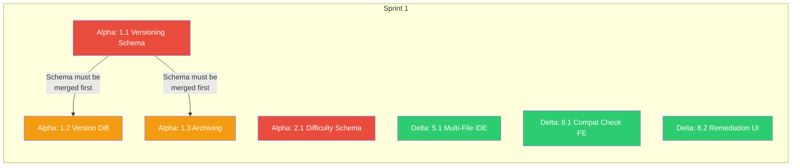
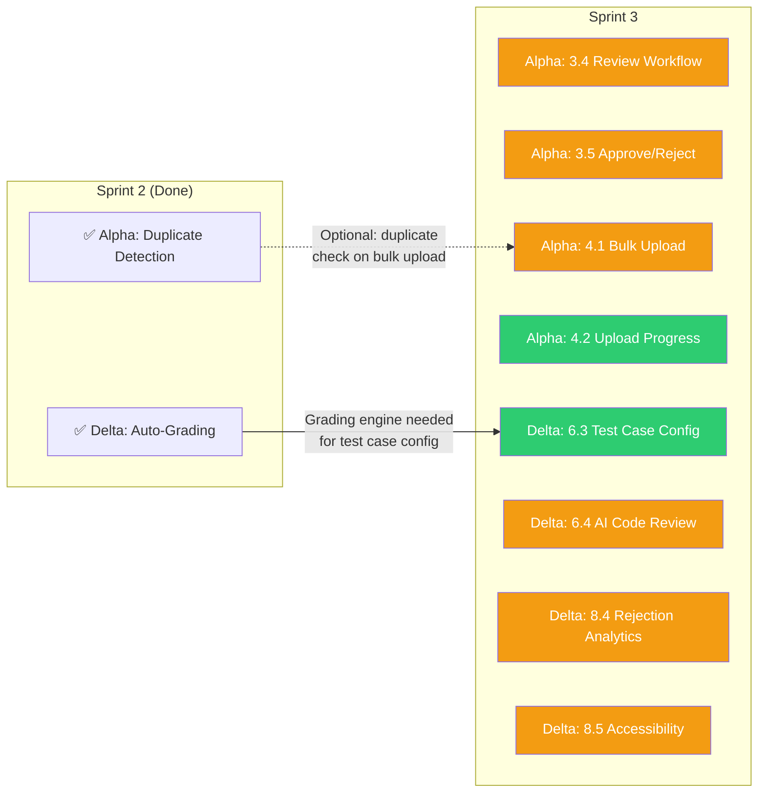
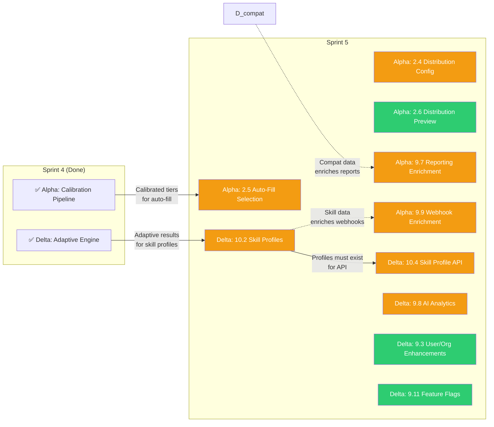
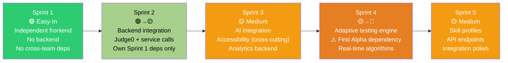

# Dodokpo Q2 2026 — Sprint Plan

**Framework:** Nexus (2 Scrum Teams, 2-week sprints, 1 Product Owner)
**Duration:** 5 sprints (10 weeks)
**Teams:** Team Alpha (experienced) + Team Delta (ramping up)

## Sprint-by-Sprint Breakdown

### Sprint 1 (Weeks 1-2): Foundations

**Sprint Goal:** Lay the foundational schemas and deliver independent frontend features.

#### Team Alpha — Sprint 1

| Story | Epic | FRs | Complexity | Description |
|-------|------|-----|-----------|-------------|
| 1.1 | E1 | FR16 | 🔴 Hard | Question Version Creation and History — new QuestionVersion Prisma model, append-only versioning, rollback, audit trail |
| 1.2 | E1 | FR17 | 🟡 Medium | Version Comparison (Side-by-Side Diff) — diff UI for question versions |
| 1.3 | E1 | FR18 | 🟡 Medium | Question Archiving — archive status, exclusion from pools, restore capability |
| 2.1 | E2 | FR1 | 🔴 Hard | Difficulty Tier + Bloom's Taxonomy Schema — Prisma migration, new enums, calibration fields |

**Alpha Sprint 1 Output:** Versioning schema live, archiving functional, difficulty/Bloom's schema deployed.

#### Team Delta — Sprint 1

| Story | Epic | FRs | Complexity | Description |
|-------|------|-----|-----------|-------------|
| 5.1 | E5 | FR26 | 🟡 Medium | Multi-File Project Editor (Frontend) — file tree, Monaco tabs, project submission |
| 8.1 | E8 | FR33 | 🟢 Easy | Pre-Test Compatibility Check (Frontend) — browser, OS, network, camera, mic, screen sharing checks |
| 8.2 | E8 | FR34, FR35 | 🟢 Easy | Remediation Guidance UI — clear guidance when issues detected, re-run check |

**Delta Sprint 1 Output:** Multi-file IDE functional, compatibility check frontend complete. *No backend dependencies — fully independent work.*

#### Cross-Team Dependencies — Sprint 1

**No cross-team dependencies in Sprint 1.** Teams work fully independently.

### Sprint 3 (Weeks 5-6): Governance & Accessibility

**Sprint Goal:** Complete AI review workflow, bulk upload, and accessibility baseline.

#### Team Alpha — Sprint 3

| Story | Epic | FRs | Complexity | Description |
|-------|------|-----|-----------|-------------|
| 3.4 | E3 | FR12 | 🟡 Medium | AI-Generated Question Review Workflow — pending_review status, review queue |
| 3.5 | E3 | FR13 | 🟡 Medium | AI Question Approve/Edit/Reject Actions — bulk review, version tracking on edits |
| 4.1 | E4 | FR20 | 🟡 Medium | Coding Question Bulk Upload via CSV/JSON — template, validation, ingestion with optional duplicate check |
| 4.2 | E4 | FR21 | 🟢 Easy | Bulk Upload Progress & Error Reporting — progress bar, success/failure counts, error download |

**Alpha Sprint 3 Output:** Full AI generation-to-review pipeline complete, bulk upload operational.

#### Team Delta — Sprint 3

| Story | Epic | FRs | Complexity | Description |
|-------|------|-----|-----------|-------------|
| 6.3 | E6 | FR30 | 🟢 Easy | Public vs Hidden Test Case Configuration — test manager UI for defining visible/hidden test cases |
| 6.4 | E6 | FR32 | 🟡 Medium | AI Code Review Integration — AI reviews candidate code for quality and patterns |
| 8.4 | E8 | FR42 | 🟡 Medium | Assessment Rejection Rate Tracking — track rejections from technical issues, surface trends to admins |
| 8.5 | E8 | FR36-39 | 🟡 Medium | Accessibility Baseline — keyboard nav, contrast audit, ARIA labels, screen-reader support (WCAG 2.1 AA) |

**Delta Sprint 3 Output:** Auto-grading complete with AI review, accessibility baseline achieved, rejection analytics live.

#### Cross-Team Dependencies — Sprint 3

**No hard cross-team dependencies.** Alpha's bulk upload optionally uses duplicate detection (Alpha's own). Delta works independently.

### Sprint 5 (Weeks 9-10): Integration & Polish

**Sprint Goal:** Complete reporting enrichment, skill profiles, assessment lifecycle, and end-to-end integration testing.

#### Team Alpha — Sprint 5

| Story | Epic | FRs | Complexity | Description |
|-------|------|-----|-----------|-------------|
| 2.4 | E2 | FR7 | 🟡 Medium | Difficulty & Bloom's Distribution Specification — configuration UI for test assembly |
| 2.5 | E2 | FR8, FR9 | 🟡 Medium | Intelligent Question Selection from Classified Pools — auto-fill from difficulty/Bloom's pools, unique per candidate |
| 2.6 | E2 | FR10 | 🟢 Easy | Test Distribution Preview Before Dispatch — breakdown chart, cross-tabulation matrix |
| 9.7 | E9 | FR57, FR59, FR62 | 🟡 Medium | Reporting Enrichment — difficulty profiles, calibration data, compat outcomes in reports |
| 9.9 | E9 | FR61, FR70, FR72 | 🟡 Medium | Webhook & API Enrichment — enriched payloads with auto-grading results, AI analysis, skill profiles |

**Alpha Sprint 5 Output:** Intelligent test assembly fully operational, reporting enriched with Q2 data, webhooks deliver enriched payloads.

#### Team Delta — Sprint 5

| Story | Epic | FRs | Complexity | Description |
|-------|------|-----|-----------|-------------|
| 10.2 | E10 | FR46 | 🟡 Medium | Skill-Level Profile Generation — granular profiles from adaptive results (e.g., "Algorithms: Expert") |
| 10.4 | E10 | FR71 | 🟡 Medium | Skill Profile API for External Consumers — API endpoint for CMS integration |
| 9.8 | E9 | FR58, FR60 | 🟡 Medium | AI Analytics Streaming — real-time AI insights delivery |
| 9.3 | E9 | FR48-50 | 🟢 Easy | User/Org Management Enhancements — new `manage_global_questions` permission, multi-org improvements |
| 9.11 | E9 | FR67-69 | 🟢 Easy | Feature Flag Administration — flag management UI, org-by-org targeting |

**Delta Sprint 5 Output:** Adaptive testing complete with skill profiles, AI analytics streaming, feature flag admin.

#### Cross-Team Dependencies — Sprint 5

**Dependency:** Delta's skill profiles (10.2) feed into Alpha's webhook enrichment (9.9). Plan for Delta to merge 10.2 in week 9 so Alpha can integrate in week 10.

## Delta Ramp-Up Progression

## Integration Points (Nexus Coordination)

### Joint Sprint Planning Part A (Every Sprint)

| Sprint | Key Alignment Topics |
|--------|---------------------|
| Sprint 1 | Confirm no cross-team deps. Agree on Prisma schema migration strategy (Alpha owns migrations). |
| Sprint 2 | Confirm Delta's IDE is merged. Agree on Kafka topic naming for new events. |
| Sprint 3 | No cross-team deps. Review accessibility checklist alignment. |
| Sprint 4 | **CRITICAL:** Agree on calibration pipeline merge timing (Alpha week 7, Delta integrates week 8). |
| Sprint 5 | Agree on skill profile data contract for webhook enrichment. Plan integration testing. |

### Shared Artifacts

| Artifact | Owner | Consumed By |
|----------|-------|-------------|
| Prisma schema (test-creation) | Alpha | Both (Delta reads for test-execution queries) |
| Kafka topic schemas | Alpha (new topics) | Delta (consumers) |
| Frontend shared components (libs/shared) | Both | Both |
| Feature flag definitions | Alpha (defines) | Both (gate features) |
| API contracts (new endpoints) | Both (own service) | Both (consumers) |

### CI Rules

- Both teams merge to `develop` branch continuously
- Prisma migrations: Alpha runs `prisma migrate deploy` — Delta must pull latest schema before backend work
- Feature flags: All Q2 features disabled by default — enable per-org after merge
- Integration test suite: Run jointly at Sprint 4 and Sprint 5 end

