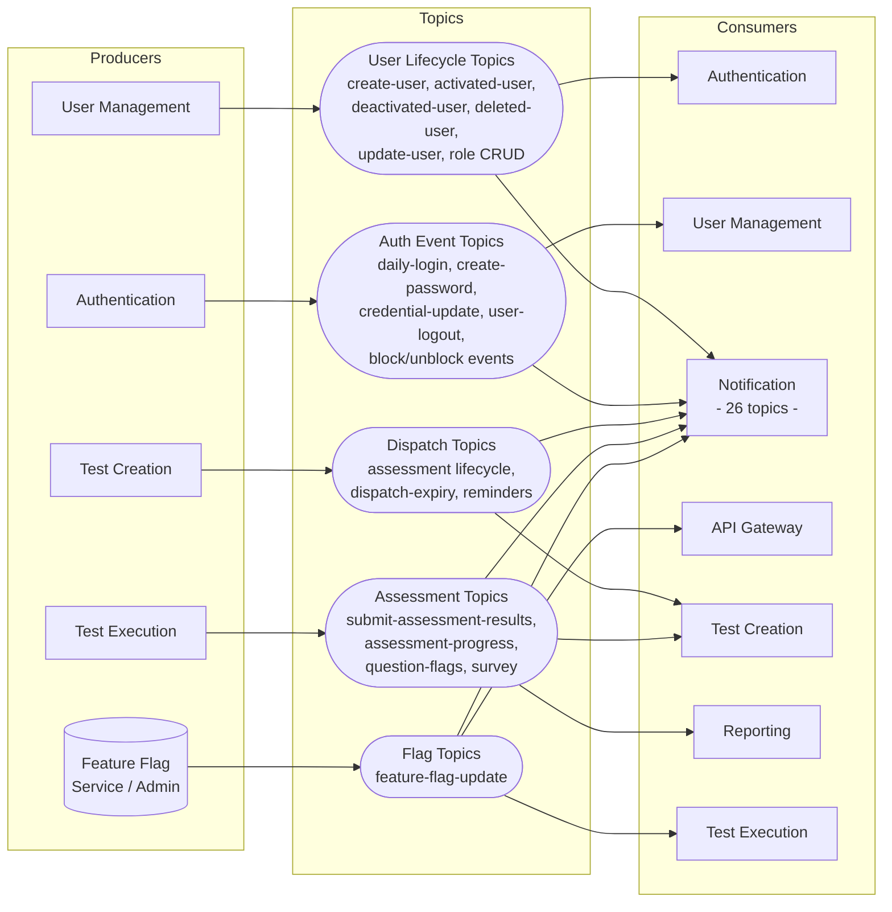
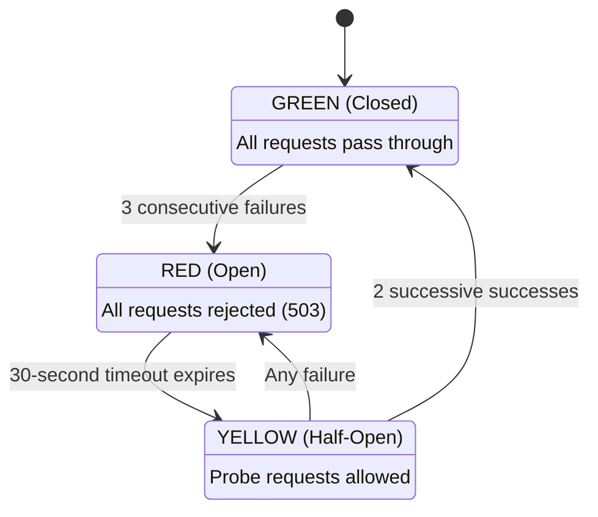
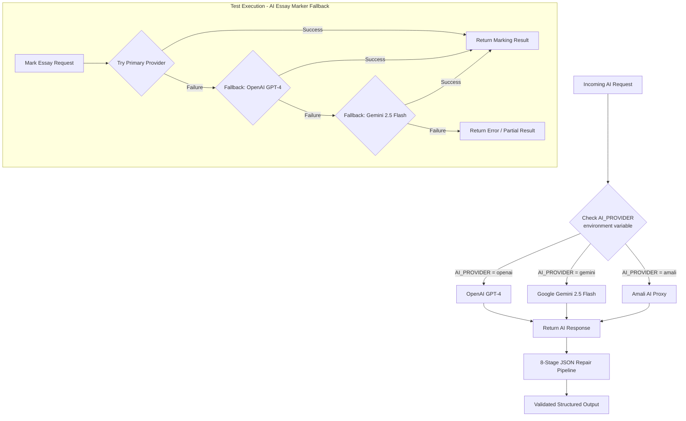

# Dodokpo Assessment Platform -- Backend Architecture

## 1. Executive Summary

The Dodokpo Assessment Platform backend is a distributed system composed of **10 microservices** and **1 shared package**, organized as a monorepo under `backend/`. The architecture follows a database-per-service pattern with event-driven communication via Apache Kafka and synchronous HTTP routing through a centralized API Gateway.

The platform supports the full assessment lifecycle: user and organization management, test creation with seven question types, proctored test execution with code compilation, AI-powered essay marking and analytics, real-time notifications, and comprehensive reporting. Cross-cutting concerns -- authentication, observability, and feature flagging -- are handled uniformly across all services.

Key architectural decisions include AES-encrypted JWT payloads for inter-service trust, a circuit-breaker pattern at the gateway layer, and a polyglot technology stack spanning Node.js (Express/NestJS), Java (Spring Boot), and Python (FastAPI) services, each chosen to match its workload profile.


## 3. Service Descriptions

### 3.1 API Gateway

| Property | Value |
|---|---|
| **Framework** | Express.js |
| **Port** | 8001 |
| **Role** | Single entry point for all client traffic |

The API Gateway is responsible for request routing, security enforcement, and traffic management. It proxies requests to 7 downstream services using `http-proxy-middleware`. Security middleware includes Helmet for HTTP header hardening, CORS policy enforcement, and a rate limiter capped at 60 requests per 30-second window, keyed by a composite of client identity and target service.

A circuit breaker protects downstream services: after 3 consecutive failures, the circuit opens for 30 seconds before allowing a probe request. JWT tokens are validated at the gateway, and their payloads are re-signed with AES-encrypted content before forwarding, establishing a trust boundary.

The gateway also exposes Prometheus metrics for operational monitoring, broadcasts feature flag updates to clients via Server-Sent Events (SSE), and consumes Kafka messages for flag change propagation.

### 3.2 Authentication

| Property | Value |
|---|---|
| **Framework** | NestJS 10 |
| **ORM** | Prisma |
| **Database** | PostgreSQL |

Handles identity verification and session lifecycle. Supports multi-organization login, password creation, reset, and change flows, and user reinvitation. Manages temporal account blocking with a cron job that runs every minute to unblock expired blocks.

**Data Models:** User, Role, Permission, AuthToken, UnauthorizeRequest.

**Kafka Producer Topics:** daily-login, create-password, credential-update, user-logout, block events.

**Kafka Consumer Topics:** create-user, organisation-creation, activated/deactivated/deleted-user, update-user, role CRUD, unauthorize-request, password-created.

### 3.3 User Management

| Property | Value |
|---|---|
| **Framework** | Express.js |
| **ORM** | Sequelize |
| **Database** | PostgreSQL |

Central authority for user profiles, roles, permissions, and organizational structure. Defines 48 granular permissions governing access across the platform. Profile images are stored in AWS S3 and served through CloudFront CDN.

**Data Models:** User, Role, Permission, OrganizationDomain, Application, ActivityLog, DailyUser, UserOrganizations.

**Kafka Producer Topics:** User lifecycle, organization lifecycle, role lifecycle events.

**Kafka Consumer Topics:** activityLog, daily-login, create-password, block/unblock events.

### 3.4 Test Creation

| Property | Value |
|---|---|
| **Framework** | Express.js |
| **ORM** | Prisma |
| **Database** | PostgreSQL |

Manages the authoring side of assessments: test definitions, question banks, skills taxonomy, and assessment configuration. Supports seven question types: multiple choice, multiple select, true/false, fill-in-the-blank, essay, matrix, and coding. Background processing is handled by BullMQ with three queues.

**Data Models:** Assessment, AssessmentTaker, Test, Question, Domain, Category, Skill, SkillLevel, ProctorLevel, ProctorFeature, OrganizationConfig.

**BullMQ Queues:**

| Queue | Purpose |
|---|---|
| `mail-queue` | Assessment invitation and notification emails |
| `dispatch-expiry-queue` | Assessment expiration processing |
| `question-bulk-upload` | Batch question import from files |

**Cron:** Candidate reminder emails dispatched every 10 minutes.

**Kafka:** Producer and consumer for assessment lifecycle events.

### 3.5 Test Execution

| Property | Value |
|---|---|
| **Framework** | Express.js 5 |
| **ORM** | Prisma |
| **Database** | PostgreSQL |

Handles the candidate-facing test experience: delivering questions, collecting answers, enforcing proctoring rules, executing code submissions, and performing AI-based essay marking.

Code execution supports JavaScript, TypeScript, Python, and Java via the Judge0 API. Essay responses are marked using OpenAI or Google Gemini models. Real-time AI-generated insights are streamed to clients via SSE.

**Data Models:** AssessmentTaker, TestResult, Draft, Identity, WindowViolation, ScreenShot, QuestionFlag.

**Proctoring Features:** Device fingerprint validation, window violation tracking, screenshot capture.

**Cron:** Auto-submits overdue assessments every 2 minutes.

### 3.6 Test Cases Management

| Property | Value |
|---|---|
| **Framework** | NestJS 11 (Serverless) |
| **Runtime** | AWS Lambda (Node.js 22) |
| **Database** | DynamoDB (metadata) + S3 (input/output files) |
| **Constraints** | 256 MB memory, 29-second timeout |

A serverless service for managing code challenge test cases. Stores test case metadata in DynamoDB and the actual input/output files in S3. Provides CRUD operations consumed primarily by the Test Creation service.

### 3.7 Reporting

| Property | Value |
|---|---|
| **Framework** | Spring Boot 3.1.4 |
| **Language** | Java 21 |
| **Database** | DynamoDB (single-table design) |
| **Cache** | Redis |

Aggregates assessment results and provides analytics through 20+ REST endpoints. Uses a DynamoDB single-table design for flexible query patterns and Redis caching for frequently accessed reports. Invokes the AI service for advanced analytics (candidate performance, test quality).

**Kafka Consumer Topics:** submit-assessment-results, assessment-progress, question-flags, survey.

**Cron:** Webhook dispatch runs every 2 minutes, delivering results to configured external endpoints.

### 3.8 AI

| Property | Value |
|---|---|
| **Framework** | FastAPI |
| **Language** | Python 3.12+ |
| **Database** | DynamoDB |
| **AI Providers** | OpenAI GPT-4, Google Gemini 2.5 Flash, Amali AI |

Centralized AI capabilities for the platform. Handles both synchronous operations (essay marking, code review) and asynchronous jobs (question generation, test analysis) with background processing via self-invoked Lambda functions. An 8-stage JSON repair pipeline ensures reliable structured output from LLM responses.

**Endpoints:**

| Endpoint | Mode | Description |
|---|---|---|
| `mark-essay` | Sync | Grade essay responses against rubrics |
| `generate-reference` | Sync | Create reference answers for questions |
| `review-code` | Sync | Analyze code submissions for quality |
| `generate-tests` | Sync | Create test cases for coding questions |
| `generate-boilerplate` | Sync | Produce starter code for challenges |
| `generate-question` | Async | Generate questions from parameters |
| `analyze-test` | Async | Evaluate test quality and statistics |
| `analyze-questions` | Async | Assess question bank effectiveness |
| `analyze-candidate-performance` | Async | Deep-dive on individual results |

### 3.9 Notification

| Property | Value |
|---|---|
| **Framework** | Express.js |
| **ORM** | Prisma |
| **Database** | PostgreSQL |

Real-time notification delivery via Server-Sent Events (SSE) and persistent notification storage. Consumes 26 Kafka topics to react to events across every service. Supports per-user notification configuration and notification type management.

**Data Models:** Notification, NotificationConfiguration, NotificationType, NotificationSetting.

### 3.10 External API Integration

| Property | Value |
|---|---|
| **Framework** | NestJS 10 |
| **ORM** | Prisma |
| **Database** | PostgreSQL |
| **Cache** | Redis |

Provides third-party API access to the platform. Manages API key issuance with PBKDF2 hashing for secure storage. Auto-creates integration accounts on first access, reducing friction for external consumers. Redis caches frequently validated keys and associated permissions.

### 3.11 Feature Flag Client (Shared Package)

A shared Node.js package consumed by all Express.js and NestJS services. Provides:

- **FlagCache:** In-memory store for feature flag state, updated via Kafka events propagated through the API Gateway.
- **featureFlagGuard:** Express middleware that gates route access based on active feature flags.


## 5. Data Architecture

### 5.1 Database-per-Service Ownership

Each service owns its database schema exclusively. No other service accesses another's database directly. Data sharing occurs through Kafka events or synchronous API calls.

| Service | Database | Key Tables / Collections |
|---|---|---|
| Authentication | PostgreSQL | User, Role, Permission, AuthToken, UnauthorizeRequest |
| User Management | PostgreSQL | User, Role, Permission, OrganizationDomain, Application, ActivityLog, DailyUser, UserOrganizations |
| Test Creation | PostgreSQL | Assessment, AssessmentTaker, Test, Question, Domain, Category, Skill, SkillLevel, ProctorLevel, ProctorFeature, OrganizationConfig |
| Test Execution | PostgreSQL | AssessmentTaker, TestResult, Draft, Identity, WindowViolation, ScreenShot, QuestionFlag |
| Notification | PostgreSQL | Notification, NotificationConfiguration, NotificationType, NotificationSetting |
| External API Integration | PostgreSQL | API key records, integration accounts |
| Reporting | DynamoDB | Single-table design (PK/SK patterns for assessments, results, analytics) |
| AI | DynamoDB | Async job metadata and status tracking |
| Test Cases Management | DynamoDB + S3 | Test case metadata (DynamoDB), input/output files (S3) |

### 5.1.1 Database Ownership Diagram

```mermaid
graph TB
    subgraph PostgreSQL["PostgreSQL Databases (Prisma / Sequelize)"]
        PG_AUTH[(Auth DB)]
        PG_UM[(User Mgmt DB)]
        PG_TC[(Test Creation DB)]
        PG_TE[(Test Execution DB)]
        PG_NTF[(Notification DB)]
        PG_EXT[(External API DB)]
    end

    subgraph DynamoDB["DynamoDB Tables"]
        DDB_RPT[(Reporting<br/>Single-Table Design)]
        DDB_AI[(AI<br/>Job Metadata)]
        DDB_TCM[(Test Cases Mgmt<br/>Case Metadata)]
    end

    subgraph ObjectStorage["S3 Buckets"]
        S3_UM[(User Mgmt<br/>Profile Images)]
        S3_TCM[(Test Cases Mgmt<br/>Input/Output Files)]
    end

    subgraph Redis["Redis Instances (Shared)"]
        R_RPT[(Reporting Cache)]
        R_EXT[(Ext API Key Cache)]
    end

    AUTH[Authentication] --> PG_AUTH
    UM[User Management] --> PG_UM
    UM --> S3_UM
    TC[Test Creation] --> PG_TC
    TE[Test Execution] --> PG_TE
    NTF[Notification] --> PG_NTF
    EXT[External API Integration] --> PG_EXT
    RPT[Reporting] --> DDB_RPT
    RPT --> R_RPT
    AI[AI Service] --> DDB_AI
    TCM[Test Cases Mgmt] --> DDB_TCM
    TCM --> S3_TCM
    EXT --> R_EXT
```



### 5.2 Question Type Schema

The Test Creation service supports seven distinct question types, each with specialized schema fields:

| Type | Storage Characteristics |
|---|---|
| Multiple Choice | Options array with single correct answer |
| Multiple Select | Options array with multiple correct answers |
| True/False | Boolean correct answer |
| Fill-in-the-Blank | Accepted answer strings with tolerance rules |
| Essay | Rubric and marking criteria (used by AI marking) |
| Matrix | Row/column structure with cell-level answers |
| Coding | Language, boilerplate, test cases (linked to Test Cases Mgmt) |

### 5.3 Data Flow Patterns

**Assessment Lifecycle (simplified):**

```
Test Creation               Test Execution              Reporting               AI
     |                            |                        |                    |
     |-- create assessment ------>|                        |                    |
     |                            |-- submit results ----->|                    |
     |                            |                        |-- request analysis->|
     |                            |                        |<-- analysis result -|
     |                            |                        |-- webhook dispatch->|
     |                            |                        |       (external)    |
```


## 7. Event-Driven Architecture (Kafka)

### 7.1 Overview

Apache Kafka serves as the central nervous system for asynchronous inter-service communication. Events are organized by domain, with services acting as producers, consumers, or both.

### 7.2 Service Roles

| Service | Producer | Consumer | Approximate Topic Count |
|---|---|---|---|
| API Gateway | No | Yes | Feature flag updates |
| Authentication | Yes | Yes | ~5 produced, ~10 consumed |
| User Management | Yes | Yes | ~6 produced, ~6 consumed |
| Test Creation | Yes | Yes | Assessment lifecycle |
| Test Execution | Yes | No | Assessment submission |
| Reporting | No | Yes | ~4 consumed |
| Notification | No | Yes | 26 consumed |
| AI | No | No | (Invoked via HTTP) |

### 7.2.1 Kafka Service Communication Map



### 7.3 Key Event Flows

**User Onboarding Flow:**

```
User Mgmt                    Authentication                Notification
    |                              |                            |
    |-- create-user event -------->|                            |
    |                              |-- create-password event -->|
    |                              |                            |-- send welcome
    |                              |                            |   notification
```

**Assessment Submission Flow:**

```
Test Execution               Reporting                    Notification
    |                            |                            |
    |-- submit-assessment ------>|                            |
    |   -results                 |-- (stores + caches)        |
    |                            |                            |
    |-- assessment-completed --->|                            |
    |                            |                            |
    |   (Kafka) --------------------------------------------------->|
    |                            |                            |-- notify assessor
```

**Organization Lifecycle Flow:**

```
User Mgmt                    Authentication                Test Creation
    |                              |                            |
    |-- organisation-creation ---->|                            |
    |                              |-- (creates auth records)   |
    |                              |                            |
    |-- organisation-creation ---------------------------------------->|
    |                              |                            |-- (creates org config)
```

### 7.4 Key Kafka Topics

| Topic | Producer | Consumer(s) | Purpose |
|---|---|---|---|
| `create-user` | User Management | Authentication | Sync user identity to auth service |
| `organisation-creation` | User Management | Authentication, Test Creation | Propagate new org setup |
| `daily-login` | Authentication | User Management | Track daily active users |
| `create-password` | Authentication | User Management, Notification | Password creation confirmation |
| `credential-update` | Authentication | Notification | Alert on credential changes |
| `user-logout` | Authentication | Notification | Session termination events |
| `activated-user` | User Management | Authentication | Enable auth for activated users |
| `deactivated-user` | User Management | Authentication | Disable auth for deactivated users |
| `deleted-user` | User Management | Authentication | Remove auth records |
| `update-user` | User Management | Authentication | Sync profile changes |
| `block-user` / `unblock-user` | User Management | Authentication | Account blocking control |
| `role-create` / `role-update` / `role-delete` | User Management | Authentication | Role permission sync |
| `unauthorize-request` | External source | Authentication | Force session invalidation |
| `submit-assessment-results` | Test Execution | Reporting | Deliver completed assessment data |
| `assessment-progress` | Test Execution | Reporting | Track in-progress assessments |
| `question-flags` | Test Execution | Reporting | Flagged question tracking |
| `survey` | Test Execution | Reporting | Post-assessment survey data |
| `activityLog` | Various | User Management | Centralized activity logging |
| `feature-flag-update` | Admin/Config | API Gateway | Feature flag state changes |

*(Notification service consumes 26 topics encompassing all of the above and additional domain-specific events.)*


## 9. Resilience and Traffic Management

### 9.1 API Gateway Protections

| Mechanism | Configuration | Behavior |
|---|---|---|
| **Rate Limiting** | 60 requests / 30 seconds | Keyed by composite of client identity + target service; returns HTTP 429 when exceeded |
| **Circuit Breaker** | 3 failures to open, 30-second timeout | Prevents cascading failures; returns HTTP 503 while open |
| **Helmet** | Default configuration | Sets secure HTTP headers (X-Frame-Options, CSP, etc.) |
| **CORS** | Configured whitelist | Restricts cross-origin access |

### 9.1.1 Circuit Breaker State Machine



### 9.2 Background Job Resilience

| Service | Technology | Resilience Strategy |
|---|---|---|
| Test Creation | BullMQ | Persistent Redis-backed queues with retry policies |
| Test Execution | Cron (2-min interval) | Idempotent auto-submit catches overdue assessments |
| Test Creation | Cron (10-min interval) | Idempotent reminder emails prevent duplicate sends |
| Reporting | Cron (2-min interval) | Webhook dispatch with retry tracking |
| Authentication | Cron (1-min interval) | Temporal unblock sweep |

### 9.2.1 AI Provider Selection Flowchart



### 9.3 AI Service Resilience

The AI service employs an 8-stage JSON repair pipeline to handle malformed LLM responses:

1. Raw response extraction
2. Markdown code fence stripping
3. Trailing comma removal
4. Unescaped quote repair
5. Truncated JSON completion
6. Bracket balancing
7. Schema validation
8. Fallback to partial extraction


## 11. Testing Strategy

### 11.1 Test Levels

| Level | Scope | Tools |
|---|---|---|
| **Unit Tests** | Individual functions, classes, and modules | Jest (Node.js services), JUnit 5 (Reporting), pytest (AI) |
| **Integration Tests** | Database operations, Kafka producer/consumer contracts, external API calls | Supertest, Testcontainers, in-memory databases |
| **API/Contract Tests** | REST endpoint request/response validation | Supertest, REST Assured (Java), httpx (Python) |
| **End-to-End Tests** | Critical user journeys across multiple services | Orchestrated test suites against staging environments |

### 11.2 Service-Specific Testing Considerations

| Service | Key Testing Focus |
|---|---|
| API Gateway | Rate limiter behavior, circuit breaker state transitions, JWT validation and re-signing, proxy routing |
| Authentication | Login flows, password lifecycle, temporal blocking/unblocking, Kafka event production |
| User Management | Permission matrix (48 permissions), role assignment, organization domain validation, S3 upload |
| Test Creation | Question type validation (all 7 types), BullMQ job processing, bulk upload parsing |
| Test Execution | Code execution via Judge0 (multi-language), AI marking integration, proctoring rule enforcement, SSE streaming |
| Test Cases Management | Lambda cold start behavior, DynamoDB CRUD, S3 file operations |
| Reporting | Single-table DynamoDB access patterns, Redis cache invalidation, webhook delivery |
| AI | LLM response parsing, JSON repair pipeline stages, async job lifecycle, multi-provider failover |
| Notification | SSE connection management, 26-topic Kafka consumption, notification configuration |
| External API Integration | API key hashing and validation, auto-provisioning, Redis cache consistency |

### 11.3 Testing Principles

- **Database isolation:** Each test run uses isolated schemas or transactions to prevent cross-test contamination.
- **Kafka testing:** Producer tests verify message shape and topic targeting; consumer tests use embedded or mocked brokers.
- **External service mocking:** Judge0, OpenAI, Gemini, and S3 calls are mocked in unit/integration tests; real integrations are validated in staging.
- **Smart test selection:** Jenkins runs only tests belonging to changed services, mirroring the build-level change detection.


## 13. Port Allocation

| Service | Port |
|---|---|
| API Gateway | 8001 |
| Authentication | Internal (not externally exposed) |
| User Management | Internal |
| Test Creation | Internal |
| Test Execution | Internal |
| Reporting | Internal |
| Notification | Internal |
| External API Integration | Internal |
| AI | Internal |
| Test Cases Management | AWS Lambda (no static port) |

*All internal services are accessed exclusively through the API Gateway. Direct external access is not permitted.*

