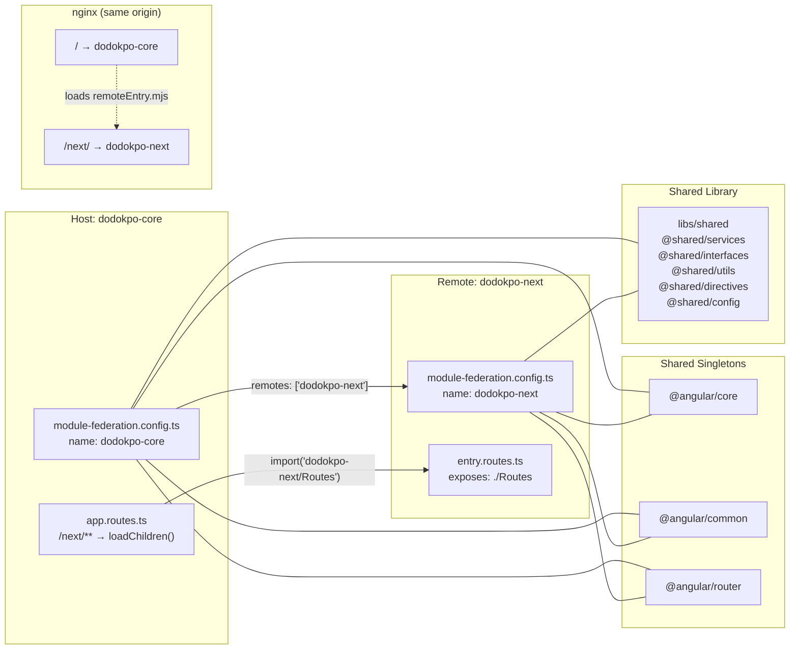
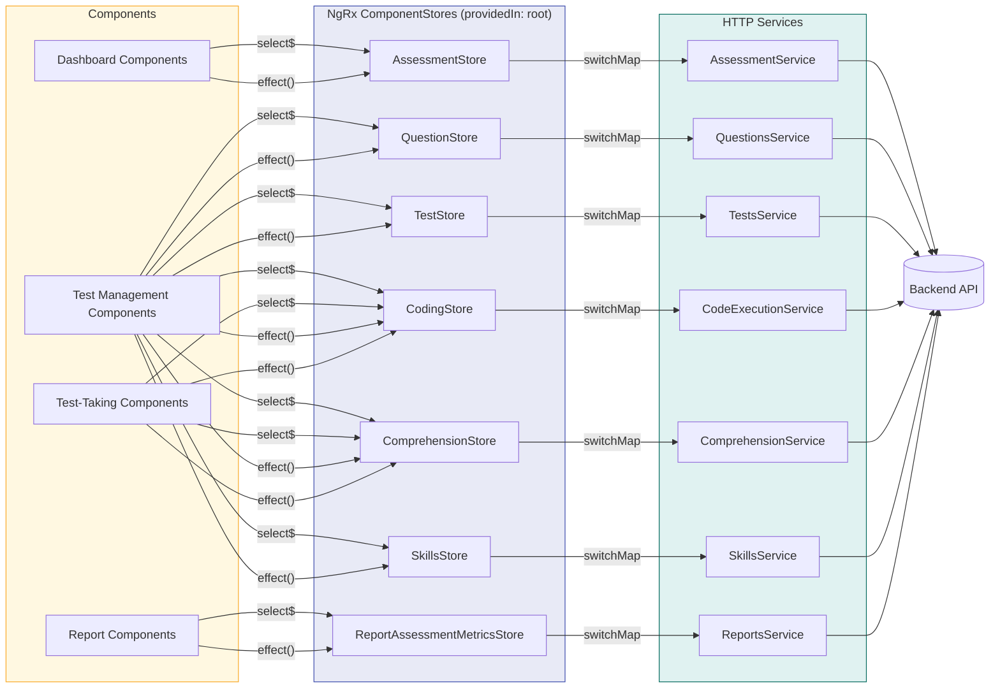
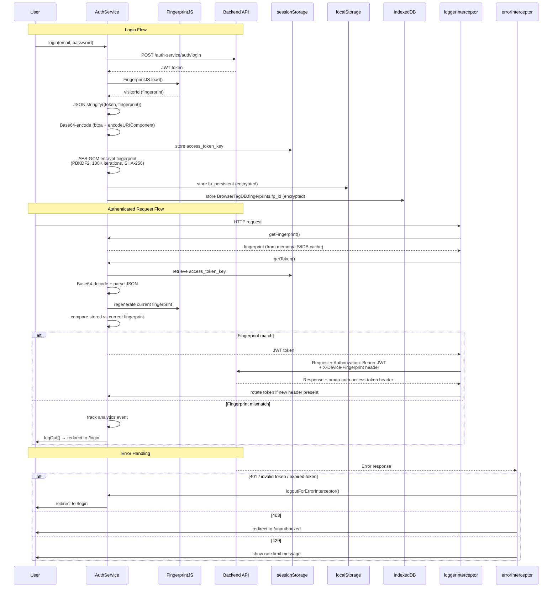
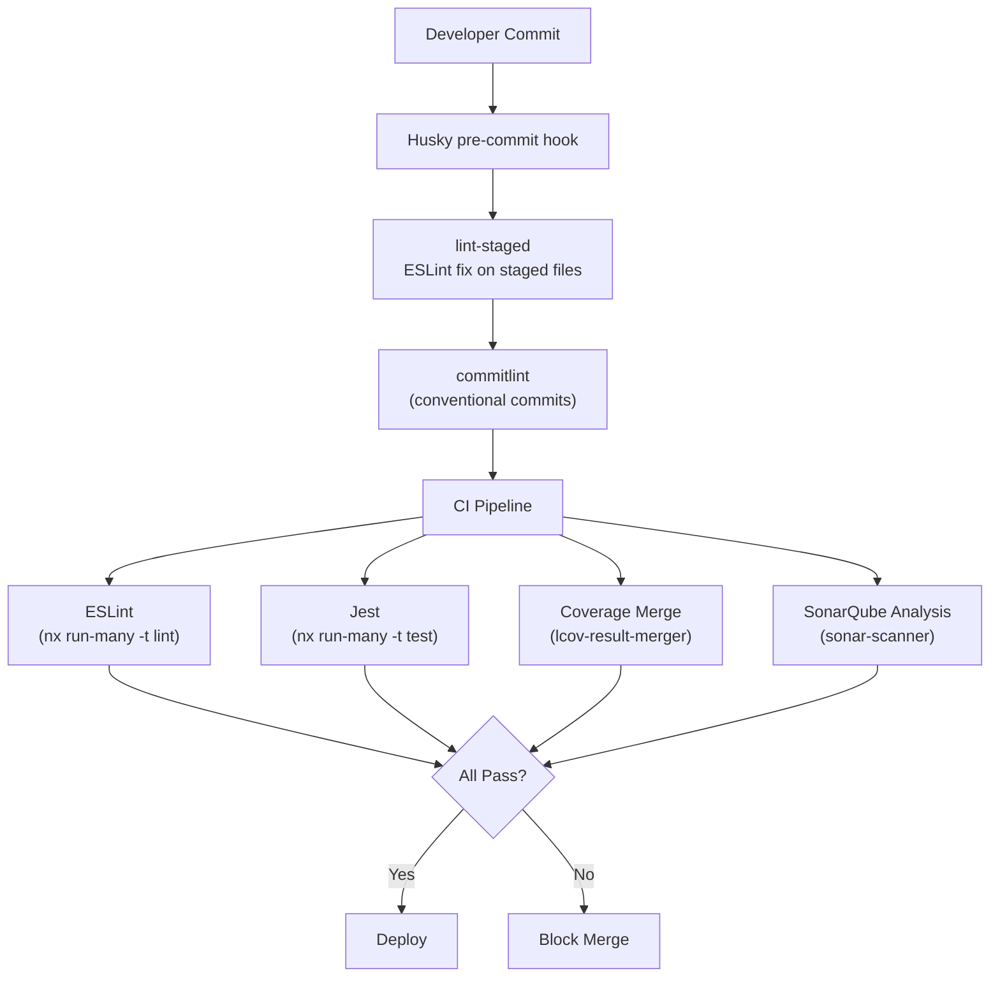

# Dodokpo Assessment Platform -- Frontend Architecture

## Table of Contents

1. [Executive Summary](#1-executive-summary)
2. [Module Federation Architecture](#2-module-federation-architecture)
3. [Routing Architecture](#3-routing-architecture)
4. [State Management](#4-state-management)
5. [Service Layer](#5-service-layer)
6. [Authentication & Security](#6-authentication--security)
7. [Proctoring Pipeline](#7-proctoring-pipeline)
8. [UI Component Architecture](#8-ui-component-architecture)
9. [Theming & Design System](#9-theming--design-system)
10. [Testing Strategy](#10-testing-strategy)


## 2. Module Federation Architecture

### 2.1 Overview

The frontend uses Webpack 5 Module Federation to split the application into independently deployable units. This enables the `dodokpo-next` remote to evolve and deploy separately from the core shell.

```
+-------------------------------+        +-----------------------------+
|        dodokpo-core           |        |       dodokpo-next          |
|         (Host Shell)          | <----> |         (Remote)            |
|                               |        |                             |
|  module-federation.config.ts  |        |  module-federation.config.ts|
|  - name: 'dodokpo-core'      |        |  - name: 'dodokpo-next'     |
|  - remotes: ['dodokpo-next']  |        |  - exposes: './Routes'      |
|  - exposes: {}                |        |    -> entry.routes.ts       |
+-------------------------------+        +-----------------------------+
```



### 2.2 Host Configuration (dodokpo-core)

```typescript
// apps/dodokpo-core/module-federation.config.ts
const config: ModuleFederationConfig = {
  name: 'dodokpo-core',
  remotes: ['dodokpo-next'],
  exposes: {},
  shared: (libraryName, defaultConfig) => {
    if (SINGLETON_LIBS.includes(libraryName)) {
      return { ...defaultConfig, singleton: true, strictVersion: true };
    }
    return defaultConfig;
  },
};
```

The host Webpack config merges a fallback configuration for Node.js polyfills (`fs: false`, `path: false`, `crypto: false`) required by dependencies like `tesseract.js` and `crypto-js`. In production, the remote entry resolves to `/next/remoteEntry.mjs` (same-origin nginx), while development uses the Nx dev server on `localhost:4201`.

### 2.3 Remote Configuration (dodokpo-next)

```typescript
// apps/dodokpo-next/module-federation.config.ts
const config: ModuleFederationConfig = {
  name: 'dodokpo-next',
  exposes: {
    './Routes': './apps/dodokpo-next/src/app/remote-entry/entry.routes.ts',
  },
  shared: (libraryName, defaultConfig) => {
    if (SINGLETON_LIBS.includes(libraryName)) {
      return { ...defaultConfig, singleton: true, strictVersion: true };
    }
    return defaultConfig;
  },
};
```

The remote exposes a single `Routes` module. The host consumes it via dynamic import:

```typescript
// In app.routes.ts
{
  path: 'next',
  loadChildren: () =>
    import('dodokpo-next/Routes').then((m) => m.remoteRoutes),
  data: { preload: true },
}
```

### 2.4 Shared Dependencies

Angular core, common, and router are configured as strict singletons to prevent duplicate framework instances. The `shared` callback preserves Nx's resolved `requiredVersion` (e.g., `^20.3.18`) rather than using the literal string `auto`, which the federation runtime cannot resolve at runtime.

### 2.5 Deployment Topology

```
                    nginx (same origin)
                    /           \
        dodokpo-core (/)     dodokpo-next (/next/)
        - index.html         - remoteEntry.mjs
        - main.*.js           - *.chunk.js
        - remoteEntry.mjs
```

Both apps are built independently (`npm run build` runs `nx run-many -t build --all --parallel=1`) and served from the same nginx instance. The host dynamically loads the remote entry from `/next/remoteEntry.mjs` at runtime.


## 4. State Management

### 4.1 Architecture: NgRx ComponentStore

State management uses **NgRx ComponentStore** (not the full NgRx Store/Effects pattern). All stores are `providedIn: 'root'`, making them application-wide singletons despite the ComponentStore name suggesting component-scoped usage.

### 4.2 Store Inventory

| Store | Location | Responsibility |
|---|---|---|
| `QuestionStore` | `stores/questions-store/question.store.ts` | Question CRUD, pagination, filtering, bulk operations |
| `AssessmentStore` | `stores/assessments-store/assessment.store.ts` | Assessment CRUD, dispatch, history |
| `TestStore` | `stores/tests-store/test.store.ts` | Test CRUD, wizard state |
| `CodingStore` | `stores/coding-store/coding.store.ts` | Code execution state, test case management |
| `ComprehensionStore` | `stores/comprehension-store/comprehension.store.ts` | Comprehension test passages and questions |
| `SkillsStore` | `stores/skills-store/skills.store.ts` | Skills CRUD, bulk upload state |
| `ReportAssessmentMetricsStore` | `stores/report-assessment-metrics.store.ts` | Report candidate metrics, proctoring data |

### 4.3 Store Pattern

Each store follows a consistent pattern:

```typescript
@Injectable({ providedIn: 'root' })
export class QuestionStore extends ComponentStore<QuestionsState> {
  // Injected dependencies
  private readonly authService = inject(AuthService);
  private readonly questionsService = inject(QuestionsService);

  constructor() {
    super({
      allQuestions: { data: { data: [], totalItems: 0, ... } },
      isQuestionLoading: boolean,
      error: string | null,
      success: boolean,
    });
  }

  // Selectors (readonly state slices)
  readonly allQuestions$ = this.select((state) => state.allQuestions);
  readonly isLoading$ = this.select((state) => state.isQuestionLoading);

  // Updaters (synchronous state mutations)
  readonly setLoading = this.updater((state, loading: boolean) => ({
    ...state, isQuestionLoading: loading,
  }));

  // Effects (async side effects)
  readonly loadQuestions = this.effect((params$: Observable<QueryParams>) =>
    params$.pipe(
      switchMap((params) => this.questionsService.getQuestions(params).pipe(
        tap((response) => this.patchState({ allQuestions: response })),
        catchError((error) => { this.patchState({ error }); return of(null); }),
      )),
    )
  );
}
```



### 4.4 DevTools Integration

NgRx Store DevTools are configured in `app.provider.ts`:

```typescript
provideStoreDevtools({
  autoPause: true,
  trace: false,
  traceLimit: 75,
  connectInZone: true,
  maxAge: 25,
  logOnly: !isDevMode(),
})
```


## 6. Authentication & Security

### 6.1 Dual-Layer Token Architecture

The application uses a dual HTTP client strategy:

| Layer | Client | Use Case |
|---|---|---|
| **Interceptor layer** | Angular `HttpClient` | All service calls from components and stores |
| **Guard layer** | Axios | Route guards that run before component initialization |

This dual approach exists because Angular's `HttpClient` interceptors are not available during guard execution in certain lifecycle scenarios. Guards use Axios directly with manual header injection.



### 6.2 Token Storage (Fingerprint-Bound)

Tokens are stored with browser fingerprint binding:

```
Login -> setToken(jwt)
  1. Generate fingerprint via FingerprintJS
  2. JSON.stringify({ token: jwt, fingerprint })
  3. Base64-encode (btoa + encodeURIComponent)
  4. Store in sessionStorage['access_token_key']

getToken()
  1. Retrieve from sessionStorage
  2. Base64-decode
  3. Parse JSON
  4. Regenerate current fingerprint
  5. Compare stored fingerprint with current
  6. If mismatch -> track analytics event -> logOut()
  7. If match -> return token
```

### 6.3 Browser Fingerprint System

The `AuthService` generates and persists browser fingerprints using a multi-layer strategy:

```
Memory cache (fastest)
    |
    v  miss
localStorage['fp_persistent'] (encrypted with AES-GCM)
    |
    v  miss
IndexedDB['BrowserTagDB']['fingerprints']['fp_id'] (encrypted with AES-GCM)
    |
    v  miss
FingerprintJS.load() -> generate new visitorId
    -> store in all three layers
```

Encryption uses **PBKDF2-derived AES-GCM keys** (100,000 iterations, SHA-256) with a 12-byte random IV prepended to the ciphertext. The passphrase is derived from the Segment write key in the environment config.

A 5-second cooldown prevents rapid fingerprint regeneration.

### 6.4 HTTP Interceptors

**loggerInterceptor** (runs first):
1. Resolves the browser fingerprint (async)
2. Retrieves the stored token (async, with fingerprint validation)
3. Clones the request with `Authorization: Bearer <token>` and `X-Device-Fingerprint: <fingerprint>` headers
4. On response, captures the `amap-auth-access-token` header for token rotation

**errorInterceptor** (runs second):
- **Status 0**: Checks internet connectivity, returns appropriate network/server error message
- **Status 429**: Extracts rate limit message from nested error response
- **Status 502/503/504**: Server communication error messages
- **Status 404**: Navigates back (except for background requests like public feature flags)
- **Status 403**: Redirects to `/unauthorized`
- **Token errors** (`invalid token`, `expired token`, `missing token`): Triggers `logoutForErrorInterceptor()`
- **Account deactivation**: Shows error for 5 seconds, then auto-logout
- **Assessment-specific errors**: Routes to `invalid-link`, `assessment-not-due`, `assessment-completed`, `link-expired`

### 6.5 Route Guards

**authGuard** (dashboard routes):
1. If user is already in memory, allow immediately
2. Otherwise, show "please wait" interstitial (`/please-wait`)
3. Retrieve and validate token (from sessionStorage with fingerprint check)
4. Verify token with server via Axios (`/auth-service/auth/verify/user`)
5. Fetch user profile via Axios (`/user-service/users/:orgId/my-profile`)
6. Fetch tags if user has tag permissions
7. Fetch authenticated feature flags and reconnect SSE
8. Set user in AuthService, return `true`
9. On any failure, redirect to `/login`

**authLinkValidationGuard** (password reset/create links):
- Validates the password link token before allowing access to change/create password pages

**testTakerGuard** (test-taker pipeline):
1. If assessment state is already loaded, allow immediately
2. Extract `testTakerId` from query params
3. Generate browser fingerprint
4. Fetch assessment link status via Axios with fingerprint header
5. Handle complex error scenarios:
   - Rate limiting (429): Show toast, preserve current route
   - Retake delays: Navigate to appropriate retake page with dates
   - Fingerprint mismatch: Clear all storage, redirect to login
   - Assessment status (invalid, undue, expired, completed, max retakes): Route to status pages
6. Process assessment phase:
   - `CODE_CONDUCT_SIGNING`: Allow navigation through the pipeline
   - `TEST_TAKING`: Calculate frontend-adjusted estimated end time, redirect to step page

**testTakingPhaseGuard** (exam phase):
1. If in-progress data exists, allow immediately
2. Fetch link status with fingerprint
3. Reject if phase is not `TEST_TAKING`
4. Calculate server clock offset: `estimatedEndTime(server) - currentDate(server) + now(client)`
5. Store remaining time in localStorage for countdown recovery

### 6.6 Server Clock Offset Compensation

The `getFrontendEstimatedEnd` function compensates for clock drift between client and server:

```typescript
export function getFrontendEstimatedEnd(
  estimatedEndTime: string,
  currentDate: string
): string {
  const now = new Date();
  const serverTimeOffset =
    new Date(estimatedEndTime).getTime() - new Date(currentDate).getTime();
  return new Date(now.getTime() + serverTimeOffset).toISOString();
}
```

This ensures the countdown timer uses the server's remaining duration applied to the client's local clock, preventing premature or delayed exam termination due to time zone or clock differences.

### 6.7 Permission System

The permission system maintains dual compatibility between new RBAC permissions and legacy permission strings:

```typescript
type PermissionName = SystemPermission |
  `${Action} ${'user' | 'role' | 'assessment' | ... }`;

type LegacyPermission = 'admin' | 'manage users' | 'view users' | ...;

interface AccessGroup {
  permissions: PermissionName[];
  legacy: LegacyPermission[];
}
```

48 access groups are defined (612 lines), covering every UI action from viewing the dashboard to archiving individual questions. The `checkPermission()` function matches a user's permission array against an access group, checking both new and legacy permission names.


## 8. UI Component Architecture

### 8.1 Component Organization

Components are organized by feature area within the `dodokpo-core` app:

```
apps/dodokpo-core/src/app/
  authentication/         # Login, password flows
  main-app/               # Dashboard shell (sidebar + header + router-outlet)
  dashboard-home-page/    # Home dashboard
  test-management/        # Domains, Questions, Tests, Assessments, Skills
    Domain/
    Questions/
    Tests/
    Assessment/
    Skills/
    components/           # Shared test-management components
  reportsManagement/      # Report views
    components/           # Dispatched assessments, candidates, metrics
    pages/                # Download, feedback, candidate report
  user-management/        # Users, organisations, roles, applications
  test-taker/             # Test-taker pipeline pages
    pages/                # Each step in the pipeline
    components/           # Shared test-taker components
  test-taking/            # Active exam experience
  feature-flags/          # Admin feature flag management
  notifications/          # Notification center
  archives/               # Archived items
  account-configuration/  # Profile, workspace settings
  components/             # Truly shared/cross-cutting components
  error/                  # Error display components
  coming-soon-page/       # Placeholder for unreleased features
  not-found-page/         # 404 page
  no-result-found/        # Empty state component
```

**Total: 253 components** across the codebase.

### 8.2 Standalone Component Pattern

All components use the standalone pattern (no NgModules):

```typescript
@Component({
  selector: 'app-example',
  standalone: true,
  imports: [CommonModule, MatButtonModule, RouterLink],
  templateUrl: './example.component.html',
  styleUrls: ['./example.component.css'],
})
export class ExampleComponent { }
```

### 8.3 Shared Library (`libs/shared`)

The shared library is organized into five sub-packages:

| Package | Import Path | Contents |
|---|---|---|
| **config** | `@shared/config` | Environment configuration (`environment.ts`) |
| **services** | `@shared/services` | 13 shared services (Toast, Auth, Theme, FeatureFlag, etc.) |
| **interfaces** | `@shared/interfaces` | 50+ TypeScript interfaces (feature flags, reports, notifications, test-taker types) |
| **directives** | `@shared/directives` | `DurationDirective`, `SafeHtmlDirective`, `HtmlTooltipDirective` |
| **utils** | `@shared/utils` | Permissions (48 access groups), constants, regex patterns, coding type utils, test-taker constants |
| **styles** | (SCSS/CSS imports) | Material M2 theme, global CSS with 80+ custom properties |

### 8.4 Third-Party UI Integration

| Library | Usage |
|---|---|
| **Angular Material** | Buttons, dialogs, tables, forms, tabs, chips, autocomplete, date pickers, snackbars |
| **PrimeNG** | Data tables (with advanced filtering), dropdowns, multiselect, calendar |
| **TailwindCSS** | Utility-first layout, spacing, typography, responsive design, dark mode (`class` strategy) |
| **Monaco Editor** | In-browser code editor for coding questions (7+ language support via Judge0) |
| **Chart.js** | Analytics visualizations (bar, line, pie charts for assessment reports) |
| **Quill** | Rich text editor for question descriptions and assessment instructions |
| **ngx-lottie** | Animated illustrations (loading states, empty states, success animations) |
| **ngx-highlightjs** | Syntax highlighting for code blocks in question previews |
| **html2pdf.js + jspdf** | Client-side PDF generation for reports and certificates |

### 8.5 Web Workers

Two Web Workers handle CPU-intensive file parsing off the main thread:

- **`csv.worker.ts`**: Parses CSV files for bulk question/skill uploads
- **`file-parse.worker.ts`**: General file parsing delegated from `FileParseWorkerService`


## 10. Testing Strategy

### 10.1 Framework and Configuration

| Aspect | Configuration |
|---|---|
| Test Runner | Jest |
| Angular Preset | `jest-preset-angular` |
| Environment | jsdom with `jest-canvas-mock` |
| Transform | TypeScript, JavaScript, MJS, HTML, SVG |
| Module Aliases | `@shared/*` mapped to `libs/shared/*/src/index.ts` |

### 10.2 Coverage Thresholds

Enforced per-build via Jest configuration:

```javascript
coverageThreshold: {
  global: {
    branches: 61,
    functions: 75,
    lines: 80,
    statements: 80,
  },
}
```

Coverage reports are generated in `coverage/apps/dodokpo-core/` and merged across all apps using `lcov-result-merger`.

### 10.3 Test File Distribution

- **353 spec files** across the `dodokpo-core` application
- Tests co-located with source files (e.g., `auth.service.spec.ts` alongside `auth.service.ts`)
- Store tests: All 7 stores have corresponding spec files
- Service tests: Core services (auth, analytics, feature-flag, proctoring, etc.) have dedicated specs
- Component tests: 253 components, majority have corresponding spec files

### 10.4 Mock Strategy

Complex third-party dependencies are mocked at the module level:

| Dependency | Mock Location |
|---|---|
| `face-api.js` | `src/__mocks__/face-api.js` |
| `html2pdf.js` | `__mocks__/html2pdf.js` |
| `pdfjs-dist` | `__mocks__/pdfjs-dist.js` |
| `chart.js` | `__mocks__/chart.js` |
| `monaco-editor` | `__mocks__/monaco-editor.js` |
| Monaco service | `__mocks__/monaco-service.js` |
| `FileParseWorkerService` | `__mocks__/file-parse-worker.service.js` |
| CSS/SCSS | `identity-obj-proxy` |
| Quill CSS | `identity-obj-proxy` |

### 10.5 Test Scripts

| Script | Purpose |
|---|---|
| `npm test` | Run all tests across all apps with merged coverage |
| `npm run test:fullCoverage` | Full coverage run with parallel=1 and merge |
| `npm run test:watch` | Watch mode for development |
| `npm run test:changed` | Only test apps affected by recent changes |
| `npm run test:coverage` | Affected tests with coverage merge |

### 10.6 Code Quality Pipeline



SonarQube is configured with:
- Source paths: `apps/dodokpo-core/src`, `libs/`
- Test inclusions: `**/*.spec.ts`
- Coverage report: `coverage/lcov.info`

### 10.7 Bundle Analysis

A dedicated script enables Webpack bundle analysis:

```bash
npm run build:analyze
# Runs: nx build dodokpo-core --stats-json
#        && npx webpack-bundle-analyzer dist/apps/dodokpo-core/stats.json
```

This is used to identify and address bundle size regressions, particularly important given heavy dependencies like tesseract.js (~14.9MB, lazy-loaded), face-api.js (dynamically imported), and Monaco Editor (conditionally preloaded).
