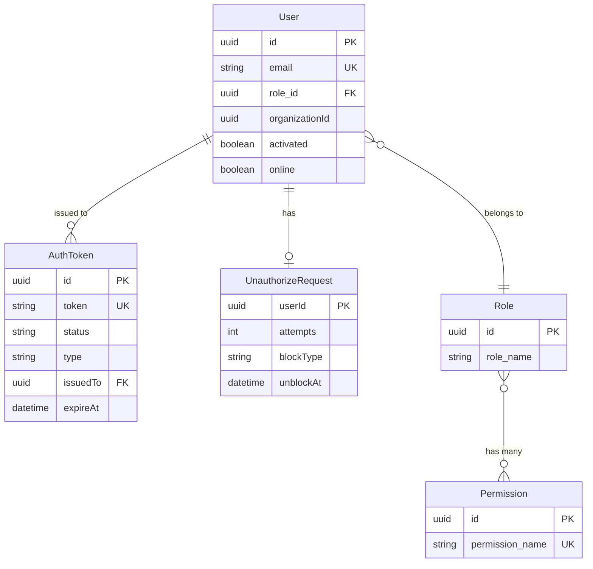
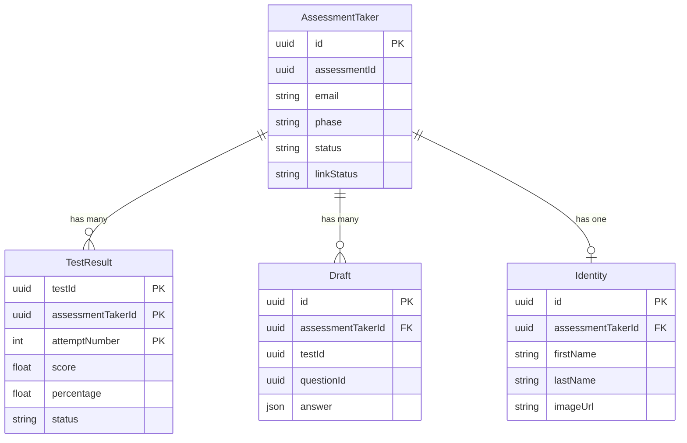
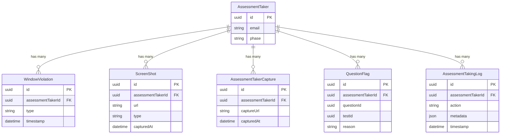
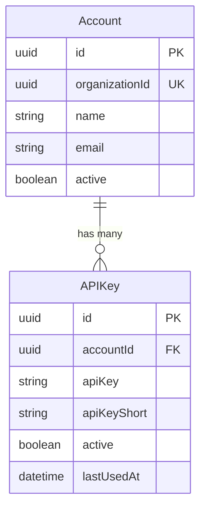
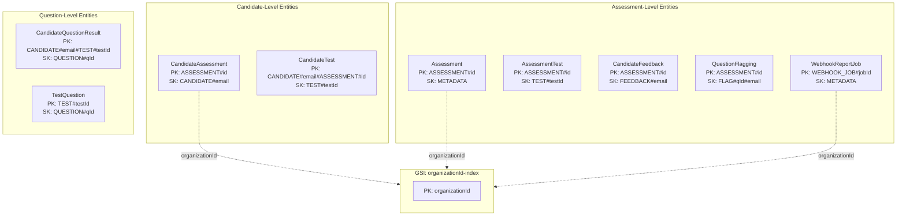
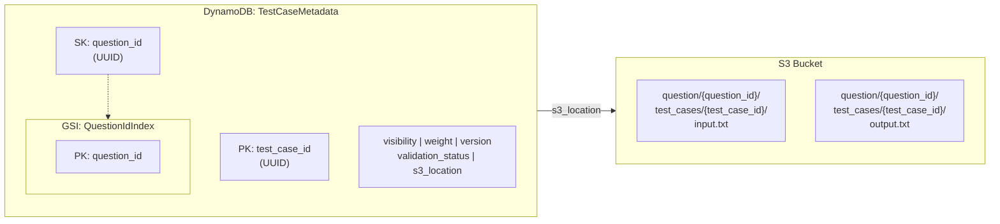

# Dodokpo Assessment Platform -- Backend Data Models

Complete reference of all database models and schemas across all services, grouped by service and database type.

## PostgreSQL (Prisma) Services

### Authentication Service

#### User

| Field | Type | Constraints | Description |
|-------|------|-------------|-------------|
| id | String (UUID) | PK, default uuid | Unique user identifier |
| email | String | Unique, not null | User email address |
| role_id | String (UUID) | FK -> Role.id | Assigned role reference |
| organizationId | String (UUID) | Not null | Organization the user belongs to |
| system | Boolean | Default false | Whether this is a system-level account |
| password | String | Nullable | Hashed password |
| reset | Boolean | Default false | Whether a password reset is pending |
| activated | Boolean | Default false | Whether the user has activated their account |
| organization_activated | Boolean | Default false | Whether the user's organization is activated |
| online | Boolean | Default false | Whether the user is currently online |
| deactivateType | String | Nullable | Type of deactivation (e.g., self, admin) |
| createdAt | DateTime | Default now | Record creation timestamp |
| updatedAt | DateTime | Auto-updated | Last update timestamp |

**Relations:** User belongs to Role (via role_id). User belongs to an Organization (via organizationId, logical reference to User Management).

#### Role

| Field | Type | Constraints | Description |
|-------|------|-------------|-------------|
| id | String (UUID) | PK, default uuid | Unique role identifier |
| role_name | String | Not null | Name of the role |
| createdAt | DateTime | Default now | Record creation timestamp |
| updatedAt | DateTime | Auto-updated | Last update timestamp |

**Relations:** Role has many Permissions (M2M via implicit join table). Role has many Users.

#### Permission

| Field | Type | Constraints | Description |
|-------|------|-------------|-------------|
| id | String (UUID) | PK, default uuid | Unique permission identifier |
| permission_name | String | Unique, not null | Permission identifier string |

**Relations:** Permission belongs to many Roles (M2M).

#### AuthToken

| Field | Type | Constraints | Description |
|-------|------|-------------|-------------|
| id | String (UUID) | PK, default uuid | Unique token identifier |
| token | String | Unique, not null | The token value (hashed) |
| status | String | Not null | Token status (active, revoked, expired) |
| type | String | Not null | Token type (reset, invite, create-password) |
| issuedBy | String (UUID) | Not null | ID of the user/system that issued the token |
| issuedTo | String (UUID) | Not null | ID of the user the token is for |
| expireAt | DateTime | Not null | Token expiration timestamp |
| createdAt | DateTime | Default now | Record creation timestamp |

#### UnauthorizeRequest

| Field | Type | Constraints | Description |
|-------|------|-------------|-------------|
| userId | String (UUID) | PK | The user making failed auth attempts |
| attempts | Int | Default 0 | Number of failed attempts |
| blockType | String | Nullable | Type of block applied (temporary, permanent) |
| firstAttempt | DateTime | Not null | Timestamp of the first failed attempt |
| lastAttempt | DateTime | Not null | Timestamp of the most recent failed attempt |
| unblockAt | DateTime | Nullable | Timestamp when the block will be lifted |

### Test Execution Service

#### Core Entities

#### Proctoring and Monitoring

#### AssessmentTaker

| Field | Type | Constraints | Description |
|-------|------|-------------|-------------|
| id | String (UUID) | PK, default uuid | Unique taker record identifier |
| assessmentId | String (UUID) | Not null | Associated assessment (cross-service ref) |
| email | String | Not null | Candidate email |
| phase | String | Not null | Current phase (identity, in-progress, completed, submitted) |
| linkStatus | String | Not null | Link status (active, expired, used) |
| status | String | Not null | Overall status (invited, started, completed, expired) |
| logSummary | Json[] | Default [] | Summary of activity/proctoring logs |
| tags | String[] | Default [] | Tags from the assessment |
| startedAt | DateTime | Nullable | When the candidate started |
| completedAt | DateTime | Nullable | When the candidate finished |
| createdAt | DateTime | Default now | Record creation timestamp |
| updatedAt | DateTime | Auto-updated | Last update timestamp |

**Relations:** AssessmentTaker has many TestResults. AssessmentTaker has many Drafts. AssessmentTaker has one Identity. AssessmentTaker has many WindowViolations. AssessmentTaker has many ScreenShots. AssessmentTaker has many QuestionFlags. AssessmentTaker has many AssessmentTakingLogs.

#### TestResult

| Field | Type | Constraints | Description |
|-------|------|-------------|-------------|
| testId | String (UUID) | Composite PK | Test identifier |
| assessmentTakerId | String (UUID) | Composite PK | Assessment taker identifier |
| attemptNumber | Int | Composite PK | Attempt number (for retakes) |
| score | Float | Nullable | Achieved score |
| totalScore | Float | Nullable | Maximum possible score |
| percentage | Float | Nullable | Score percentage |
| status | String | Not null | Result status (pending, graded, reviewed) |
| answers | Json | Not null | Submitted answers |
| startedAt | DateTime | Not null | When the test was started |
| submittedAt | DateTime | Nullable | When the test was submitted |

**Primary Key:** Composite of (testId, assessmentTakerId, attemptNumber).
**Relations:** TestResult belongs to AssessmentTaker (via assessmentTakerId).

#### Draft

| Field | Type | Constraints | Description |
|-------|------|-------------|-------------|
| id | String (UUID) | PK, default uuid | Draft identifier |
| assessmentTakerId | String (UUID) | FK -> AssessmentTaker.id | Associated taker |
| testId | String (UUID) | Not null | Associated test |
| questionId | String (UUID) | Not null | Associated question |
| answer | Json | Not null | Draft answer content |
| updatedAt | DateTime | Auto-updated | Last update timestamp |

**Unique Constraint:** (assessmentTakerId, testId, questionId).

#### Identity

| Field | Type | Constraints | Description |
|-------|------|-------------|-------------|
| id | String (UUID) | PK, default uuid | Identity record identifier |
| assessmentTakerId | String (UUID) | FK -> AssessmentTaker.id, unique | Associated taker |
| firstName | String | Not null | Candidate first name |
| lastName | String | Not null | Candidate last name |
| imageUrl | String | Nullable | Identity verification photo URL |
| verifiedAt | DateTime | Nullable | When identity was verified |

#### WindowViolation

| Field | Type | Constraints | Description |
|-------|------|-------------|-------------|
| id | String (UUID) | PK, default uuid | Violation record identifier |
| assessmentTakerId | String (UUID) | FK -> AssessmentTaker.id | Associated taker |
| type | String | Not null | Violation type (tab-switch, window-blur, resize) |
| timestamp | DateTime | Not null | When the violation occurred |
| metadata | Json | Nullable | Additional violation context |

#### ScreenShot

| Field | Type | Constraints | Description |
|-------|------|-------------|-------------|
| id | String (UUID) | PK, default uuid | Screenshot record identifier |
| assessmentTakerId | String (UUID) | FK -> AssessmentTaker.id | Associated taker |
| url | String | Not null | S3 URL of the screenshot |
| type | String | Not null | Screenshot type (capture, screen) |
| capturedAt | DateTime | Not null | When the screenshot was taken |

#### QuestionFlag

| Field | Type | Constraints | Description |
|-------|------|-------------|-------------|
| id | String (UUID) | PK, default uuid | Flag record identifier |
| assessmentTakerId | String (UUID) | FK -> AssessmentTaker.id | Associated taker |
| questionId | String (UUID) | Not null | Flagged question |
| testId | String (UUID) | Not null | Associated test |
| reason | String | Nullable | Reason for flagging |
| createdAt | DateTime | Default now | Record creation timestamp |

**Unique Constraint:** (assessmentTakerId, questionId, testId).

#### AssessmentTakingLog

| Field | Type | Constraints | Description |
|-------|------|-------------|-------------|
| id | String (UUID) | PK, default uuid | Log entry identifier |
| assessmentTakerId | String (UUID) | FK -> AssessmentTaker.id | Associated taker |
| action | String | Not null | Action type (start, submit, navigate, violation) |
| metadata | Json | Nullable | Additional log context |
| timestamp | DateTime | Default now | When the action occurred |

### External API Integration Service

#### Account

| Field | Type | Constraints | Description |
|-------|------|-------------|-------------|
| id | String (UUID) | PK, default uuid | Account identifier |
| organizationId | String (UUID) | Unique, not null | Associated organization |
| name | String | Not null | Account name |
| email | String | Not null | Contact email |
| active | Boolean | Default true | Whether the account is active |
| createdAt | DateTime | Default now | Record creation timestamp |
| updatedAt | DateTime | Auto-updated | Last update timestamp |

**Relations:** Account has many APIKeys.

#### APIKey

| Field | Type | Constraints | Description |
|-------|------|-------------|-------------|
| id | String (UUID) | PK, default uuid | Key record identifier |
| accountId | String (UUID) | FK -> Account.id | Parent account |
| apiKey | String | Not null | Hashed API key value |
| apiKeyShort | String | Not null | Visible short prefix (e.g., "dk_...abc") |
| active | Boolean | Default true | Whether the key is active |
| lastUsedAt | DateTime | Nullable | Last time the key was used |
| createdAt | DateTime | Default now | Record creation timestamp |

**Relations:** APIKey belongs to Account.

## DynamoDB

### Reporting Service

**Design:** Single-table design. All entities share one DynamoDB table with a GSI on `organizationId`.

#### Entity: Assessment

| Attribute | Type | Key | Description |
|-----------|------|-----|-------------|
| PK | String | Partition Key | `ASSESSMENT#<assessmentId>` |
| SK | String | Sort Key | `METADATA` |
| organizationId | String | GSI PK | Organization identifier |
| title | String | -- | Assessment title |
| status | String | -- | Assessment status |
| createdAt | String (ISO) | -- | Creation timestamp |

#### Entity: CandidateAssessment

| Attribute | Type | Key | Description |
|-----------|------|-----|-------------|
| PK | String | Partition Key | `ASSESSMENT#<assessmentId>` |
| SK | String | Sort Key | `CANDIDATE#<candidateEmail>` |
| organizationId | String | GSI PK | Organization identifier |
| email | String | -- | Candidate email |
| status | String | -- | Completion status |
| score | Number | -- | Overall score |
| percentage | Number | -- | Score percentage |
| startedAt | String (ISO) | -- | Start timestamp |
| completedAt | String (ISO) | -- | Completion timestamp |

#### Entity: AssessmentTest

| Attribute | Type | Key | Description |
|-----------|------|-----|-------------|
| PK | String | Partition Key | `ASSESSMENT#<assessmentId>` |
| SK | String | Sort Key | `TEST#<testId>` |
| testTitle | String | -- | Test title |
| testType | String | -- | Test type |
| duration | Number | -- | Duration in minutes |
| questionCount | Number | -- | Number of questions |

#### Entity: CandidateTest

| Attribute | Type | Key | Description |
|-----------|------|-----|-------------|
| PK | String | Partition Key | `CANDIDATE#<candidateEmail>#ASSESSMENT#<assessmentId>` |
| SK | String | Sort Key | `TEST#<testId>` |
| score | Number | -- | Test score |
| totalScore | Number | -- | Maximum possible score |
| percentage | Number | -- | Score percentage |
| submittedAt | String (ISO) | -- | Submission timestamp |

#### Entity: CandidateQuestionResult

| Attribute | Type | Key | Description |
|-----------|------|-----|-------------|
| PK | String | Partition Key | `CANDIDATE#<candidateEmail>#TEST#<testId>` |
| SK | String | Sort Key | `QUESTION#<questionId>` |
| answer | String/Map | -- | Submitted answer |
| score | Number | -- | Achieved score |
| maxScore | Number | -- | Maximum score |
| isCorrect | Boolean | -- | Whether the answer is correct |

#### Entity: TestQuestion

| Attribute | Type | Key | Description |
|-----------|------|-----|-------------|
| PK | String | Partition Key | `TEST#<testId>` |
| SK | String | Sort Key | `QUESTION#<questionId>` |
| questionText | String | -- | Question text |
| questionType | String | -- | Question type |
| score | Number | -- | Question score value |
| difficultyLevel | String | -- | Difficulty level |

#### Entity: CandidateFeedback

| Attribute | Type | Key | Description |
|-----------|------|-----|-------------|
| PK | String | Partition Key | `ASSESSMENT#<assessmentId>` |
| SK | String | Sort Key | `FEEDBACK#<candidateEmail>` |
| rating | Number | -- | Numeric rating |
| comments | String | -- | Feedback text |
| submittedAt | String (ISO) | -- | Submission timestamp |

#### Entity: QuestionFlagging

| Attribute | Type | Key | Description |
|-----------|------|-----|-------------|
| PK | String | Partition Key | `ASSESSMENT#<assessmentId>` |
| SK | String | Sort Key | `FLAG#<questionId>#<candidateEmail>` |
| reason | String | -- | Flag reason |
| createdAt | String (ISO) | -- | Flag timestamp |

#### Entity: WebhookReportJob

| Attribute | Type | Key | Description |
|-----------|------|-----|-------------|
| PK | String | Partition Key | `WEBHOOK_JOB#<jobId>` |
| SK | String | Sort Key | `METADATA` |
| organizationId | String | GSI PK | Organization identifier |
| status | String | -- | Job status (pending, processing, completed, failed) |
| payload | Map | -- | Webhook payload data |
| createdAt | String (ISO) | -- | Creation timestamp |

**GSI: organizationId-index**
- Partition Key: `organizationId`
- Enables querying all entities by organization.

### Test Cases Management Service

**Table:** TestCaseMetadata

| Attribute | Type | Key | Description |
|-----------|------|-----|-------------|
| pk (test_case_id) | String (UUID) | Partition Key | Unique test case identifier |
| sk (question_id) | String (UUID) | Sort Key | Associated question identifier |
| visibility | String | -- | Visibility level (public, hidden) |
| weight | Number | -- | Weight/importance of this test case |
| version | Number | -- | Version number for optimistic locking |
| s3_location | String | -- | S3 path to input/output files |
| validation_status | String | -- | Status (pending, valid, invalid) |
| createdAt | String (ISO) | -- | Creation timestamp |
| updatedAt | String (ISO) | -- | Last update timestamp |

**GSI: QuestionIdIndex**
- Partition Key: `question_id`
- Enables querying all test cases for a given question.

